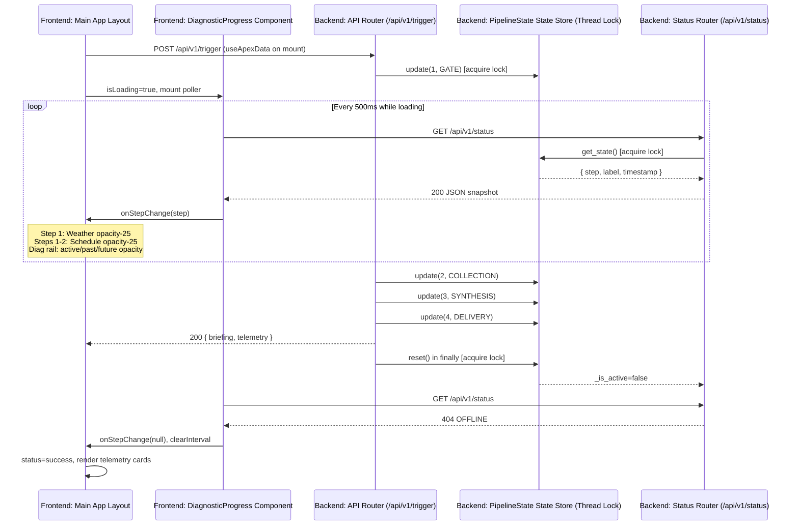

# APEX: Automated Personal Environment Xylem

A Python-based personal HUD that delivers a synchronized audio-visual briefing on demand. The idea came from wanting a real-world analog to Jarvis from Iron Man: a system that wakes up, reads the room, and gives you a situational briefing without you having to ask. Along the way it became a practical tool for automating the morning routine of checking weather, sports updates, news headlines, and personal reminders. Out of the box, APEX ships with a nature-themed persona that leans into this imagery, but the core engine is built to be a completely blank slate where the name, voice, and attitude are fully configurable.

---

## How It Works

`launcher.py` is the entry point for a full local session. It starts uvicorn and `http.server` as parallel child processes, waits for both to bind their ports, then opens the frontend in a kiosk window using the first Chromium browser binary it finds. `atexit` hooks and signal handlers bring both processes down on exit.

With both servers up, `api.py` listens on `127.0.0.1:8000`. A `POST` to `/api/v1/trigger` kicks off a four-stage pipeline:

1. **Gate** — `scanner.py` checks the environment before anything else: home Wi-Fi by SSID, wall power, and a 1-hour cooldown since the last run. If any check fails, the request is rejected with a `403` and nothing runs.
2. **Collection** — each enabled data connector fetches its feed in sequence: weather, sports, news, email, calendar, and pending reminders from the local database. Disabled connectors are skipped with no API call made.
3. **Synthesis** — the raw outputs are joined into a single pipe-delimited string and passed to Gemini 2.5 Flash via the Google GenAI SDK. `brain.py` prepends the persona prompt from `config.json` and returns the generated briefing text. A filler phrase plays on a background thread while the model processes to avoid dead air. If the Gemini call fails for any reason, the raw data string is read out directly so the run never crashes.
4. **Output** — `speaker.py` plays the final briefing through the TTS fallback chain. The endpoint also returns the briefing text and a telemetry object as JSON, which the web HUD reads to fill each module slot on the page.

With `DEV_MODE=true` in `.env`, the scanner bypasses hardware and cooldown gates, live Gemini, Gmail and Calendar, run logging, and reminder read-marking. Servers, weather/sports/news connectors, and the database remain active.

```
launcher.py  →  [uvicorn (port 8000) + http.server (port 5500)]  →  Browser (kiosk window)
api.py  →  scanner.py  →  [Data Connectors (Clients & DB)]  →  brain.py  →  speaker.py
(Entry)      (Gate)              (Collection)               (Synthesis)   (Delivery)
```

### FastAPI Pipeline Telemetry & Polling

A full briefing run is a blocking HTTP call. The trigger request stays open until all four stages finish, which takes long enough that the HUD needs something to show while it waits. Rather than streaming partial JSON out of the trigger response, the design keeps execution and observation separate. `useApexData` fires a single `POST` to `/api/v1/trigger` and holds it open, while `DiagnosticProgress` runs a separate `setInterval` loop at **500 ms** that polls `GET /api/v1/status` to find out where the pipeline is at.

When the hook fires on mount it sets `status` to `loading`, which is what tells `App.tsx` to render `DiagnosticProgress` in the center card. The status component starts polling immediately. Each response comes back with `{ step, label, timestamp }` read out of `PipelineState.get_state()` under a `threading.Lock`. The step integer gets handed back up to `App.tsx` through the `onStepChange` callback, which uses it to control opacity on the flanking cards: step **1** (Gate) drops Weather to 25% opacity, and steps **1 and 2** (Gate and Collection) do the same to Schedule. Inside the progress component itself the same step value drives the highlight state, connector fill, and label opacity across the four-step rail (Gate, Collection, Synthesis, Delivery).

On the backend, `core/api.py` calls `global_pipeline_state.update(step, label)` at each stage boundary to keep the state current. The whole collection and synthesis block lives inside a `try...finally` so `global_pipeline_state.reset()` always runs at the end regardless of whether the run succeeded or threw. Once that reset fires, `_is_active` goes false and the next poll to `/api/v1/status` gets a 404 back. The component treats a 404 as idle, clears the interval, and calls `onStepChange(null)`. By that point the trigger `POST` has already resolved and the HUD fills the telemetry cards from the response body.



---

## Features

**Context-aware gating (`scanner.py`)**  
Before any API calls are made, the scanner checks whether you're on your home Wi-Fi (by SSID), whether the machine is plugged in, and whether it's been at least 1 hour since the last run. All three have to pass for a standard run to prevent it from activating on every login or while away from home. Two `.env` flags control this gate: `DEV_MODE=true` bypasses all three checks and also disables live Gemini, Gmail, Calendar, run logging, and reminder read-marking for local development. `ENABLE_STARTUP_GATE=false` (with `DEV_MODE=false`) bypasses only the hardware and cooldown checks while leaving all live API pipelines intact, for use cases where the system needs to run outside the home environment without compromising live data.

**Live data connectors (`weather_client.py`, `sports_client.py`, `news_client.py`, `gmail_client.py`, `calendar_client.py`)**  
Weather comes from the OpenWeatherMap API. `sports_client.py` pulls two feeds: the next F1 race from the Ergast/Jolpica API (cached locally at `clients/.f1_cache.json` with a 24-hour TTL), and the next FC Barcelona fixture from the football-data.org API (authenticated via `FOOTBALL_API_KEY`). `news_client.py` fetches one headline each for Artificial Intelligence and Global Events from the GNews API (authenticated via `GNEWS_API_KEY`), with a short sleep between requests to stay inside the free-tier rate limit. Unread Primary inbox emails come from the Gmail API. Calendar data comes from the Google Calendar API as a rolling 48-hour window. Both Google clients share the same OAuth2 flow through `google_auth.py`. Each connector is its own module, so adding a new source is mostly isolated to one new file and a few lines in `api.py`. Every connector can be individually toggled on or off via `config.json`. When a connector is disabled, the API call is skipped entirely and the module is excluded from the briefing.

**Config-driven feature flags and persona (`config.json`, `config.py`)**  
`config.py` reads `config.json` at startup and exposes a boolean for each connector (`FEATURE_WEATHER`, `FEATURE_SPORTS`, `FEATURE_NEWS`, `FEATURE_EMAIL`, `FEATURE_CALENDAR`), `SYSTEM_PROMPT`, and three TTS constants: `PRIMARY_TTS`, `GOOGLE_VOICE_ID`, and `INWORLD_VOICE_ID`. If the file is missing or broken, flags default to `False`, `SYSTEM_PROMPT` falls back to a generic placeholder, and `PRIMARY_TTS` defaults to `"pyttsx3"` so nothing crashes. `config.json` ships committed with all flags on and Google Cloud TTS configured as the active engine. It also keeps preferences and secrets separate: toggles, the persona prompt, and TTS voice settings live here (safe to commit), API keys go in `.env` (gitignored).

**AI-generated briefings (`brain.py`)**  
Raw data from all the connectors is passed straight to Gemini 2.5 Flash via the Google GenAI SDK. `brain.py` has no persona baked into it. It pulls `SYSTEM_PROMPT` from `config.py` and prepends it to the request, so the voice is entirely driven by `config.json`. Pipe (`|`) delimiters separate each source in the raw string to keep the model's context clean. If the API call fails for any reason, it catches the exception and falls back to reading the raw data directly so the run never crashes.

**Persistent reminders and session logging (`database.py`)**  
A local SQLite database tracks user reminders and run timestamps. Reminders are marked as read after they've been read out so they don't repeat across sessions. The run log is what the scanner queries to enforce the 1-hour cooldown.

**Unified development mode (`DEV_MODE`)**  
Set `DEV_MODE=true` in `.env` for local work. Bypasses Wi-Fi SSID validation, AC power check, and the 1-hour cooldown; skips live Gemini, Gmail, and Calendar; does not call `database.log_run()` or mark reminders read (`is_read` stays `0`). Weather, sports, news, SQLite, FastAPI, and the kiosk launcher are unchanged.

**Production startup gate (`ENABLE_STARTUP_GATE`)**  
Controls whether hardware and cooldown checks run under a production setup (`DEV_MODE=false`). Defaults to `true` when the key is absent, so the gate is always enforced unless explicitly disabled. Set to `false` to bypass the Wi-Fi SSID check, AC power check, and 1-hour cooldown while keeping all live API clients active. Useful for running APEX from an untrusted network or without wall power without switching to `DEV_MODE`.

**Web HUD (`frontend/`)**  
A React/TypeScript application bundled with Vite. On mount, the `useApexData` hook fires a `POST` to `/api/v1/trigger` and manages the full `idle | loading | success | error` lifecycle in a single piece of state. While that request is open, `DiagnosticProgress` polls `/api/v1/status` every 500 ms and drives a four-step progress rail along with staggered opacity on the Weather and Schedule cards. Full detail on that flow is in the **FastAPI Pipeline Telemetry & Polling** section. After success, the center panel renders the briefing text with a looping pulse animation. Layout is a Tailwind CSS bento grid that collapses to a single column on smaller viewports. Production output is compiled by Vite into `/dist` at the project root, which `http.server` serves directly.

**Atmospheric Theme Provider (`AtmosphericThemeContext.tsx`)**  
A React context provider that reads the raw weather string from `useApexData` and scans it for exact substring tokens to update CSS variables on `document.documentElement`. The scan runs in priority order on each data change and applies the matching theme profile:

| Token | `--hud-bg` | `--hud-text` | `--hud-accent` | Condition |
|---|---|---|---|---|
| `"Thunderstorm"` | `#1a202c` (dark charcoal) | `#e2e8f0` | `#06b6d4` (cyan) | `stormy` |
| `"Clear"` | `#020617` (deep night) | `#f8fafc` | `#eab308` (amber) | `clear` |
| _(no match)_ | `#0a0f1d` (default navy) | `#c8d3f5` | `#3b82f6` (blue) | `neutral` |

The variables are written synchronously inside `updateThemeFromTelemetry` before the next render cycle, so there is no flash between the default state and the resolved profile. `useAtmosphericTheme()` exposes `{ theme, updateThemeFromTelemetry }` to any descendant that needs to read the resolved condition or re-evaluate the theme against an arbitrary string. The `isStormy` boolean on `AtmosphericTheme` is a convenience flag for components that need a binary storm branch without re-checking the condition string.

**Variable Typography Engine (`TelemetryCard.tsx`)**  
Maps ambient temperature in Fahrenheit to a CSS `font-weight` integer for the primary temperature readout via linear interpolation over two closed intervals:

- **Temperature domain:** \[40°F, 90°F\] — clamped before interpolation
- **Font weight range:** \[300, 800\] — `300` at the cold bound, `800` at the hot bound
- **Formula:** `weight = 300 + ((clampedTemp − 40) / 50) × 500`, rounded to the nearest integer

The weight is applied as an inline `style` on the readout `<p>` element (tagged `data-vte="primary-temperature-readout"`) so it overrides Tailwind's static utilities without a class conflict. `resolveTemperatureFontWeight(input: VariableTypographyInput): number` is exported as a named function for unit testing.

**Pipeline String Format Contract (`useApexData.ts`)**  
Two named parser functions in `useApexData.ts` extract structured fields from the fixed-format string that `weather_client.py` produces. Both return safe fallbacks (`null` or `'No Atmospheric Data'`) when the input does not match rather than throwing into the render tree.

Upstream string format:
```
Current temperature is {temp} degrees with {condition}.
```

| Field | Function | Regex | Return type |
|---|---|---|---|
| Integer °F | `resolvePipelineTemperatureF` | `/Current temperature is\s+(-?\d+)\s+degrees/` | `number \| null` |
| Condition text | `resolveWeatherDetail` | `/with\s+([^.]+)/` | `string` |

The parsed values are stored on `TelemetryPayload` as `temperatureF` and `weatherDetail`. If an upstream format change breaks either regex, the temperature readout goes blank and VTE interpolation is skipped cleanly. The condition field falls back to the full raw string. Both failures are immediately visible in the HUD, making format regressions easy to catch without a crash.

**Text-to-speech engine (`speaker.py`)**  
Three engines in a fallback chain. At module import, `_warm_cloud_clients()` checks for `GOOGLE_APPLICATION_CREDENTIALS` and, if present, instantiates a `TextToSpeechClient` singleton. This avoids constructing a new client on every `speak` call and logs a skip message instead of raising when credentials are absent. `fetch_google_audio` uses that singleton directly. If it is `None` at call time, a `RuntimeError` is raised. All calls to `speak()` are serialized through a module-level `threading.Lock`, preventing audio interleaving across concurrent invocations. The returned MP3 bytes are played directly from memory via `pygame.mixer` with no disk writes. `SDL_VIDEODRIVER=dummy` is set at import time so pygame doesn't crash if there's no display attached. Inworld requests use a shared `requests.Session` rather than a bare `requests.post`. If both cloud paths are down, `pyttsx3` runs locally with no network dependency. The active engine is set by `primary_tts` in `config.json`. `"google"` tries Google first, then Inworld, then pyttsx3. `"inworld"` reverses that order. `"pyttsx3"` skips cloud entirely.

---

## The Default Configuration (Nature-Themed Tone)

The briefing voice, the AI's name, and how it addresses the user are all set by the `system_prompt` field in `config.json`. Nothing about that is hardcoded. Change the value and the whole personality changes.

The default persona is a deliberate personal choice. Just as xylem tissue carries nutrients through a tree, APEX moves your personal data through its processing layers, a parallel too good to leave at just the name. That imagery is carried over into the briefing voice and is reflected in the tone, and the word choices.

---

## Environment Modes

Both flags are read from `.env`. Values are normalized at read time, so `True`, `true`, and `TRUE` all work the same way. `DEV_MODE` defaults to `false` if absent. `ENABLE_STARTUP_GATE` defaults to `true` if absent, keeping the gate enforced in any environment where the key is not explicitly set.

| Configuration | Wi-Fi + Power | Cooldown | Gemini API | Gmail + Calendar (PII) | Logs Run | Marks Reminders Read |
|---|---|---|---|---|---|---|
| Production (`DEV_MODE=false`, `ENABLE_STARTUP_GATE=true`) | ✅ enforced | ✅ 1-hour | ✅ live (w/ fallback) | ✅ per `config.json` | ✅ yes | ✅ yes |
| Gate off (`DEV_MODE=false`, `ENABLE_STARTUP_GATE=false`) | ⬜ bypassed | ⬜ bypassed | ✅ live (w/ fallback) | ✅ per `config.json` | ✅ yes | ✅ yes |
| `DEV_MODE=true` | ⬜ bypassed | ⬜ bypassed | ⬜ bypassed | ⬜ bypassed | ⬜ no | ⬜ no |

## Feature Toggles

Individual data connectors can be switched on or off in `config.json` without touching any code. This is useful when you don't hold a particular API key, want to speed up development runs by cutting unused sources, or just don't need a connector for a period of time.

Set any `features` value to `false` to disable that connector. When a connector is off, no API call or authentication attempt is made, the module is excluded from the Gemini context window, and a bypass notice is logged to the terminal.

Two edge cases worth knowing:

- `DEV_MODE=true` always force-bypasses Gmail and Calendar regardless of `config.json`. Feature flags are an additional layer of control that only matters in a normal production run.
- If `config.json` is missing or broken, `config.py` logs a warning and defaults every feature flag to `False` and `SYSTEM_PROMPT` to a neutral generic fallback so the system doesn't crash.

---

## Tech Stack

| Layer | Tool |
|---|---|
| Language | Python 3.10+ |
| AI Engine | Google GenAI SDK (Gemini 2.5 Flash) |
| GUI | React, TypeScript, Vite, Tailwind CSS |
| Database | SQLite3 |
| TTS | Google Cloud TTS (primary), Inworld AI (secondary, inactive by default), pyttsx3 (offline fallback) |
| Key Libraries | `psutil`, `requests`, `python-dotenv`, `google-api-python-client`, `google-cloud-texttospeech`, `pygame-ce` |

### AI-Augmented Development

The project uses a set of custom agent rules in `.cursor/rules/`. Each rule is scoped to a file glob so the right agent activates automatically based on what file is open. `global.mdc` runs across all files and enforces the universal constraints: port constants, full code articulation (no placeholder-only implementations), a mandatory 5-point pre-flight validation block before any functional change, and a post-implementation handoff section after every completed pass.

- **Global** (`*`) enforces port constants, full code articulation, the pre-flight validation gate, the handoff section requirement, and language standards for comments, logs, and documentation. Always active.
- **Analyst** (`clients/**/*.py`) acts as the Data Scientist and API Inspector. It maps external API parameters, traces nested JSON payloads, evaluates package ecosystems, and analyzes mathematical logic such as coordinate conversions and telemetry normalization. It never writes or modifies application code and delivers all findings as Markdown tables or raw JSON blocks.
- **Auditor** performs read-only security and stability audits covering thread races, deadlocks, blocking async calls, resource leaks, secrets isolation, SQLite transaction safety, external API trust boundaries, and compile-time type correctness. It reports findings with file references and severity but does not apply patches.
- **Backend** (`core/**/*.py`) covers FastAPI routes, async orchestration, and SQLite persistence. It enforces real database constraints over application-only validation, documents indexing strategy, eliminates N+1 query patterns, and requires bounded retries and explicit timeout handling on all external connectors.
- **Builder** generates complete, production-ready implementations after explicit human sign-off on the approved specification. It builds functional FastAPI endpoints, React/TypeScript modules, SQLite layers, and API connectors with full logic — no placeholder scaffolding.
- **Communicator** handles documentation, commit logs, and PR drafting. It produces four copy-ready outputs for every PR: title, full description, squash-and-merge title, and squash-and-merge body. Commit body bullets use plain past-tense technical verbs; prefixes are restricted to the title line.
- **DevOps** (`config.json`, `.env*`, `launcher.py`, `*.bat`) manages launchers, dependency lockfiles, and the strict wall between `config.json` (application state) and `.env` (credentials). It never writes real keys or system paths into example files and treats `requirements.txt` and `package-lock.json` as rigid contracts.
- **Frontend** (`frontend/**/*.{ts,tsx,css,html}`) builds the HUD layout using Vite, React, TypeScript, and Tailwind CSS. Hardcoded pixel sizes are prohibited; all layouts use relative units and Tailwind breakpoints. All data flows through the `useApexData()` hook. The HUD renders a unified pipeline state (`Idle → Loading → Delivered`); per-component loading spinners are prohibited.
- **Mechanic** resolves compile-time failures, runtime crashes, and typing conflicts within the reported scope only. It also generates complete pytest/unittest suites with assertions, mocks, and offline harnesses for network-bound services.

---

## Setup

**1. Clone the repo**
```bash
git clone https://github.com/yourusername/apex.git
cd apex
```

**2. Install dependencies**
```bash
pip install -r requirements.txt
```

**3. Configure environment variables**

Copy the included template and fill in your values:

macOS / Linux:
```bash
cp .env.example .env
```

Windows:
```powershell
copy .env.example .env
```

`.env.example` contains all required keys with descriptive placeholders and comments explaining each group. The `.env` file is excluded from version control. Two keys are worth calling out: `GOOGLE_APPLICATION_CREDENTIALS` takes the **absolute file path** to your `service_account.json` file, not the contents of the file. `INWORLD_API_KEY` needs to be a pre-Base64-encoded `client_id:client_secret` pair, exactly as formatted in the Inworld AI console.

`APEX_ALLOWED_ORIGINS` is an optional comma-separated list of origins allowed to make cross-origin requests to the API. If it's not set, `api.py` defaults to `http://127.0.0.1:8000`, `http://localhost:8000`, `http://127.0.0.1:5500`, and `http://localhost:5500`. If you're serving the web HUD from a different port, set this key. Note that a custom value replaces the defaults entirely rather than adding to them.

`CUSTOM_BROWSER_PATH` points `launcher.py` at a specific browser executable for the kiosk window. If you use Vivaldi, Brave, or any other Chromium-based browser that is not Chrome or Edge, set the full path here (e.g., `C:\Users\you\AppData\Local\Vivaldi\Application\vivaldi.exe`). It gets checked first. If it is not set, `launcher.py` looks for Chrome then Edge under the default `PROGRAMFILES` paths.

**4. Configure persona and feature toggles (optional)**

`config.json` ships with all five connectors enabled and the default Xylem persona set as the system prompt. Both can be customized without touching any code.

To change the briefing voice, tone, or persona, edit the `system_prompt` field. To disable a connector, set its flag to `false`:

```json
{
  "features": {
    "weather": true,
    "sports": false,
    "news": true,
    "email": false,
    "calendar": false
  },
  "tts_settings": {
    "primary_tts": "google",
    "google_voice_id": "en-US-Chirp3-HD-Gacrux",
    "inworld_voice_id": ""
  },
  "system_prompt": "You are APEX. Deliver a sharp, neutral briefing in under 75 words. No emojis or markdown."
}
```

`primary_tts` accepts `"google"`, `"inworld"`, or `"pyttsx3"`. Leave `google_voice_id` or `inworld_voice_id` blank to skip that engine regardless of the `primary_tts` setting.

This is also the right way to handle a missing API key. If you skip the `FOOTBALL_API_KEY` setup, set `"sports": false` here instead of getting a fetch error every run. The briefing will still generate with whatever data is enabled.

`config.py` validates both the `features` object and the `system_prompt` string at startup. If either is missing or malformed, it falls back to safe defaults and logs a warning rather than crashing.

**5. Set up Google API credentials**

- Go to the Google Cloud Console.
- Enable both the Gmail API and the Google Calendar API for your project.
- Create an OAuth client ID for a desktop application and download it as `credentials.json`.
- Place `credentials.json` in the project root directory.
- If you change API scopes later, delete `token.json` and re-authenticate to get a fresh token.

**6. Set up Google Cloud TTS credentials**

- Go to the Google Cloud Console.
- Enable the **Cloud Text-to-Speech API** for your project.
- Create a **service account**, grant it the `Cloud Text-to-Speech User` role, and download the JSON key.
- Save the key file as `service_account.json` in the project root (it is gitignored).
- Set `GOOGLE_APPLICATION_CREDENTIALS` in `.env` to the **absolute file path** of that file (e.g., `C:\Users\you\projects\apex\service_account.json`).

**7. (Optional) Configure Inworld AI**

Inworld AI is wired in as a secondary TTS engine but is inactive by default. To enable it:

- Create an Inworld AI account and obtain your `client_id` and `client_secret`.
- Base64-encode the pair (`base64("client_id:client_secret")`) and paste the result as `INWORLD_API_KEY` in `.env`.
- Set `"inworld_voice_id"` in `config.json` to a valid Inworld voice ID.
- Set `"primary_tts"` to `"inworld"` if you want it to be tried before Google.

**8. Run**

The recommended way to start is with the orchestrator:

```bash
python launcher.py
```

This starts uvicorn and `http.server` in the background, waits for both to come up, then opens the frontend in a kiosk window automatically. `Ctrl+C` shuts both down.

To run the processes separately:

**Terminal 1 (API server):**
```bash
python -m uvicorn core.api:app --reload
```

**Terminal 2 (static file server):**
```bash
python -m http.server -d dist 5500
```

Then open `http://127.0.0.1:5500` in a browser. Both commands are run from the project root. The `-d dist` flag points the file server at the compiled Vite build output directory. Run `npm run build` inside `frontend/` first to produce that output before starting the static server.

---

## Deployment & Launch

`launch_apex.bat` is in the project root. Double-click it, or run it from a terminal:

```powershell
.\launch_apex.bat
```

It runs `launcher.py` and holds the window open on exit so errors don't disappear before you can read them.

**Creating a Windows Desktop Shortcut**

Right-click `launch_apex.bat` → **Create shortcut**, then drop it on the Desktop. One extra step: right-click the shortcut, open **Properties**, and set the **Start in** field to the full project path (e.g., `C:\Users\you\Documents\APEX`). Without this, `launcher.py` can't resolve its relative paths and the run will fail immediately.

**Why this exists**

The long-term plan is a physical button that cold-starts the whole system without touching a keyboard. This `.bat` file is the software stand-in for that same single-trigger behavior, just from the desktop instead of a hardware input. When that integration gets built, this is what it calls.

---

## API Usage

With both processes running, two endpoints are available:

**Health check**
```
GET http://127.0.0.1:8000/
```
Returns `{"status": "online", "system": "APEX Nexus"}`. Useful for confirming the server came up cleanly before sending a trigger.

**Trigger a briefing**
```
POST http://127.0.0.1:8000/api/v1/trigger
```
Kicks off a full run: scanner gate, data collection, Gemini synthesis, and TTS playback. On success, returns a JSON payload with three fields:

```json
{
  "status": "success",
  "briefing": "...",
  "telemetry": {
    "weather": "...",
    "sports": "...",
    "news": "...",
    "email": "...",
    "calendar": "...",
    "reminders": "..."
  }
}
```

`briefing` is the AI-generated text that was read aloud. `telemetry` is a JSON object with one string field per connector, not the raw pipe-delimited string passed to Gemini internally. The web HUD reads these keys to fill each module slot. If the scanner gate fails (wrong network, no power, or inside the cooldown window), the endpoint returns a `403` with a detail message instead of running.

**Pipeline diagnostic status**
```
GET http://127.0.0.1:8000/api/v1/status
```
Readable only while a trigger run is active. Returns the current stage as a step integer, a short label, and a UTC timestamp:

```json
{
  "step": 2,
  "label": "COLLECTION",
  "timestamp": "2026-05-18T12:34:56.789012+00:00"
}
```

`step` runs **1 through 4** and maps to Gate, Collection, Synthesis, and Delivery in that order. If nothing is running the route returns **404**. The HUD polls this during `loading` to drive the progress rail and card opacity. It does not carry the final telemetry data and is not a substitute for reading the trigger response.

---

## Project Structure

```
apex/
├── core/
│   ├── api.py           # REST API entry point — FastAPI app + uvicorn server (port 8000)
│   ├── brain.py         # Briefing synthesis via genai.Client and Gemini 2.5 Flash
│   ├── scanner.py       # Environment gate (Wi-Fi, power, cooldown)
│   ├── speaker.py       # TTS fallback chain: Google Cloud TTS → Inworld AI → pyttsx3, MP3 played from memory via pygame
│   ├── database.py      # SQLite session logging and reminder management
│   ├── config.py        # Feature flag and system prompt loader with validation
│   └── __init__.py
├── clients/
│   ├── weather_client.py    # OpenWeatherMap connector
│   ├── sports_client.py     # F1 (Ergast/Jolpica) + 24-hr cache, FC Barcelona fixture connector (football-data.org)
│   ├── news_client.py       # GNews API connector for AI and Global Events headlines
│   ├── gmail_client.py      # Gmail API v1 extraction and timestamp parsing
│   ├── calendar_client.py   # Google Calendar 48-hour schedule extractor
│   ├── google_auth.py       # Centralized OAuth2 utility for Google APIs
│   ├── .f1_cache.json       # Auto-generated F1 telemetry cache — 24-hour TTL (not committed)
│   └── __init__.py
├── frontend/                # React/TypeScript source — compiled by Vite
│   ├── src/
│   │   ├── hooks/
│   │   │   └── useApexData.ts   # Central data hook — trigger, lifecycle state, telemetry distribution; VTE string parser
│   │   ├── types/
│   │   │   └── telemetry.ts     # TelemetryPayload, AtmosphericTheme, AtmosphericCondition type definitions
│   │   ├── context/
│   │   │   └── AtmosphericThemeContext.tsx  # CSS variable theme provider — condition token scan, --hud-* variable injection
│   │   ├── components/
│   │   │   ├── TelemetryCard.tsx       # Shared card frame + Variable Typography Engine interpolation
│   │   │   └── DiagnosticProgress.tsx  # 500ms status poller + four-step progress rail
│   │   ├── App.tsx              # Root layout; step-driven card opacity
│   │   └── main.tsx             # Vite entry point
│   ├── index.html               # Vite HTML shell
│   ├── package.json
│   ├── vite.config.ts
│   └── tsconfig.json
├── dist/                    # Compiled Vite build output — served by http.server in production
├── launcher.py          # Master orchestrator — starts uvicorn and http.server in parallel, opens browser kiosk
├── config.json          # Persona prompt, feature toggles, and TTS engine settings (user preferences, committed)
├── apex_memory.db       # Auto-generated on first run
├── credentials.json     # Google Cloud OAuth client ID for Gmail/Calendar (BYOK - not committed)
├── service_account.json # Google Cloud TTS service account key (BYOK - not committed)
├── token.json           # Auto-generated user access token (not committed)
├── .env                 # Local environment variables (not committed)
└── .env.example         # Environment variable template with placeholder values
```

---

## F1 Minimalist Intake Engine & HUD Synthesis Contract

This covers the full data contract between the F1 ingestion layer in `clients/sports_client.py` and the rendering layer in `frontend/src/components/TelemetryCard.tsx`.

### File-Backed Local Cache & 24-Hour TTL

The F1 connector writes a local cache at `clients/.f1_cache.json` to cut down on unnecessary network calls. Race schedules don't change often, so 24 hours is a reasonable TTL. The logic each run:

1. `_read_f1_cache()` tries to load the file from disk. If it's missing, unreadable, or malformed, it returns `None` and the network fetch runs unconditionally.
2. `_is_f1_cache_fresh()` checks the `cached_at` ISO timestamp against the current UTC clock. The window is exactly **24 hours** (`timedelta(hours=24)`). An invalid or timezone-naive timestamp counts as stale.
3. Fresh cache hit: the stored `f1_map` dict is used and no HTTP request is made.
4. Stale or missing: a `GET` goes out to `https://api.jolpi.ca/ergast/f1/current/next.json`. On success, `_write_f1_cache()` writes the new map to disk with compact separators (`(",", ":")`), plus a fresh `cached_at` UTC timestamp.
5. Network failure with a stale map on disk: the stale map is used as a fallback. If there's nothing on disk at all, the connector emits the plain string `"F1 race telemetry unavailable."`.

The cache file is gitignored and created automatically on first run.

### F1_DATA Payload Format

The F1 map doesn't go into the pipeline as a plain English sentence. It's emitted as a compact JSON object with a named prefix tag that keeps it compatible with the pipe-delimited string `brain.py` already expects:

```
F1_DATA:{"raceName":"...","round":"...","country":"...","raceDateTimeEST":"...","relativeWeek":"...","sprintScheduled":true,"sprintDateTimeEST":"..."}
```

The `F1_DATA:` prefix is what `TelemetryCard.tsx` scans for. It lets the component pull the JSON object out of the raw `sports` string regardless of what else is in there. The compact separators keep the payload small.

`extractF1DataJson()` finds the prefix, skips any whitespace, and hands the rest off to `extractBalancedJsonObject()`, a balanced-brace walker that tracks depth and handles escaped characters inside strings correctly. That's more reliable than a naive `indexOf('}')` approach. The extracted string goes through `JSON.parse()` and a type check before any field is read. A parse failure returns `null` and the card renders nothing instead of crashing.

### Pipeline Variables

`_build_f1_map_from_race()` flattens the Jolpica response into a fixed-shape map. These seven fields are always present:

| Field | Type | Source | Fallback |
|---|---|---|---|
| `raceName` | `string` | `race["raceName"]` | `"Unknown"` |
| `round` | `string` | `race["round"]` | `"Unknown"` |
| `country` | `string` | `race["Circuit"]["Location"]["country"]` | `"Unknown"` |
| `raceDateTimeEST` | `string` | UTC race datetime converted via `_format_est_edt()` | `"Unscheduled"` |
| `relativeWeek` | `string` | Week offset from current Eastern date | `"Unscheduled"` |
| `sprintScheduled` | `boolean` | `True` when a valid sprint datetime is present | `False` |
| `sprintDateTimeEST` | `string` | UTC sprint datetime converted via `_format_est_edt()` | `"Unscheduled"` |

All datetimes use `ZoneInfo("America/New_York")` and format to `"%A, %B %d at %I:%M %p %Z"` (e.g., `Sunday, June 01 at 3:00 PM EDT`). If `ZoneInfo` isn't available on the host, the module falls back to `timezone.utc` at import time so it doesn't blow up on startup.

`relativeWeek` produces one of three strings: `"This week"`, `"Next week"`, or `"In N weeks"`, based on Monday-aligned ISO week boundaries in Eastern time.

### Frontend Rendering

`TelemetryCard.tsx` turns on the F1 block when the `title` prop trims and lowercases to `"f1 schedule"`. That's the only condition checked.

**Country flag lookup.** `COUNTRY_FLAG_MAP` is a plain object keyed by lowercase country name and mapped to the ISO 3166-1 alpha-2 code. The incoming `country` string is lowercased before the lookup. The current table covers the full active F1 calendar:

| Country | Code | Country | Code |
|---|---|---|---|
| Australia | `au` | Italy | `it` |
| Bahrain | `bh` | Japan | `jp` |
| Belgium | `be` | Mexico | `mx` |
| Brazil | `br` | Monaco | `mc` |
| Canada | `ca` | Netherlands | `nl` |
| China | `cn` | Qatar | `qa` |
| Hungary | `hu` | Saudi Arabia | `sa` |
| Singapore | `sg` | Spain | `es` |
| United Arab Emirates | `ae` | United Kingdom | `gb` |
| United States / USA | `us` | | |

**Flag image delivery.** When a code resolves, the flag renders as an `` pulled from the `flag-icon-css` package on the Cloudflare CDN:

```
https://cdnjs.cloudflare.com/ajax/libs/flag-icon-css/3.4.6/flags/4x3/{code}.svg
```

`loading="lazy"` and `decoding="async"` are set to keep it off the critical path. The image renders at `h-4 w-6` with `rounded` and `shadow-sm`.

**Checkered flag fallback.** If the country string doesn't match anything in the table, `resolveCountryFlag()` returns the `🏁` emoji instead of a code. The render branch checks for strict equality against the `CHECKERED_FALLBACK_FLAG` constant and swaps the `` for an inline `<span>` at `text-xl`. The card always shows something, no network required.

---

## Roadmap

Development is tracked via GitHub Issues and milestones. For the latest on what's planned, in progress, or recently shipped, check the live project board:

**[👉 View Live Development Roadmap](https://github.com/edumarcano/apex/projects)**

---

## Notes on Design

A few things that aren't obvious just from reading the code:

- **Why split `.env` and `config.json` instead of putting everything in one place?** `.env` is for secrets: API keys, OAuth tokens, anything you'd never commit to a public repo. `config.json` is for preferences: which features to run, the persona prompt, what behavior to opt in or out of. Keeping them separate means the defaults are visible in version control (`config.json` is committed), collaborators can clone the repo and immediately see the expected shape of the config, and `.env.example` stays focused on secrets without getting cluttered with toggles. It also means you can change the persona or a feature flag without touching anything near your credentials.

- **Why Gemini over a template?** Templated output gets repetitive fast and requires manual updates whenever a data source changes format. Passing raw strings to the model and letting it figure out the sentence structure turned out to be simpler and more flexible.

- **Why this specific TTS setup?** Inworld AI was the original primary engine. It was integrated under the assumption that it had a usable free tier for REST API access. It doesn't. After implementation it became clear that Inworld runs on a finite promotional credit model (a $1.00 grant that debits per synthesis request), which isn't practical for a personal tool. Google Cloud TTS replaced it as the primary engine because its 1-million-character monthly free tier is actually sustainable for a daily briefing tool long-term. The Inworld code in `speaker.py` was left in on purpose rather than deleted. When its credits eventually run out and the API starts returning HTTP 403s, it gives a real test of whether the fallback chain holds. If `pyttsx3` takes over cleanly with no crash, the circuit breaker logic is proven. It's a live integration test that costs nothing to run.

- **Why SQLite over a flat file?** The reminder feature needs read/write with state (marking items as read). SQLite handles that cleanly without pulling in anything external.

- **Why an offline fallback instead of a secondary LLM?** For the briefing synthesis layer specifically, the original plan was to route failed Gemini calls to an OpenAI or Anthropic fallback. But developer API credits expire after 12 months, and paying to fund a secondary account that rarely triggers isn't worth it for a personal tool. Just reading the raw data out loud during an outage gets to 100% uptime at zero cost. (The TTS layer is covered in the note above.)

- **Logging conventions.** Every module prefixes its terminal output with a bracketed tag: `[BRAIN]`, `[SCANNER]`, `[SPEAKER]`, `[WEATHER]`, `[SPORTS]`, `[NEWS]`, `[GMAIL]`, `[CALENDAR]`, `[SYSTEM]`. It makes it easy to tell which module produced a given line when watching a full run scroll past.

- **Environment isolation.** `launcher.py` intentionally gives each child process a different environment. Uvicorn gets the full environment, including all `.env` keys. The static file server and browser each get a stripped copy with only `PATH`, `SYSTEMROOT`, `TEMP`, `TMP`, and `PYTHONPATH`. API keys never reach the browser process. There is no reason they should.
