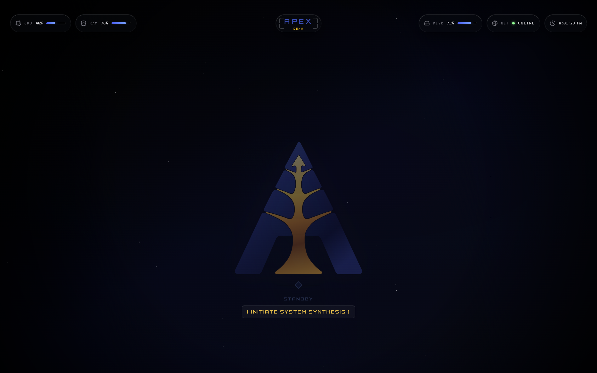
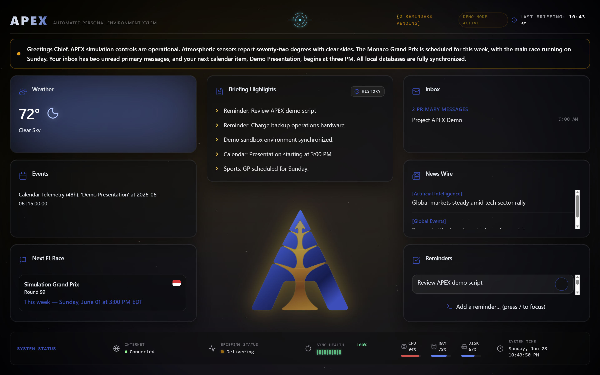

# APEX: Automated Personal Environment Xylem

A Python-based personal HUD that delivers a synchronized audio-visual briefing on demand. APEX evaluates the local environment, pulls live data from a set of configurable connectors, passes everything to Gemini 3.1 Flash Lite for synthesis, and reads the result aloud through a browser dashboard. It started as a personal utility and grew into a practical exercise in multi-threaded Python, FastAPI API design, React/TypeScript frontend engineering, and AI pipeline integration.

<p align="center">
  
</p>

<p align="center">
  <em>Dormant standby mode with centralized command trigger, reminder badge, parallax starfield, and live system diagnostics.</em>
</p>

---

## Architecture Overview

`launcher.py` starts a FastAPI server (port 8000) and a static file server (port 5500) as parallel child processes, polls the API health check, then opens the HUD in a kiosk browser window. The HUD starts in standby. An "INITIATE SYSTEM SYNTHESIS" button (or `Enter` key) fires `POST /api/v1/trigger`, which runs a four-stage pipeline while the frontend polls `/api/v1/status` at 500 ms to track progress and drive animations.

```
launcher.py → [uvicorn (8000) + http.server (5500)] → Browser (kiosk)
                          ↓
core/api.py → scanner.py → [Data Connectors] → brain.py → speaker.py
              (Gate)         (Collection)     (Synthesis)  (Delivery)
```

Full pipeline walkthrough, mermaid sequence diagram, component inventory, and data contracts are in [docs/architecture.md](docs/architecture.md).

---

## Interface Preview

<p align="center">
  
</p>

<p align="center">
  <em>Active briefing mode with synthesized output, live data modules, reminder controls, demo-mode telemetry, sync health, and system diagnostics rendered in the full HUD layout.</em>
</p>

---

## Features

- **Context-aware gate** — checks home Wi-Fi (SSID), AC power, and a 1-hour cooldown before any API call is made (`scanner.py`)
- **Live data connectors** — OpenWeatherMap, F1 schedule (Jolpica/Ergast with 24-hr file cache), FC Barcelona fixtures, GNews (AI + Global Events headlines), Gmail (unread primary inbox), Google Calendar (48-hr window)
- **AI briefing synthesis** — raw connector output passed to Gemini 3.1 Flash Lite; falls back to reading raw data if the API call fails
- **Config-driven persona and feature flags** — voice, tone, enabled connectors, and TTS engine set in `config.json` without touching code
- **Text-to-speech** — Google Cloud TTS primary with native pyttsx3 fallback; Kokoro ONNX available as an optional local engine that falls back to Google on failure; pre-warmed singletons, serialized `_SPEAK_LOCK`
- **Persistent reminders** — SQLite-backed reminder management with full create/dismiss lifecycle from the HUD
- **Real-time system diagnostics** — CPU, RAM, and disk polled at 1,000 ms and rendered as color-coded micro-bars in a six-column status footer; additional columns show internet connectivity, briefing lifecycle state, sync health, and live system time
- **Dormant ambient HUD mode** — idle state collapses peripheral data wings, expands the central command area, surfaces pending reminders, and animates the APEX logo with pipeline-driven color states and parallax background motion
- **Pipeline state visibility** — step, label, timestamp, and `is_speaking` exposed via `/api/v1/status` under a threading lock
- **Confidence scoring** — each production run produces a `confidence_score` (0–100) and `failed_connectors` list from connector output evaluation; displayed as a color-coded segmented block bar in the system status footer with a per-connector hover tooltip
- **Briefing history ledger** — every production briefing and its `DigestPayload` are persisted to SQLite; the last 50 records are accessible via `GET /api/v1/briefings/history` and viewable in a portal-mounted modal from the HUD
- **APEX assistant** — a conversational assistant with tool-calling access to live weather, F1 standings/calendar, Google Calendar, reminders, and briefing history; answered from an inline query bar or a slide-out chat drawer with six selectable performance profiles across two providers — cloud (Gemini: Comet, Nova, Pulsar) and local (Ollama: Lynx, Acinonyx, Neofelis)
- **Local Ollama inference** — optional on-device model execution for the APEX assistant with automatic model load/unload, a single-loaded-model policy, idle auto-unload, RAM/CPU resource gating per profile, and a manual unload control in the assistant drawer
- **Demo mode** — `DEMO_MODE=true` intercepts the trigger, runs a staged simulation with static mock telemetry, and displays a badge in the HUD; no external API calls are made
- **Atmospheric theming** — weather condition drives HUD background color, accent color, card glow, and condition icons in real time
- **Variable Typography Engine** — primary temperature font weight linearly interpolated from `font-weight: 300` (40°F) to `font-weight: 800` (90°F)

---

## Technology Stack

| Layer | Tool |
|---|---|
| Language | Python 3.10+ |
| API Framework | FastAPI, uvicorn |
| AI Engine (cloud) | Google GenAI SDK — Gemini 3.1 Flash Lite (briefing synthesis); Gemini 3.1 Flash Lite, Gemini 3 Flash (preview), Gemini 3.5 Flash (assistant reasoning tiers) |
| AI Engine (local) | Ollama — `qwen3:1.7b`, `qwen3:4b-instruct`, `qwen3:8b` (assistant local reasoning tiers) |
| Frontend | React, TypeScript, Vite, Tailwind CSS |
| Icons | lucide-react |
| Database | SQLite3 |
| TTS | Google Cloud TTS, pyttsx3, Kokoro ONNX (optional) |
| Key Libraries | `psutil`, `requests`, `python-dotenv`, `google-api-python-client`, `google-auth`, `google-auth-oauthlib`, `google-cloud-texttospeech`, `google-genai`, `pygame-ce`, `tzdata`, `kokoro-onnx`, `onnxruntime`, `numpy` |

---

## Environment Modes

Both flags are read from `.env`. Values are normalized at read time (`true`, `True`, `1` all resolve the same). Unset flags default to the values shown.

| Configuration | Wi-Fi + Power | Cooldown | Gemini | Gmail + Calendar | Logs Run |
|---|---|---|---|---|---|
| Production (`DEV_MODE=false`, `ENABLE_STARTUP_GATE=true`) | ✅ enforced | ✅ 1-hour | ✅ live | ✅ per config | ✅ yes |
| Gate off (`DEV_MODE=false`, `ENABLE_STARTUP_GATE=false`) | ⬜ bypassed | ⬜ bypassed | ✅ live | ✅ per config | ✅ yes |
| `DEV_MODE=true` | ⬜ bypassed | ⬜ bypassed | ⬜ depends on `DEV_AI_SYNTHESIS` | ⬜ fetched; content masked | ⬜ no |
| `DEMO_MODE=true` | ⬜ bypassed | ⬜ bypassed | ⬜ bypassed | ⬜ bypassed | ⬜ no |

`DEMO_MODE` intercepts the trigger entirely and serves static mock telemetry from `core/mock/telemetry.json`. It does not run any connectors or write to the database. `DEV_MODE` and `DEMO_MODE` are independent flags; `DEMO_MODE` takes priority in the trigger path when both are set.

Two keys are only read when `DEV_MODE=true`: `DEV_AI_SYNTHESIS` (`raw` default, `slm` placeholder, `llm` routes to live Gemini) and `DEV_TTS_PLAYBACK` (`pyttsx3` default, `google`, `kokoro`). `DEMO_TTS` is only read when `DEMO_MODE=true` and sets the TTS engine for the demo path (`pyttsx3`, `google`, or `kokoro`).

---

## Feature Toggles

Individual connectors are switched on or off in `config.json`. When a connector is off, no API call or auth attempt is made, and the module is excluded from the Gemini context.

```json
{
  "features":    { "weather": true, "sports": true, "news": true, "email": false, "calendar": false },
  "modules":     { "f1": true, "football": false },
  "tts_settings": { "primary_tts": "google", "voice_gender": "female" },
  "system_prompt": "You are APEX. Deliver a concise briefing in under 75 words. No emojis or markdown.",
  "agent_system_prompt": "You are APEX, a cloud-powered agent assisting Chief with operations.",
  "local_agent_system_prompt": "You are APEX, a local operations assistant assisting Chief with operations.",
  "ask_apex": { "enabled": true, "default_cloud_profile": "comet", "max_session_messages": 6 },
  "gemini": { "agent_max_turns": 3, "agent_max_tool_calls": 4 },
  "ollama": {
    "enabled": true,
    "host": "http://localhost:11434",
    "idle_unload_timeout_minutes": 5,
    "single_loaded_model": true,
    "manual_unload_enabled": true,
    "resource_gates": {
      "lynx": { "ram_limit": 88.0, "cpu_limit": 95.0 },
      "acinonyx": { "ram_limit": 78.0, "cpu_limit": 90.0 },
      "neofelis": { "ram_limit": 68.0, "cpu_limit": 85.0 }
    }
  }
}
```

`modules.football` ships disabled; enable it when `FOOTBALL_API_KEY` is set. `primary_tts` accepts `"google"`, `"pyttsx3"`, or `"kokoro"`. `voice_gender` accepts `"male"` or `"female"`. If `config.json` is missing or malformed, all feature flags default to `false` and `system_prompt` falls back to a neutral placeholder.

`agent_system_prompt` sets the cloud APEX assistant persona; `local_agent_system_prompt` sets the equivalent persona for local Ollama profiles. Both are independent of the briefing `system_prompt`. `ask_apex.enabled` toggles the post-briefing assistant interface and assistant drawer off entirely (`POST /api/v1/agent/query` returns `403` when disabled); `default_cloud_profile` accepts `"comet"`, `"nova"`, or `"pulsar"`; `max_session_messages` (2–20) bounds the client-held chat history. `gemini.agent_max_turns` (1–5) and `gemini.agent_max_tool_calls` (1–10) cap the assistant tool-calling loop per query for both cloud and local profiles. See [docs/api.md](docs/api.md) for the full agent query contract.

`ollama.enabled` toggles local inference off entirely (local profiles report `disabled` in the HUD and `POST /api/v1/agent/query` returns `503` for a local profile). `ollama.host` points at the Ollama daemon's HTTP address. `ollama.idle_unload_timeout_minutes` (1–60) sets how long an unused local model stays loaded before automatic unload. `ollama.manual_unload_enabled` toggles the manual "Unload" control in the assistant drawer. `ollama.resource_gates.{lynx,acinonyx,neofelis}` set the RAM/CPU utilization percentage thresholds (0–100) above which a *cold* load of that profile is blocked; a model already loaded is unaffected by these limits. See [Local Agent Profiles](docs/architecture.md#local-agent-profiles) for the full per-profile defaults.

---

## Setup

**1. Clone**
```bash
git clone https://github.com/edumarcano/apex.git
cd apex
```

**2. Install Python dependencies**
```bash
pip install -r requirements.txt
```

**3. Install and build the frontend**
```bash
cd frontend
npm install
npm run build
cd ..
```

**4. Configure environment variables**

Copy the template and fill in your values:
```bash
cp .env.example .env          # macOS / Linux
copy .env.example .env        # Windows
```

`.env.example` documents every key with inline comments. Required keys: `GEMINI_API_KEY`, `OPENWEATHER_API_KEY`, `GNEWS_API_KEY`, `HOME_SSID`. `GOOGLE_APPLICATION_CREDENTIALS` takes the **absolute file path** to `service_account.json`, not the file contents. `CUSTOM_BROWSER_PATH` points the launcher at a specific browser executable (Brave, Vivaldi, etc.); Chrome and Edge are checked by default.

**5. Set up Google OAuth credentials (Gmail + Calendar)**

- Enable the Gmail API and Google Calendar API in Google Cloud Console.
- Create an OAuth client ID for a desktop application and download it as `credentials.json`.
- Place `credentials.json` in the project root.
- On first run the OAuth flow opens in the browser and writes `token.json` automatically. If you later change API scopes, delete `token.json` to force re-authentication.

**6. Set up Google Cloud TTS**

- Enable the Cloud Text-to-Speech API in Google Cloud Console.
- Create a service account, grant it the `Cloud Text-to-Speech User` role, and download the JSON key.
- Save the key as `service_account.json` in the project root (gitignored).
- Set `GOOGLE_APPLICATION_CREDENTIALS` in `.env` to its absolute path.

**7. (Optional) Set up Local Neural Voices (Kokoro ONNX)**

APEX supports offline speech synthesis using local Kokoro ONNX model weights. To use this engine, place the required files in the gitignored folder as follows:
- **Kokoro ONNX**:
  - Save the ONNX model files inside `core/weights/kokoro/`.
  - Required files: `kokoro-v1.0.onnx` and `voices-v1.0.bin` (available from the Kokoro ONNX releases).

**8. (Optional) Set up local Ollama models for the APEX assistant**

The APEX assistant can run entirely on-device instead of calling Gemini. To enable the local Lynx, Acinonyx, and Neofelis profiles:
- Install [Ollama](https://ollama.com) and start the daemon.
- Pull the model tags used by the profiles you want available:
  ```bash
  ollama pull qwen3:1.7b          # Lynx (lightweight)
  ollama pull qwen3:4b-instruct   # Acinonyx (balanced)
  ollama pull qwen3:8b            # Neofelis (heavy)
  ```
- No `.env` keys are required for local inference. `config.json` `ollama.host` defaults to `http://localhost:11434`; change it only if Ollama runs on a different host or port.
- A profile whose model tag isn't installed reports `model_not_installed` in the HUD's profile selector rather than failing a query. Set `ollama.enabled: false` in `config.json` to hide local profiles entirely.

**9. (Optional) Customize persona and connectors**

Edit `config.json` to change the briefing voice, toggle connectors, or switch TTS engine. See [Feature Toggles](#feature-toggles) above. API keys for disabled connectors are not required.

**10. (Optional) Dev and demo overrides**

Set `DEV_MODE=true` in `.env` for local development. The scanner gate, run logging, and (by default) Gemini synthesis are bypassed. Gmail and Calendar connectors still make live OAuth-authenticated requests; returned content is masked to `[HIDDEN]`. Set `DEMO_MODE=true` for a fully offline simulation using static mock telemetry. See [Environment Modes](#environment-modes) above.

---

## Running

**Recommended — full orchestrator:**
```bash
python launcher.py
```
Starts both servers, polls the health check, opens the HUD in a kiosk window. Closing the window shuts down uvicorn automatically. `Ctrl+C` also works.

**Manual — two terminals:**
```bash
# Terminal 1 — API server
python -m uvicorn core.api:app --reload

# Terminal 2 — static file server
python -m http.server 5500 --directory dist
```
Then open `http://127.0.0.1:5500`. Run both commands from the project root.

---

## Deployment

`launch_apex.bat` in the project root runs `launcher.py` and holds the terminal window open on exit so errors are visible:
```powershell
.\launch_apex.bat
```

**Desktop shortcut (Windows):** right-click `launch_apex.bat` → Create shortcut → open shortcut Properties → set **Start in** to the full project path (e.g., `C:\Users\you\Documents\APEX`). Without this field, `launcher.py` cannot resolve its relative paths and the run fails immediately.

---

## Project Planning

Active development is tracked on [GitHub Projects](https://github.com/edumarcano/apex/projects).

Long-term architecture planning and milestone progression are documented in [roadmap.md](docs/roadmap.md).

Full version history is available in [CHANGELOG.md](CHANGELOG.md).

---

## Documentation

| File | Contents |
|---|---|
| [docs/architecture.md](docs/architecture.md) | Pipeline internals, component inventory, data contracts, F1 cache, theming systems, project structure |
| [docs/api.md](docs/api.md) | All API endpoints, request/response schemas, Pydantic models, environment variables |
| [docs/decisions.md](docs/decisions.md) | Engineering rationale, TTS selection history, AI workflow, design trade-offs |
| [docs/roadmap.md](docs/roadmap.md) | Milestone history, current phase, planned platform evolution |
