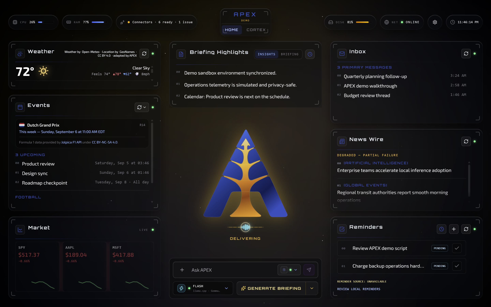
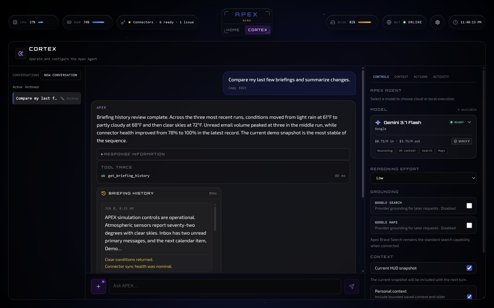
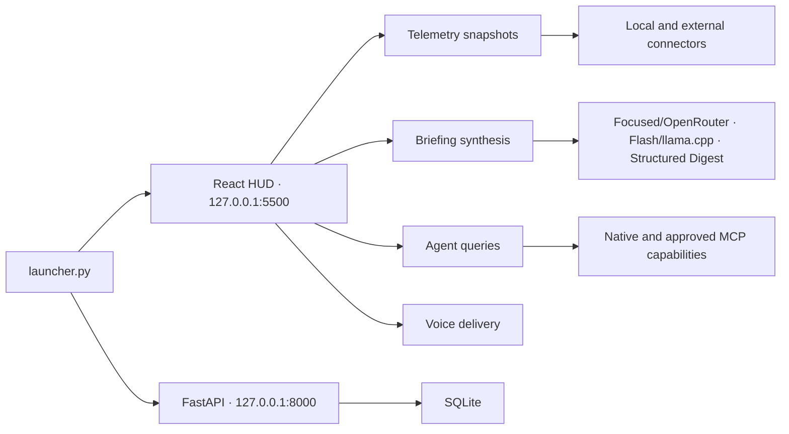

# APEX: Automated Personal Environment Xylem

<p align="center">
  
</p>

APEX started as a small, fun experiment: could I build something that gave me a spoken daily briefing with a little of the Jarvis feeling from *Iron Man*? As it grew, it became a playground for a new interest in AI tools and software development, a place to experiment, learn, and find out what I could actually build.

Today, it is a local-first operational HUD that brings weather, schedules, reminders, news, markets, system health, and Apex Agent work into one deliberate workspace. It turns those signals into Home telemetry, concise briefings, and Agent queries while keeping the local machine, not a hosted account, at the center of the system.

APEX has two main workspaces: Home, which shows telemetry and briefings, and Cortex, which is the workspace for interacting directly with Apex Agent. Telemetry means structured status collected from connected services; a briefing summarizes that status; and an Agent query is a request sent to the selected model through Apex Agent.

<p align="center">
  
</p>

<p align="center">
  <em>The Home workspace delivering a briefing with static, non-personal demo telemetry.</em>
</p>

## What APEX does

### Builds a live Home workspace

APEX collects enabled weather, calendar, inbox, news, sports, reminder, and market signals into typed telemetry. Each connector reports its own freshness and health, so missing data is visible rather than hidden inside generated prose.

### Produces briefings on user-defined terms

A briefing uses Flash, Focused, or Structured. Flash uses a fixed local Gemma E2B route for immediate orientation; Focused uses the fixed OpenRouter DeepSeek V4 Flash route with High reasoning; Structured renders facts without a model. Focused falls back through Flash and then Structured. All routes derive from one bounded fact snapshot, and a provider failure ends in a useful deterministic result instead of a blank screen.

### Operates Apex Agents

Agent queries can use approved read tools for live data, briefing history, Gmail, Microsoft To Do, and optional MCP (Model Context Protocol) providers. Reads run directly. Supported native writes create action proposals that require local approval and verification before they are considered complete.

After a Microsoft To Do list is selected, its incomplete tasks become the Home reminder source. SQLite keeps a small cache for stale display and an offline queue for local reminders that still need to sync. The Home Reminders panel can edit, complete, delete, reopen, and review completed tasks directly without adding the Agent approval step. Apex Agent uses one Tools selector; cloud and local model defaults remain runtime-scoped, while policy and MCP permissions remain separate boundaries.

<p align="center">
  
</p>

<p align="center">
  <em>The Cortex workspace using an Apex Agent to review persisted briefing history, with conversation, model, tool, and personal context controls available alongside the chat.</em>
</p>

### Keeps runtime control visible

The HUD exposes connector health, CPU and memory use, active model state, briefing mode, voice delivery, preflight warnings, and machine-local settings. Activation, telemetry refresh, briefing generation, Agent requests, and speech are separate operations rather than one mandatory pipeline.

## Engineering highlights

- **Local-first:** FastAPI, the React HUD, SQLite, runtime settings, and the default Ollama endpoint stay on the machine and bind to loopback.
- **Independent features:** Telemetry, briefing generation, Agent work, and voice delivery can fail independently instead of taking the whole HUD down.
- **Safer model input:** Connectors produce structured results, and briefing models receive only selected facts marked as untrusted data.
- **Three briefing modes:** Flash is the default local Gemma orientation, Focused is OpenRouter DeepSeek V4 Flash planning, and Structured is a model-free deterministic view.
- **One local model at a time:** APEX avoids hidden local-inference queues and keeps model loading visible.
- **Local storage:** SQLite keeps briefing history, the reminder cache and offline queue, the durable action ledger, and Cortex conversation trees with response metadata. Reloading APEX restores the active conversation branch and its per-conversation Agent/tool preferences.
- **Visible failures:** Readiness checks, connector health, stable errors, run IDs, and preflight warnings make degraded states easier to understand.
- **Credential isolation:** The backend receives credentials; the static server and browser receive a restricted child environment.

## Architecture at a glance


```mermaid
flowchart LR
    L["launcher.py"] --> API["FastAPI · 127.0.0.1:8000"]
    L --> HUD["React HUD · 127.0.0.1:5500"]
    HUD --> T["Telemetry snapshots"]
    HUD --> B["Briefing synthesis"]
    HUD --> A["Agent queries"]
    HUD --> V["Voice delivery"]
    T --> C["Local and external connectors"]
    B --> M["Focused/OpenRouter · Flash/llama.cpp · Structured Digest"]
    A --> P["Native and approved MCP capabilities"]
    API --> DB["SQLite"]
```

The browser owns the interactive session. FastAPI owns connector access, runtime coordination, model and tool execution, speech, and persistence. See the [architecture reference](docs/architecture.md) for the full system model and failure behavior.

## Technology

| Layer | Current stack |
|---|---|
| Backend | Python 3.14, FastAPI, Pydantic, uvicorn |
| Frontend | React 19, TypeScript 6, Vite 8, Tailwind CSS 4 |
| Persistence | SQLite |
| Cloud reasoning | Apex Agent through OpenAI, OpenRouter, Google, or SpaceXAI; see Configuration for current model IDs |
| Local model infrastructure | Apex Agent through Ollama development models or llama.cpp with Gemma and Qwen options |
| Voice | Google Cloud TTS, pyttsx3, optional Kokoro ONNX |
| Tool integrations | Native connectors plus allowlisted MCP clients |
| Validation | unittest, Vitest, ESLint, TypeScript, Vite build |

## Try it safely

The quickest evaluation path uses static demo data and needs no external credentials:

```powershell
copy .env.example .env
# Set DEMO_MODE=true in .env

uv sync --locked
cd frontend
npm ci
npm run build
cd ..
uv run python launcher.py
```

Demo mode bypasses live connectors and model calls, does not write briefing history, and uses the configured demo voice path. For the complete Windows setup, optional providers, manual launch commands, and troubleshooting, see [Getting Started](docs/getting-started.md).

## Use APEX without the HUD

When the backend is already running, the included CLI can inspect APEX, run one Agent turn, generate a briefing, and review or resolve durable actions:

```powershell
uv run apex status
uv run apex models
uv run apex ask "What needs my attention?" --profile personal_ops
uv run apex briefing --mode structured
uv run apex actions list
```

The CLI talks only to APEX's loopback API at `127.0.0.1:8000`; it does not start the backend or provide remote access. See the [CLI reference](docs/cli.md) for the full command list and action behavior.

## Local trust boundary

APEX is local-first, not fully offline. Enabled connectors and selected cloud model or speech providers receive the data required for their operation. The API has no authentication and intentionally binds only to `127.0.0.1`; CORS is not an access-control boundary.

Use Flash or Structured to avoid sending briefing data to a cloud model provider. Review [Privacy and Data Boundaries](docs/privacy.md) before enabling personal connectors or cloud processing.

## Documentation

| Document | Its one job |
|---|---|
| [Getting Started](docs/getting-started.md) | Install APEX, run a safe demo, launch the full system, and resolve common startup problems |
| [Configuration](docs/configuration.md) | Configure modes, settings, credentials, connectors, models, speech, and MCP providers |
| [Architecture](docs/architecture.md) | Understand processes, runtime paths, state ownership, data boundaries, concurrency, and failure behavior |
| [API](docs/api.md) | Use the public HTTP workflows and understand their behavioral contracts |
| [CLI](docs/cli.md) | Use the running local backend from a terminal without duplicating backend logic |
| [Engineering Decisions](docs/decisions.md) | Understand why important technical choices and trade-offs were made |
| [Identity and Naming](docs/identity-and-naming.md) | Understand the APEX name, logo symbolism, product vocabulary, and Apex Agent |
| [Privacy](docs/privacy.md) | See what stays local, what can leave the machine, and what is persisted |
| [Design System](docs/design-system.md) | Preserve the HUD's visual language, state semantics, responsiveness, and accessibility |
| [Roadmap](docs/roadmap.md) | Follow APEX's product and architectural evolution and its planned direction |
| [Changelog](CHANGELOG.md) | Review the detailed record of released changes |
| [Frontend Guide](frontend/README.md) | Work specifically in the React/TypeScript application |
| [Local Model Benchmarking](benchmarks/README.md) | Compare local models and one-off llama.cpp candidates with the developer benchmark utility |

Run the documentation consistency check after editing public docs:

```powershell
uv run python scripts/check_docs.py
```

APEX is a personal project. Local constraints, privacy boundaries, failure behavior, and the HUD's visual language are part of how I want the system to work, not afterthoughts.

## License

APEX is licensed under the [MIT License](LICENSE). Third-party software notices are listed in [THIRD_PARTY_NOTICES.md](THIRD_PARTY_NOTICES.md).
