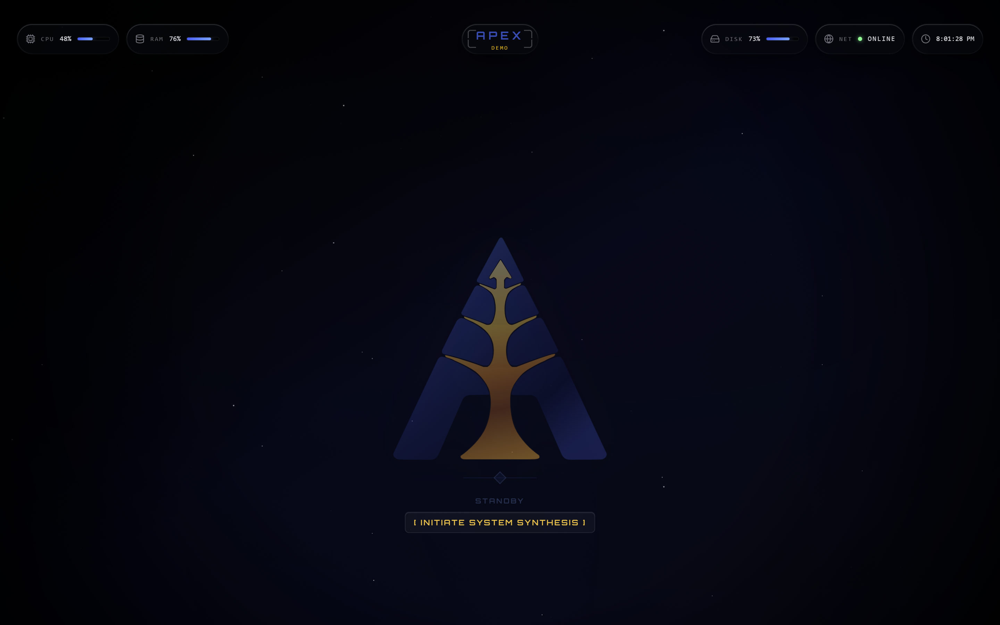
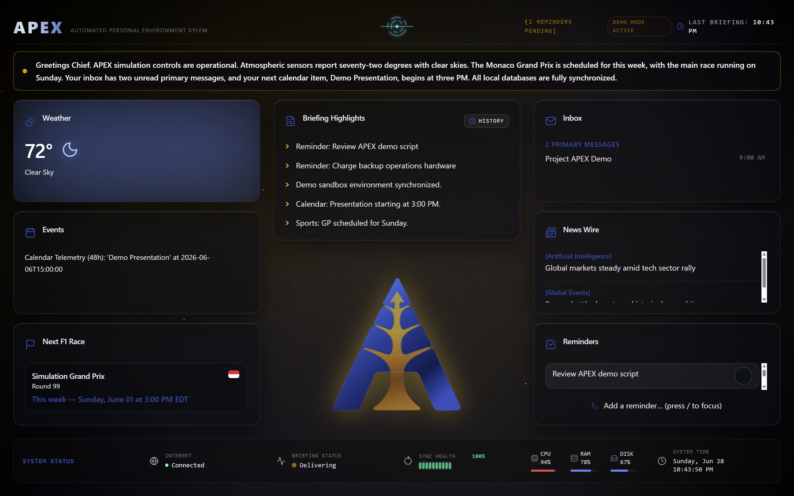
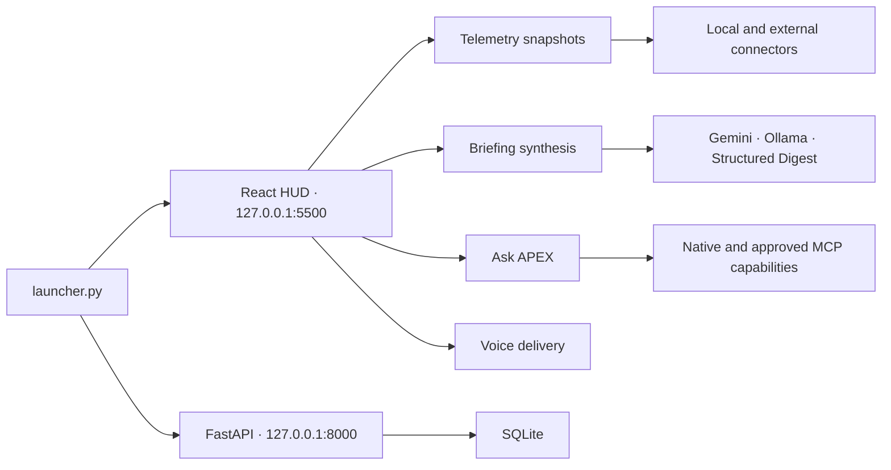

# APEX: Automated Personal Environment Xylem

APEX started as a small, fun experiment: could I build something that gave me a spoken daily briefing with a little of the Jarvis feeling from *Iron Man*? As it grew, it became a playground for a new interest in AI tools and software development, a place to experiment, learn, and find out what I could actually build.

Today, it is a local-first operational HUD that brings weather, schedules, reminders, news, markets, system health, and Apex Agent work into one deliberate workspace. It turns those signals into Home telemetry, concise briefings, and Ask APEX while keeping the local machine, not a hosted account, at the center of the system.

<p align="center">
  
</p>

<p align="center">
  <em>Standby keeps the interface quiet until I choose to load the overview or begin with a briefing.</em>
</p>

## What APEX does

### Builds a live personal overview

APEX collects enabled weather, calendar, inbox, news, sports, reminder, and market signals into typed telemetry. Each connector reports its own freshness and health, so missing data is visible rather than hidden inside generated prose.

### Produces briefings on my terms

A briefing can use Panthera through OpenAI, Mus or Sorex through Ollama, or a deterministic Structured Digest. All routes receive the same sanitized, size-bounded facts; a provider failure ends in a useful model-free result instead of a blank screen.

### Operates Apex Agents

Ask APEX can direct Apex Agents to query approved read-only capabilities for live data, briefing history, Gmail, Microsoft To Do, and optional MCP providers. Cloud and local Agents share one provider-neutral capability layer, while local commands remain explicitly scoped per request.

### Keeps runtime control visible

The HUD exposes connector health, CPU and memory use, active model state, briefing mode, voice delivery, preflight warnings, and machine-local settings. Activation, telemetry refresh, briefing synthesis, assistant queries, and speech are independent operations rather than one mandatory pipeline.

<p align="center">
  
</p>

<p align="center">
  <em>An activated demo overview using static, non-personal telemetry.</em>
</p>

## Engineering highlights

- **Local-first boundary** — FastAPI, the React HUD, SQLite, runtime settings, and the default Ollama endpoint stay on the machine and bind to loopback.
- **Independent runtime paths** — telemetry, briefing generation, assistant work, and voice delivery can succeed or fail without taking the entire HUD down.
- **Typed trust boundary** — connectors produce structured results; models receive only selected, sanitized facts marked as untrusted data.
- **Cloud, local, and deterministic execution** — Gemini and Ollama are optional strategies, with Structured Digest as the final model-free fallback.
- **Explicit concurrency controls** — briefing execution, local inference, speech, settings writes, and telemetry refreshes use bounded ownership rather than silent queues.
- **Durable personal state** — SQLite persists reminders and the last 50 production briefings, while browser-held assistant conversations disappear on reload.
- **Inspectable failure behavior** — readiness probes, connector health, stable error categories, run IDs, and advisory preflight keep degraded states understandable.
- **Privacy-aware process isolation** — the backend receives credentials; the static server and browser receive a restricted child environment.

## Architecture at a glance


```mermaid
flowchart LR
    L["launcher.py"] --> API["FastAPI · 127.0.0.1:8000"]
    L --> HUD["React HUD · 127.0.0.1:5500"]
    HUD --> T["Telemetry snapshots"]
    HUD --> B["Briefing synthesis"]
    HUD --> A["Ask APEX"]
    HUD --> V["Voice delivery"]
    T --> C["Local and external connectors"]
    B --> M["Gemini · Ollama · Structured Digest"]
    A --> P["Native and approved MCP capabilities"]
    API --> DB["SQLite"]
```

The browser owns the interactive session. FastAPI owns connector access, runtime coordination, model/provider boundaries, speech, and persistence. See the [architecture reference](docs/architecture.md) for the state owners, request flows, and failure model.

## Technology

| Layer | Current stack |
|---|---|
| Backend | Python 3.14, FastAPI, Pydantic, uvicorn |
| Frontend | React 19, TypeScript 6, Vite 8, Tailwind CSS 4 |
| Persistence | SQLite |
| Cloud reasoning | Gemini 3.5 Flash Lite, Gemini 3.5 Flash, Gemini 3.6 Flash |
| Local reasoning | Ollama with Qwen3 profiles |
| Voice | Google Cloud TTS, pyttsx3, optional Kokoro ONNX |
| Tool integrations | Native connectors plus allowlisted MCP clients |
| Validation | unittest, Vitest, ESLint, TypeScript, Vite build |

## Try it safely

The quickest evaluation path uses static demo data and needs no external credentials:

```powershell
copy .env.example .env
# Set DEMO_MODE=true in .env

uv sync --locked
cd frontend
npm ci
npm run build
cd ..
uv run python launcher.py
```

Demo mode bypasses live connectors and model calls, does not write briefing history, and uses the configured demo voice path. For the complete Windows setup, optional providers, manual launch commands, and troubleshooting, see [Getting Started](docs/getting-started.md).

## Local trust boundary

APEX is local-first, not fully offline. Enabled connectors and selected cloud model or speech providers receive the data required for their operation. The API has no authentication and intentionally binds only to `127.0.0.1`; CORS is not an access-control boundary.

Use a local Ollama briefing mode or Structured Digest to avoid OpenAI disclosure for briefing synthesis. Review [Privacy and Data Boundaries](docs/privacy.md) before enabling personal connectors or cloud processing.

## Documentation

| Document | Its one job |
|---|---|
| [Getting Started](docs/getting-started.md) | Install APEX, run a safe demo, launch the full system, and resolve common startup problems |
| [Configuration](docs/configuration.md) | Configure modes, settings, credentials, connectors, models, speech, and MCP providers |
| [Architecture](docs/architecture.md) | Understand processes, runtime paths, state ownership, data boundaries, concurrency, and failure behavior |
| [API](docs/api.md) | Use the public HTTP workflows and understand their behavioral contracts |
| [Engineering Decisions](docs/decisions.md) | Understand why important technical choices and trade-offs were made |
| [Privacy](docs/privacy.md) | See what stays local, what can leave the machine, and what is persisted |
| [Design System](docs/design-system.md) | Preserve the HUD's visual language, state semantics, responsiveness, and accessibility |
| [Roadmap](docs/roadmap.md) | Follow APEX's product and architectural evolution and its planned direction |
| [Changelog](CHANGELOG.md) | Review the detailed record of released changes |
| [Frontend Guide](frontend/README.md) | Work specifically in the React/TypeScript application |

Run the documentation consistency check after editing public docs:

```powershell
uv run python scripts/check_docs.py
```

APEX is a personal project, but the engineering is intentionally explicit: local constraints, privacy boundaries, failure modes, and visual behavior are part of the product rather than afterthoughts.
