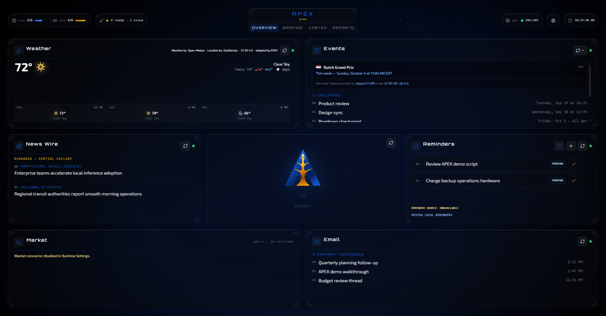
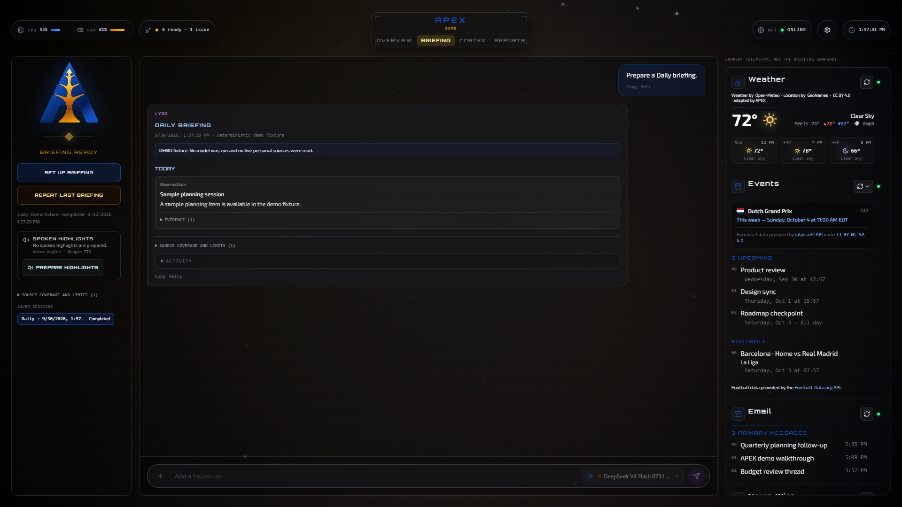
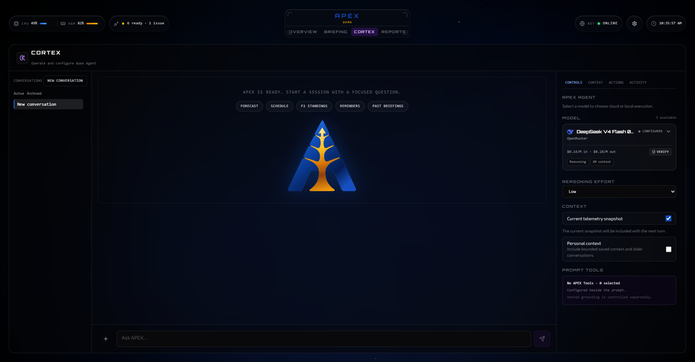
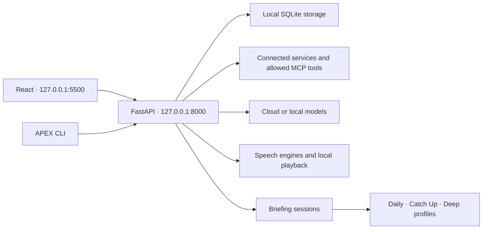

# APEX

<p align="center">
  
</p>

APEX is a local-first personal intelligence workspace. It brings schedules, reminders, weather, markets, email, and personal context together so you can check what needs attention, prepare a briefing, and follow up with an assistant that can use your connected services.

The application runs on your machine and stores its history locally. You choose which services to connect and whether to use a cloud or local model. Collection, briefing generation, conversations, and speech are separate operations, with their status and failures visible in the interface.

APEX began as a small experiment in spoken daily briefings, inspired by the Jarvis feeling from *Iron Man*. It remains a personal project and a place for me to learn and experiment with software development using AI tools.

## Find your way around

APEX opens on Launch, with access to four workspaces:

| Workspace | Use it to |
|---|---|
| **Overview** | Collect status from connected services, check freshness and connector health, and manage reminders |
| **Briefing** | Generate Daily, Catch Up, or Deep briefings, revisit saved sessions, and prepare spoken highlights |
| **Cortex** | Talk with the APEX Agent, choose its model and tools, review actions, and manage personal context |
| **Reports** | Read work reports submitted by outside tools and review findings that might belong in personal context |

<p align="center">
  
</p>

<p align="center">
  <em>Overview after collecting demo telemetry, with four equal side cards and a central Weather and identity column.</em>
</p>

## Try the demo

The demo uses static data and needs no connector or model credentials. The validated development baseline is Windows with Python 3.14, uv, Node.js 24, and npm. Start from the repository root. If you do not already have a `.env` file, copy the example:

```powershell
copy .env.example .env
```

Set `DEMO_MODE=true` in `.env`, then install and launch:

```powershell
uv sync --locked
cd frontend
npm ci
npm run build
cd ..
uv run python launcher.py
```

Demo mode skips live connectors and model calls. It provides fixed Daily and Catch Up briefings and deterministic Agent responses; Deep is unavailable. Demo history is held in memory and resets when the process stops. Optional speech uses the configured demo voice engine.

See [Getting Started](docs/getting-started.md) for prerequisites, live setup, development servers, and troubleshooting.

## Everyday workflows

### Check connected services and manage reminders

In Overview, choose **Collect Telemetry** to check readiness and collect status from enabled services. Opening the workspace does not start collection. Telemetry provides the status behind Weather, Events, Email, Market, and Reminders. Each connector reports its health and freshness, including unavailable or stale data. You can refresh individual connectors or use **Refresh All** after collection.

Selecting a Microsoft To Do list makes its incomplete tasks the Overview reminder source. The Reminders panel lets you edit, complete, delete, reopen, and inspect completed tasks directly. A local cache supports stale display, and an offline queue retains local reminders awaiting synchronization.

### Prepare a briefing and follow up

Briefing offers three profiles:

- **Daily** gives an orientation from current sources.
- **Catch Up** compares current sources with previously presented briefing evidence. When comparable sources show no material changes, it saves a no-change result without calling a model.
- **Deep** can investigate with a limited set of read-only tools before producing the briefing.

Each completed session saves the briefing and its supporting evidence locally, with a linked Cortex conversation for follow-up. APEX uses your selected model and does not silently switch to another if it is unavailable.

You can also prepare spoken highlights from a saved briefing, then play them on your machine. Preparation uses the saved briefing as its source; replay uses stored audio. These controls do not speak automatically.

<p align="center">
  
</p>

<p align="center">
  <em>A saved Daily demo briefing and its linked conversation.</em>
</p>

### Work with the APEX Agent

The **APEX Agent**, named **Lynx** by default, is the assistant shared across Overview, Briefing, and Cortex. Choosing a model changes how that same Agent runs. Cortex provides its full conversation workspace, with model, reasoning, context, and tool controls.

Enabled read tools can access connected services, briefing history, and personal context. Optional MCP (Model Context Protocol) integrations add explicitly allowed capabilities. Reads run directly within the configured permissions. Supported native write tools create action proposals that require local approval and verification before the Agent can treat them as complete.

<p align="center">
  
</p>

<p align="center">
  <em>Cortex conversation controls, including the selected model's availability.</em>
</p>

### Keep personal context reviewable

Cortex keeps personal-context records alongside their original evidence and change history. Clear input you provide can be saved or corrected directly. Sensitive, conflicting, or model-interpreted changes wait for review. The Records and Review views let you inspect the evidence before accepting or rejecting a proposal; pending proposals stay outside trusted retrieval.

The **Context vault** can export selected records as linked Markdown notes for Obsidian or other tools. Export starts disabled, and Cortex requires a preview before enabling a scope or broadening what it shares. APEX retains the source records and manages the exported copies. If you sync those notes through Google Drive or another service, that service controls the external copies. See the [Context Vault guide](docs/context-vault.md) for selection, sharing, and cleanup.

### Review reports from outside tools

Local tools can submit work reports through the CLI, JSON or Markdown import, a configured report folder, or an optional local HTTP and MCP gateway. Reports preserves the submitted content and lets you mark each report new, reviewed, or dismissed.

You can propose a finding as personal context, but it enters trusted retrieval only after its linked review is accepted. Relevant report excerpts may also be used as explicitly untrusted briefing evidence. See [Configuration](docs/configuration.md#external-activity-intake) for intake options and [Privacy](docs/privacy.md#external-activity-reports) for how reports are used.

## What stays local

APEX stores conversations, briefings and their evidence, prepared briefing audio, personal context, reports, and action history in local SQLite storage. Settings are local too. Personal-context retrieval is disabled by default for both cloud and local models.

Enabled connectors contact their services, and cloud model requests send the prompt, history, evidence, and tool results allowed for that operation. Selecting a local model keeps inference on the configured llama.cpp endpoint. Speech has its own boundary: Google Cloud TTS receives spoken text, while pyttsx3 and Kokoro run locally. Review [Privacy and Data Boundaries](docs/privacy.md) before enabling personal connectors, cloud processing, or context export.

The launcher serves the interface at `127.0.0.1:5500` and the API at `127.0.0.1:8000`. The API has no authentication and is intended for local use; CORS is not an access-control boundary. The launcher limits the environment variables passed to the frontend server and browser processes.

## Use APEX from a terminal

With the backend running, the CLI can inspect status, ask the Agent a question, generate a briefing, and review stored context, reports, and actions:

```powershell
uv run apex status
uv run apex ask "What needs my attention?"
uv run apex briefing --profile catch-up
uv run apex actions list
```

The CLI talks only to the local API and does not start the backend. See the [CLI reference](docs/cli.md) for all commands and examples.

## How it runs

The React interface handles presentation and interaction. FastAPI coordinates connectors, model and tool execution, speech, and persistence. The Cortex Engine runs bounded Agent turns, and local generation is limited to one request at a time, with model loading visible in the interface.


```mermaid
flowchart LR
    UI["React · 127.0.0.1:5500"] --> API["FastAPI · 127.0.0.1:8000"]
    CLI["APEX CLI"] --> API
    API --> DB["Local SQLite storage"]
    API --> C["Connected services and allowed MCP tools"]
    API --> P["Cloud or local models"]
    API --> V["Speech engines and local playback"]
    API --> B["Briefing sessions"]
    B --> M["Daily · Catch Up · Deep profiles"]
```

The backend uses Python 3.14, FastAPI, and Pydantic. The frontend uses React 19, TypeScript 6, Vite 8, and Tailwind CSS 4. Cloud model support includes Google and OpenRouter; local inference uses llama.cpp. See [Configuration](docs/configuration.md) for supported models and optional dependencies, and [Architecture](docs/architecture.md) for runtime ownership and failure behavior.

## Documentation

| Start here | Reference |
|---|---|
| Install and run | [Getting Started](docs/getting-started.md) |
| Choose services, models, and settings | [Configuration](docs/configuration.md) |
| Understand storage and data sharing | [Privacy](docs/privacy.md), [Context Vault](docs/context-vault.md) |
| Use APEX from other tools | [CLI](docs/cli.md), [API](docs/api.md) |
| Understand the implementation | [Architecture](docs/architecture.md), [Engineering Decisions](docs/decisions.md) |
| Work on the interface | [Frontend Guide](frontend/README.md), [Design System](docs/design-system.md) |
| Configure speech or compare local models | [Speech Runtime](docs/speech-runtime.md), [Local Model Benchmarking](benchmarks/README.md) |
| Understand APEX's identity and development | [Identity and Naming](docs/identity-and-naming.md), [Roadmap](docs/roadmap.md), [Changelog](CHANGELOG.md) |

## License

APEX is licensed under the [MIT License](LICENSE). Third-party software notices are listed in [THIRD_PARTY_NOTICES.md](THIRD_PARTY_NOTICES.md).
