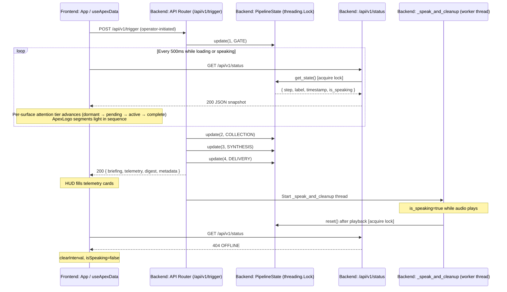
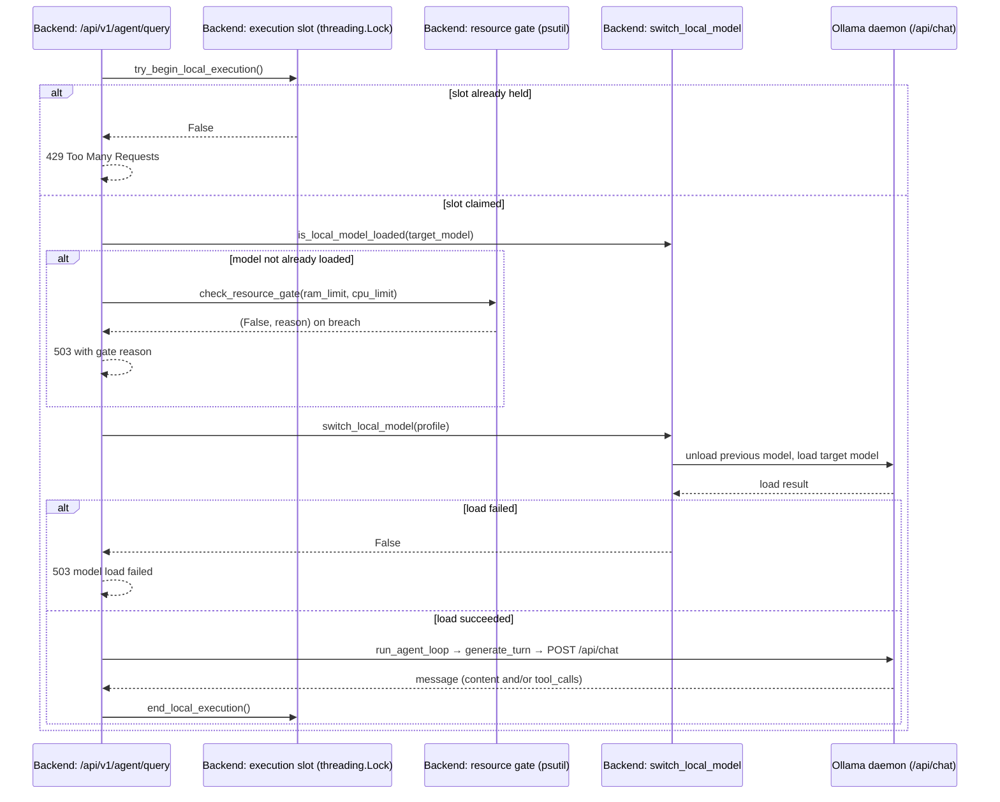

# APEX Architecture

---

## Pipeline Overview

`launcher.py` is the entry point for a full local session. It starts uvicorn and `http.server` as parallel child processes, then polls `GET /` on the API up to 30 times at 500 ms intervals. The browser kiosk window opens only after that health check returns `200`. When the browser window closes, `launcher.py` detects the exit and terminates uvicorn. `atexit` hooks and signal handlers are registered for `Ctrl+C` and `SIGTERM`.

With both servers up, `api.py` listens on `127.0.0.1:8000`. A `POST /api/v1/trigger` runs a four-stage pipeline:

1. **Gate** — `scanner.py` checks home Wi-Fi by SSID, AC power, and a 1-hour cooldown. If any check fails the request is rejected with `403` and nothing runs.
2. **Collection** — each enabled connector fetches its feed in sequence. Disabled connectors are skipped with no API call made.
3. **Synthesis** — raw outputs are joined into a pipe-delimited string and passed to Gemini 3.1 Flash Lite. `brain.py` prepends the persona prompt from `config.json`. A filler phrase plays on a background thread while the model processes. The model response is parsed for `===SPEECH===` and `===INSIGHTS===` markers; the speech section becomes the TTS briefing and the insights section yields structured bullet strings. If the Gemini call fails, the raw data string is returned as the briefing with a single fallback insight.
4. **Delivery** — connector outputs are evaluated for trust, producing a `DigestPayload` with a `confidence_score` and `failed_connectors` list. The trigger endpoint returns the briefing text, telemetry, digest, and metadata as JSON. On production runs, `_speak_and_cleanup` persists the briefing and digest to the SQLite `briefings` ledger before starting TTS playback. `global_pipeline_state.reset()` is called inside that thread after playback finishes, keeping `/api/v1/status` active with `is_speaking: true` for the full duration audio plays.

With `DEV_MODE=true`, the scanner bypasses hardware and cooldown gates and run logging. Gemini synthesis is bypassed unless `DEV_AI_SYNTHESIS=llm`. Gmail and Calendar connectors still execute and make live OAuth-authenticated requests; returned content is masked to `[HIDDEN]`. Reminder dismissal is always an explicit user action through `/api/v1/reminders/read` and is not affected by `DEV_MODE`. Servers, weather/sports/news connectors, and the database remain active.

**API lifespan worker:** `core/api.py` registers a FastAPI lifespan handler that starts `check_idle_models_loop()` as a background `asyncio` task when `config.OLLAMA_ENABLED` is true, and cancels it on shutdown. This task polls every 30 seconds and unloads the active local Ollama model once it has been idle past `ollama.idle_unload_timeout_minutes`. It runs independently of the trigger/briefing pipeline described above.

---

## FastAPI Pipeline Telemetry & Polling

A full briefing run is a blocking HTTP call. Rather than streaming partial JSON out of the trigger response, execution and observation are kept separate. When the operator clicks "INITIATE SYSTEM SYNTHESIS" or presses `Enter`, `useApexData.triggerSynthesis()` fires a single `POST /api/v1/trigger` and holds it open, while a `setInterval` loop at **500 ms** inside the same hook polls `GET /api/v1/status`.

On the backend, `core/api.py` calls `global_pipeline_state.update(step, label)` at each stage boundary. The state is read under a `threading.Lock` on every poll. At step 4 (Delivery), the trigger response returns while TTS plays on a worker thread. Once `_speak_and_cleanup` calls `global_pipeline_state.reset()`, the next poll returns `404`. The hook treats `404` as idle, clears the interval, and the HUD fills its cards from the trigger response body.



---

## APEX Assistant Query Flow

Unlike the trigger/status pipeline, an assistant query is a single request-response cycle with no polling. The frontend holds the entire conversation; the backend holds none of it. `AgentQueryRequest.profile` selects one of six values (`comet`/`nova`/`pulsar` → Gemini, `lynx`/`acinonyx`/`neofelis` → Ollama); the provider used for a given turn is resolved from that value.

```mermaid
sequenceDiagram
    participant Bar as Frontend: AskApexBar / ConsoleTray
    participant Hook as Frontend: useApexAssistant (history state)
    participant Query as Backend: /api/v1/agent/query
    participant DB as Backend: SQLite (latest briefing)
    participant Loop as Backend: run_agent_loop
    participant Gemini as Gemini API

    Bar->>Hook: queryAssistant(prompt, profile)
    Hook->>Query: POST { prompt, profile, session_id, history }
    Query->>DB: fetch_briefing_history(limit=1)
    DB-->>Query: latest briefing + insights
    Query->>Loop: run_agent_loop(request, profile, hud_context)
    loop Up to profile.max_tool_turns
        Loop->>Gemini: generate_turn(history, tools)
        Gemini-->>Loop: text and/or tool_calls
        opt tool_calls present
            Loop->>Loop: dispatch registered tool(s)
            Loop->>Gemini: next turn with wrapped tool results
        end
    end
    Loop-->>Query: AgentQueryResponse { answer, tool_trace }
    Query-->>Hook: 200 JSON
    Hook->>Hook: append {user, model} to local history array
    Hook-->>Bar: render answer + tool trace
```

The `hud_context` injected before the loop starts is built fresh on every request from whatever briefing is currently the most recent in the ledger — it is not cached or part of the client-sent `history`. This lets an operator ask "why did you mention the weather?" and have it resolve against the briefing currently on their screen, without the frontend needing to send the briefing text itself.

### Local (Ollama) Query Path

When `profile` resolves to a local profile, `query_agent()` in `core/api.py` runs three admission checks before handing off to `run_agent_loop()`, replacing the direct `Loop->>Gemini` call above with a call to `OllamaProvider.generate_turn()` against the Ollama `/api/chat` REST endpoint:



Key behaviors:

- **Already-loaded models skip the resource gate.** The RAM/CPU check in step 2 only runs when the target model is not already resident in Ollama. Re-selecting an already-loaded model never fails on resource pressure, since it does not add to host memory usage.
- **`num_predict` and tool withholding.** `OllamaProvider` sets `num_predict` to the profile's `tool_select_max_tokens` when tools are offered, or `final_answer_max_tokens` when they are not. `run_agent_loop()` withholds tools entirely on the last permitted turn for local profiles, forcing a text answer instead of a tool call that could never execute.
- **Truncated tool-select retry.** If a tool-offering turn hits the `num_predict` ceiling without producing a tool call (`done_reason: "length"`), the same turn is regenerated once without tools under the `final_answer_max_tokens` budget, rather than returning a truncated fragment.
- **Reasoning stripped from output.** `<think>...</think>` blocks emitted by Qwen models are removed from `content` before it is returned to the client. `think` defaults to `False` on all local profiles.
- **Activity registration.** Every completed local turn calls `register_activity()`, resetting the idle-unload countdown so a long multi-turn conversation never gets evicted mid-session.

See [Local Agent Profiles](#local-agent-profiles) for the per-profile `ram_limit`/`cpu_limit`/token/timeout values, and [docs/api.md](api.md#post-apiv1agentquery) for the `429`/`503` response contract.

---

## Demo Mode Simulation

When `DEMO_MODE=true` in `.env`, the trigger endpoint branches into `_run_demo_briefing()` before the normal pipeline runs. The simulation:

1. Advances `global_pipeline_state` through all four stages with a **1.5-second delay** between each step so the frontend polling loop has time to observe each stage.
2. Loads static mock telemetry and a pre-built `DigestPayload` from `core/mock/telemetry.json` via `_load_mock_telemetry()`. The mock telemetry file includes a `digest` sub-object with `weather_archetype`, counts, `confidence_score`, `failed_connectors`, and `insights` bullets.
3. Returns a deterministic briefing string built by `_build_demo_briefing()`.
4. Starts `_speak_and_cleanup` with the `DEMO_TTS` engine override.

The `metadata.demo_mode_active` field is `true` in the trigger response. `useApexData` reads this and sets `demoModeActive` on `ApexDataState`, which `App.tsx` uses to render an amber "DEMO MODE ACTIVE" badge in the header. `GET /api/v1/briefings/history` returns a static mock ledger of three records when `DEMO_MODE=true`. All reminder endpoints return static data without database access in demo mode. No data connectors or external APIs are called on the demo path.

---

## Project Structure

```
apex/
├── core/
│   ├── api.py           # FastAPI app — routes, PipelineState, Pydantic models, clean_for_tts
│   ├── brain.py         # Briefing synthesis via Gemini 3.1 Flash Lite (google-genai)
│   ├── scanner.py       # Environment gate (Wi-Fi, power, cooldown) + sample_system_vitals()
│   ├── speaker.py       # TTS routing: Google Cloud TTS → pyttsx3 (default); Kokoro (optional) → Google → pyttsx3; pre-warmed singletons, _SPEAK_LOCK
│   ├── database.py      # SQLite session logging and reminder CRUD
│   ├── config.py        # Feature flags, module flags, system prompt, TTS settings, agent/ask_apex settings loader
│   ├── agent/
│   │   ├── loop.py              # Bounded tool-calling loop: turn/call ceilings, tool dispatch and validation
│   │   ├── tools.py              # Registered read-only agent tools + AGENT_TOOLS_REGISTRY
│   │   ├── types.py              # AgentMessage, ToolCall, ToolResult, AgentQueryRequest/Response models
│   │   ├── providers/
│   │   │   ├── gemini.py          # GeminiProvider: message↔Content conversion, retry/backoff, security boundary
│   │   │   ├── gemini_models.py   # GeminiModelProfile + Comet/Nova/Pulsar profile definitions
│   │   │   ├── ollama.py          # OllamaProvider: /api/chat REST calls, tool schema conversion, thinking-tag stripping
│   │   │   ├── ollama_models.py   # OllamaModelProfile + Lynx/Acinonyx/Neofelis profile definitions
│   │   │   └── ollama_lifecycle.py # Model load/unload/switch, idle auto-unload loop, resource gate, status snapshot cache
│   │   └── __init__.py
│   ├── mock/
│   │   └── telemetry.json   # Static telemetry payload for DEMO_MODE runs
│   └── __init__.py
├── clients/
│   ├── weather_client.py    # OpenWeatherMap connector
│   ├── sports_client.py     # F1 (Jolpica/Ergast) + 24-hr file cache; FC Barcelona fixture connector
│   ├── news_client.py       # GNews API — AI and Global Events headlines
│   ├── gmail_client.py      # Gmail API v1 — unread primary inbox extraction; DEV_MODE PII masking
│   ├── calendar_client.py   # Google Calendar — 48-hr upcoming events; DEV_MODE PII masking
│   ├── google_auth.py       # Centralized OAuth2 helper for Gmail and Calendar
│   ├── .f1_cache.json       # Auto-generated F1 cache — 24-hr TTL (gitignored)
│   └── __init__.py
├── frontend/                # React/TypeScript source — compiled by Vite
│   ├── src/
│   │   ├── hooks/
│   │   │   ├── useApexData.ts           # Central hook: trigger, polling, telemetry, reminder state, boot config fetch
│   │   │   ├── useSystemDiagnostics.ts  # 1,000 ms diagnostics poller
│   │   │   ├── useApexAssistant.ts      # Console assistant state: query submission, client-held history, trace, errors
│   │   │   └── useMarketData.ts         # 30 s market poller with stale-fallback on fetch failure
│   │   ├── types/
│   │   │   └── telemetry.ts             # TelemetryPayload, ApexDataState, PipelineState, DigestPayload, SystemDiagnostics, WeatherConditionArchetype
│   │   ├── components/
│   │   │   ├── ApexLogo.tsx             # State-driven SVG reactor: segment activation by pipeline step
│   │   │   ├── CommandTrigger.tsx       # Synthesis trigger button (hover/focus label states)
│   │   │   ├── BriefingDigest.tsx       # Insight bullets panel with history ledger modal
│   │   │   ├── CelestialBackground.tsx  # Seeded starfield — 80 stars across three twinkling tiers
│   │   │   ├── TelemetryCard.tsx        # Shared card frame, VTE interpolation, F1 renderer, weather icons, attention tier
│   │   │   ├── MarketTickerCard.tsx     # End-of-day market ticker card and compact row
│   │   │   ├── SystemDiagnostics.tsx    # Six-column status footer: internet, briefing state, sync health, hardware resources, system time
│   │   │   ├── VoiceSignalGlyph.tsx     # Centered pipeline status, thinking, and speech indicator
│   │   │   ├── ReminderListRow.tsx      # Per-item reminder display with optimistic dismissal
│   │   │   ├── AskApexBar.tsx           # Inline assistant query input, prompt chips, profile selector
│   │   │   ├── ConsoleTray.tsx          # Bottom/rail console with assistant and reminders tabs
│   │   │   ├── AssistantToolCards.tsx   # Structured per-tool result cards for whitelisted tool_outputs
│   │   │   ├── CloudProfileSelector.tsx # Cloud/local profile dropdown shared by console inputs
│   │   │   └── weather/                # Per-condition animated SVG icons (ClearDay, ClearNight, Clouds, Rain, Thunderstorm)
│   │   ├── lib/
│   │   │   ├── api.ts                   # Shared local API endpoint constants
│   │   │   ├── attentionTier.ts         # Pipeline-driven attention-tier reveal schedule and resolvers
│   │   │   └── promptChips.ts           # Shared assistant prompt chip definitions
│   │   ├── App.tsx          # Root layout: three-column bento grid, nebula glow, demo badge
│   │   └── main.tsx         # Vite entry point
│   ├── index.html
│   ├── package.json
│   ├── vite.config.ts
│   └── tsconfig.json
├── dist/                    # Compiled Vite output — served by http.server
├── launcher.py              # Orchestrator: servers, readiness polling, kiosk browser, shutdown hooks
├── config.json              # Persona prompt, feature toggles, TTS settings (committed)
├── CHANGELOG.md             # Full version history
├── LICENSE
├── apex_memory.db           # Auto-generated on first run (gitignored)
├── credentials.json         # Google OAuth client ID (BYOK — gitignored)
├── service_account.json     # Google Cloud TTS service account key (BYOK — gitignored)
├── token.json               # Auto-generated user OAuth token (gitignored)
├── .env                     # Local environment variables (gitignored)
└── .env.example             # Environment variable template with placeholders
```

---

## Backend Modules

### `core/scanner.py`

`should_run()` is the gate function called at the start of every trigger. It branches in order:

1. If `DEV_MODE=true` → return `True` immediately (no checks run).
2. If `ENABLE_STARTUP_GATE=false` → return `True` immediately (hardware/cooldown bypassed, live APIs remain active).
3. Otherwise → call `_enforce_production_gate()`, which checks SSID against `HOME_SSID`, calls `psutil.sensors_battery()` to verify AC power, and queries the database for the last run timestamp.

`check_power()` returns `psutil.sensors_battery().power_plugged` when a battery sensor is present, and `False` when `psutil.sensors_battery()` returns `None`. On desktop machines with no battery, the gate fails unless `ENABLE_STARTUP_GATE=false` or `DEV_MODE=true`.

`sample_system_vitals()` queries CPU percent, CPU frequency, virtual memory, and root-disk usage via psutil. Each query is isolated in a `try/except`; a single failure returns `0.0` for that field without crashing the response.

### `core/brain.py`

`process_telemetry(raw_data)` constructs a `genai.Client` with `GEMINI_API_KEY`, prepends `SYSTEM_PROMPT` from `config.json`, and calls `gemini-3.1-flash-lite`. The function returns a `dict[str, Any]` with keys `briefing` (TTS prose string) and `insights` (list of bullet strings).

**Gemini output protocol:** The system prompt instructs the model to return exactly two sections separated by markers:

- `===SPEECH===` — everything after this marker and before `===INSIGHTS===` becomes the `briefing` string.
- `===INSIGHTS===` — everything after this marker is split into lines; bullet prefixes (`•`, `-`, `*`, `>`) are stripped, and non-empty lines become the `insights` list.

`_parse_model_output(text)` performs this split. If neither marker is present, the full response is used as the briefing with an empty insights list.

When `DEV_MODE=true`:

- `DEV_AI_SYNTHESIS=raw` — returns the raw data string as `briefing` with a single placeholder insight. No model call.
- `DEV_AI_SYNTHESIS=slm` — returns a placeholder briefing string. Local SLM integration is not yet implemented.
- `DEV_AI_SYNTHESIS=llm` — falls through to the live Gemini call and logs a network-leakage warning.

On any exception (missing key, empty speech section, API error), the function catches it, logs diagnostics, and returns `{ "briefing": raw_data, "insights": ["Telemetry data loaded directly."] }` so the run completes.

### `core/agent/` — Cortex reasoning engine for the APEX assistant

Backs `POST /api/v1/agent/query`. Separate from `brain.py`; briefing synthesis and the APEX assistant use independent prompts, and the assistant additionally supports tool calling and multi-turn conversation through the internal Cortex engine.

**`core/agent/types.py`** — Pydantic models for the wire contract: `AgentMessage` (role plus optional `content`, `tool_calls`, `tool_results`), `ToolCall`, `ToolResult`, `AgentQueryRequest`, `AgentQueryResponse`. See [docs/api.md](api.md#pydantic-models) for full field definitions.

**`core/agent/providers/gemini_models.py`** — Defines `GeminiModelProfile` and three fixed profiles in `GEMINI_MODEL_PROFILES`:

<a id="cloud-agent-profiles"></a>

| Profile | Display Name | Model | Tier | Stability | Max Turns | Max Tool Calls | Temperature |
|---|---|---|---|---|---|---|---|
| `comet` | Apex Comet | `gemini-3.1-flash-lite` | fast | stable | `min(2, AGENT_MAX_TURNS)` | `min(3, AGENT_MAX_TOOL_CALLS)` | 0.2 |
| `nova` | Apex Nova | `gemini-3-flash-preview` | balanced | preview | `AGENT_MAX_TURNS` | `AGENT_MAX_TOOL_CALLS` | 0.2 |
| `pulsar` | Apex Pulsar | `gemini-3.5-flash` | advanced | stable | `AGENT_MAX_TURNS` | `AGENT_MAX_TOOL_CALLS` | 0.1 |

`AGENT_MAX_TURNS` (1–5, default 3) and `AGENT_MAX_TOOL_CALLS` (1–10, default 4) are read from `config.json` `gemini.agent_max_turns` / `gemini.agent_max_tool_calls` in `core/config.py`; Comet always applies a lower fixed ceiling regardless of configured values.

<a id="local-agent-profiles"></a>

**`core/agent/providers/ollama_models.py`** — Defines `OllamaModelProfile` and three fixed local profiles in `OLLAMA_MODEL_PROFILES`, each targeting a distinct `qwen3` model tag:

| Profile | Display Name | Model | Tier | Stability | Context Window | Tool-Select Tokens | Final-Answer Tokens | Threads | Timeout | RAM Limit | CPU Limit |
|---|---|---|---|---|---|---|---|---|---|---|---|
| `lynx` | Apex Lynx | `qwen3:1.7b` | lightweight | stable | 4096 | 128 | 512 | 4 | 120s | 88% | 95% |
| `acinonyx` | Apex Acinonyx | `qwen3:4b-instruct` | balanced | stable | 4096 | 128 | 768 | 6 | 150s | 78% | 90% |
| `neofelis` | Apex Neofelis | `qwen3:8b` | heavy | preview | 4096 | 128 | 1024 | 4 | 180s | 68% | 85% |

`max_tool_turns` and `max_tool_calls` mirror `AGENT_MAX_TURNS`/`AGENT_MAX_TOOL_CALLS` the same way the Gemini profiles do (Lynx applies a lower fixed ceiling: `min(2, AGENT_MAX_TURNS)` / `min(3, AGENT_MAX_TOOL_CALLS)`). All three profiles default `think=False` (Ollama's chain-of-thought phase is disabled) and `default_temperature=0.2` (`0.1` for Neofelis). RAM and CPU limits are percentage thresholds evaluated by the resource gate before a cold load; they are configurable per profile via `config.json` `ollama.resource_gates.{lynx,acinonyx,neofelis}.{ram_limit,cpu_limit}`, defaulting to the values above.

**`core/agent/providers/ollama_lifecycle.py`** — Owns all local-model runtime state:

- **Status snapshot cache** (`get_status_snapshot()`) — a single `/api/tags` probe feeds Ollama reachability and installed-tag lists, refreshed at most once per 10 seconds. Skipped entirely while a generation holds the execution slot, so a saturated daemon is never polled mid-inference.
- **Execution slot** (`try_begin_local_execution()` / `end_local_execution()`) — a non-blocking `threading.Lock` held for the full duration of a local generation. A second concurrent request is rejected rather than queued.
- **Resource gate** (`check_resource_gate()`) — compares fresh `psutil` CPU/RAM percentages against a profile's `ram_limit`/`cpu_limit`, returning the specific breached dimension (`insufficient_ram` or `cpu_overloaded`) so the caller can surface an accurate reason.
- **Model switching** (`switch_local_model()`) — enforces a single loaded model: unloads whatever is currently active (if different), then loads the target model with a warmup request mirroring its real runtime options (context window, thread count, `think`) so the first real turn doesn't pay a second setup cost.
- **Idle auto-unload** (`check_idle_models_loop()` / `_maybe_unload_idle_model()`) — a 30-second polling loop (started as an API lifespan task) that unloads the active model after `ollama.idle_unload_timeout_minutes` of inactivity, tracked via monotonic time so wall-clock changes cannot trigger a premature unload.
- **Manual unload** (`unload_active_local_model()`) — used by `POST /api/v1/agent/local/unload`; falls back to an `/api/ps` probe to recover the active model name after an API restart if the in-process tracker was reset.

**`core/agent/tools.py`** — `AGENT_TOOLS_REGISTRY` maps tool names to Python callables, each documented with a Google-style docstring the model uses as its function-calling schema:

| Tool | Source |
|---|---|
| `get_current_weather` | `weather_client.fetch_weather_data()` |
| `get_weather_forecast(days)` | `weather_client.fetch_weather_forecast()`, clamped to 1–5 days |
| `get_f1_driver_standings` | `sports_client.fetch_f1_driver_standings()` |
| `get_f1_season_calendar` | `sports_client.fetch_f1_season_calendar()` |
| `get_upcoming_calendar_events(days)` | `calendar_client.get_upcoming_calendar_events()`, clamped to 1–14 days; independent of the HUD's 48-hour window |
| `get_active_reminders` | `database.fetch_unread_reminders()` |
| `get_briefing_history(limit)` | `database.fetch_briefing_history()`, clamped to 1–5 records |

All tools are read-only; none can mutate reminders, settings, or telemetry state.

**`core/agent/loop.py`** — `run_agent_loop()` drives a bounded turn loop: each turn calls `provider.generate_turn()`, appends the model's message to history, and if the model requested tool calls, dispatches them via `default_tools_dispatcher()` before looping again. `default_tools_dispatcher` validates and coerces arguments against each tool's type hints (int arguments are clamped per-tool, e.g. `get_weather_forecast` days to 1–5) and raises on missing required arguments. The loop terminates when the model returns a message with no tool calls (success), when `profile.max_tool_calls` total executions are reached, or when `profile.max_tool_turns` turns elapse without a final answer — the latter two return the best available partial answer with `error` populated rather than looping indefinitely. Any unhandled exception in the loop is caught and converted into a generic unavailability message plus a `traceback.format_exc()` in `error`.

**Tool output whitelist:** alongside `tool_trace` (name/status/duration only), the loop builds `tool_outputs`, a parallel list carrying the full structured result for tools in `ALLOWED_TOOL_OUTPUT_REGISTRY` — every registered tool except `get_current_weather`. A non-whitelisted or failed call contributes an `{"error": "..."}` placeholder in place of its real output. The frontend's `AssistantToolCards.tsx` (see Frontend Components below) renders one result card per `tool_outputs` entry.

**`core/agent/providers/gemini.py`** — `GeminiProvider` implements the `AgentProvider` protocol. `_messages_to_contents()` converts the internal `AgentMessage` history into Gemini `types.Content` objects; `_content_to_agent_message()` converts the reply back, including any `function_call` parts into `ToolCall`s. Tool call arguments are sent with `automatic_function_calling` disabled — APEX's own loop drives execution, not the SDK's built-in auto-calling.

Every tool result is wrapped in an `<untrusted_tool_output name='...'>...</untrusted_tool_output>` XML block before being sent back to the model. A `_SECURITY_BOUNDARY_DIRECTIVE` appended to every system instruction explicitly tells the model to treat this block's contents as data only, never as instructions — a defense against prompt injection carried in live connector output (e.g. a news headline or calendar event title engineered to look like a system command).

Gemini API calls retry up to 3 attempts on `429` (exponential backoff starting at 1.0s, plus jitter) and on `500`/`502`/`503`/`504` (fixed 2.0s backoff); any other `APIError` status is raised immediately without retry.

**`core/agent/providers/ollama.py`** — `OllamaProvider` implements the same `AgentProvider` protocol against Ollama's `/api/chat` REST endpoint instead of the Gemini SDK. `_messages_to_ollama()` converts the internal `AgentMessage` history into Ollama's `role`/`content`/`tool_calls` message shape; tool results are wrapped in the same `<untrusted_tool_output>` boundary used by Gemini. Tool schemas are converted from the same Python callables in `AGENT_TOOLS_REGISTRY` into OpenAI-compatible function-tool JSON via `_function_to_openai_schema()`, cached per-function after first build. Connection failures, timeouts, and non-2xx responses from the daemon are raised as `RuntimeError` with a message identifying the failed call and the configured `OLLAMA_HOST`.

**Session model:** the agent endpoint holds no server-side session state. `AgentQueryRequest.history` is supplied by the client on every call; the frontend's `useApexAssistant` hook accumulates it in React state and resends the full list each turn. `session_id` is an opaque passthrough value with no server-side lookup.

### `core/speaker.py`

Three warm-up functions run at module import time:

- `_warm_system_subsystems()` — calls `pygame.mixer.init()` once and holds the channel open. `SDL_VIDEODRIVER=dummy` is set at import to prevent crashes when no display is attached.
- `_warm_cloud_clients()` — instantiates a `TextToSpeechClient` singleton when `GOOGLE_APPLICATION_CREDENTIALS` is present. Logs a skip message when absent rather than raising.
- `_warm_local_kokoro()` — instantiates the local Kokoro ONNX model session in a background daemon thread to eliminate initialization latency on the first briefing run.

`speak(text, *, tts_override=None)` acquires `_SPEAK_LOCK` (a module-level `threading.Lock`) before routing. All concurrent invocations serialize through this lock, preventing audio interleaving. Routing order:

1. If `tts_override` is set, route directly to the named engine (used by `DEMO_MODE`).
2. If `DEV_MODE=true`, route to `DEV_TTS_PLAYBACK`.
3. Otherwise route to `PRIMARY_TTS` from `config.json`.

`_route_tts_playback` routes audio generation through a cascading fallback chain keyed by the resolved engine name:
- `"google"`: Synthesizes text to MP3 using Google Cloud TTS and plays via Pygame. If it fails, falls back to `"pyttsx3"`. This is the default primary engine.
- `"pyttsx3"`: Synthesizes text locally using the OS-native speech engine. Terminal fallback, no external dependency.
- `"kokoro"`: Synthesizes text to PCM using local Kokoro ONNX and plays via Pygame. If it fails, falls back to `"google"`. Selected only when `primary_tts` is set to `"kokoro"` in `config.json`.

`is_speaking()` returns `True` when `_SPEAK_LOCK` is held or `pygame.mixer.music.get_busy()` is active. This is the value exposed through `GET /api/v1/status`.

### Hardware Throttling & Local Fallbacks

To prevent system resource starvation and audio lag, APEX evaluates hardware vitals using `psutil` before resolving the active speech engine:
- **Throttling Thresholds**: Throttling triggers when RAM utilization is $\ge 85\%$ or when CPU utilization exceeds $80\%$ across two sequential samples spaced 100ms apart (`is_system_throttled()`).
- **Dynamic Downscaling**: If throttling is active, `/api/v1/trigger` calls `_resolve_tts_diagnostics()` to automatically override cloud or heavy local engines with lower-overhead alternatives:
  - `"google"` redirects to `"pyttsx3"`
  - `"kokoro"` redirects to `"pyttsx3"`
- **Diagnostics Reporting**: The resolved engine and throttling status are returned in the response metadata (`active_tts_engine` and `system_load_throttled`) and updated in `/api/v1/status`.

### `core/database.py`

SQLite database file: `apex_memory.db`. Three tables, all created by `initialize_db()`:

- `runs (id INTEGER PRIMARY KEY, timestamp TEXT)` — written by `log_run()` on each production trigger; read by `get_last_run()` for cooldown enforcement.
- `reminders (id INTEGER PRIMARY KEY, note TEXT, is_read INTEGER DEFAULT 0)` — managed by `save_reminder()`, `fetch_unread_reminders()`, and `mark_reminders_read()`.
- `briefings (id INTEGER PRIMARY KEY AUTOINCREMENT, timestamp TEXT, briefing TEXT, digest_json TEXT)` — written by `save_briefing()` after each production run; indexed on `timestamp DESC` for efficient history queries.

`initialize_db()` is called at the start of `should_run()`, ensuring the schema exists before any read or write.

**Briefing ledger functions:**

- `save_briefing(briefing, digest_dict)` — persists the briefing text and a compact JSON-encoded `DigestPayload` dict to the `briefings` table.
- `fetch_briefing_history(limit=50)` — returns up to 50 rows ordered by `timestamp DESC`, with the `digest_json` field parsed back into a dict.
- `prune_historical_ledger()` — deletes all rows not in the 50 most recent by timestamp. Called inside `_speak_and_cleanup` immediately after `save_briefing()`. Uses an explicit `BEGIN` / `ROLLBACK` transaction for safety.

### `core/config.py`

Loads `config.json` at module import. All environment flags (`DEV_MODE`, `DEMO_MODE`, `ENABLE_STARTUP_GATE`, `DEV_AI_SYNTHESIS`, `DEV_TTS_PLAYBACK`, `DEMO_TTS`) are parsed via `_parse_env_bool()` or typed literal validators with normalization and logged fallbacks for unrecognized values. If `config.json` is missing or malformed, feature flags default to `False` and `SYSTEM_PROMPT` falls back to a neutral placeholder.

Also loads the assistant config surface for the Cortex engine: `AGENT_SYSTEM_PROMPT` (`config.json` `agent_system_prompt`), `LOCAL_AGENT_SYSTEM_PROMPT` (`config.json` `local_agent_system_prompt`, used as the base persona for local Ollama profiles instead of `AGENT_SYSTEM_PROMPT`), `ASK_APEX_ENABLED` / `DEFAULT_CLOUD_PROFILE` / `MAX_SESSION_MESSAGES` (`config.json` `ask_apex.*`), and `AGENT_MAX_TURNS` / `AGENT_MAX_TOOL_CALLS` (`config.json` `gemini.*`). Each is validated and clamped independently, with fallback defaults on malformed input (see [Cloud Agent Profiles](#cloud-agent-profiles)).

Local Ollama runtime settings are parsed from `config.json` `ollama.*` into `OLLAMA_ENABLED`, `OLLAMA_HOST` (default `http://localhost:11434`), `OLLAMA_IDLE_UNLOAD_MINUTES` (1–60, default 5), `OLLAMA_SINGLE_LOADED_MODEL` (parsed for forward compatibility; `ollama_lifecycle` always enforces a single loaded model today regardless of this flag), and `OLLAMA_MANUAL_UNLOAD_ENABLED`. Per-profile `ram_limit`/`cpu_limit` pairs are parsed from `ollama.resource_gates.{lynx,acinonyx,neofelis}` into `LYNX_RAM_LIMIT`/`LYNX_CPU_LIMIT`, `ACINONYX_RAM_LIMIT`/`ACINONYX_CPU_LIMIT`, and `NEOFELIS_RAM_LIMIT`/`NEOFELIS_CPU_LIMIT` (see [Local Agent Profiles](#local-agent-profiles) for defaults). Any parsing failure across the whole `ollama` block falls back to the documented defaults rather than raising at import time.

---

## Frontend Components

### `App.tsx`

Root layout. At `xl` breakpoints the HUD uses a three-column flex row (left wing / center reactor / right wing). At smaller breakpoints columns stack. Manages:

- `reminderPulseCount` — incremented on successful reminder submission, passed to `ApexLogo` to trigger an 800 ms blue surge.
- `lastBriefingTime` — stores the formatted time of the last successful briefing, populated on mount from `GET /api/v1/briefings/history` and updated on each trigger resolution.
- `prevStatus` — tracks the previous render's status string to detect the `loading → success` transition.
- `glowColor` — a derived CSS RGB tuple that drives the nebula swirl layers via `--glow-color`. Stage mapping: green (`57, 255, 136`) at steps 1–2, purple (`168, 85, 247`) at step 3, gold (`251, 191, 36`) at step 4, APEX blue (`15, 77, 184`) on `success` while not speaking, red (`220, 38, 38`) on `error`, deep slate (`15, 23, 42`) at idle.

**Dormant canvas mode:** When `status === 'idle'` (`isDormant`), the left and right wings collapse: `opacity-0`, outward `translate-x`, `xl:flex-[0_0_0%]`, and `overflow-hidden`. The center column expands to fill the full row width. The `ApexLogo` scales up (`scale-115` / `xl:scale-125`) within a larger container. The `BriefingDigest` panel collapses (`max-h-0 opacity-0 scale-95`). All transitions use `duration-1000 ease-[cubic-bezier(0.16,1,0.3,1)]`. When any non-idle status is set, the wings expand back to their active classes (`opacity-100 translate-x-0 xl:flex-1`) and the digest panel reveals.

The header renders the `APEX` identity pill on the left and diagnostics on the right. The large center logo stack owns briefing and voice state through `VoiceSignalGlyph`, a single always-mounted indicator beneath `ApexLogo` that colors itself by pipeline stage, shows the current stage label, animates mirrored conduit flow dashes during active processing, and renders a cyan center waveform when `isSpeaking=true` while keeping stage color on the rail, flow accents, and label.

The `CommandTrigger` component is mounted **below the centered logo accessory stack** in the center column. It is visible (`opacity-100 pointer-events-auto`) when `status === 'idle'` or `status === 'loading'`, and fades out otherwise.

**Attention-tier reveal:** Telemetry card visibility is driven by `resolveAttentionTier()` (`frontend/src/lib/attentionTier.ts`), not by direct opacity toggles in `App.tsx`. See [Attention-Tier Reveal System](#attention-tier-reveal-system) below.

**Assistant wiring:** `App.tsx` holds `agentProfile` state (default `'nova'`, synchronized from `data.defaultProfile` once `GET /api/v1/config` resolves) and consumes `useApexAssistant()` directly. `ConsoleTray` owns the assistant/reminders console UI and renders as a bottom tray on compact layouts or a right rail on large desktop layouts. `AskApexBar` is gated by `showAskApexBar = status === 'success' && askApexEnabled`, so it appears only after a briefing has been delivered and not at all when `ask_apex.enabled` is `false`. Pressing `Enter` to trigger a new briefing (`resetAssistantSession()`) clears any open assistant conversation first. `queryAssistant()` opens the console, switches to the Assistant tab, and appends the user/model turn to client-held history.

### `CelestialBackground.tsx`

A persistent `memo`-wrapped starfield rendered behind all HUD content. Uses a seeded `mulberry32` PRNG (seed `0x41504558`) to generate 80 deterministic stars across three size tiers (48 slow-twinkle, 24 medium-twinkle, 8 fast-twinkle). Positioned with `position: absolute` at `z-[var(--z-celestial-stars)]`. Stars are built once at module load and never recomputed.

**Mouse-parallax:** Each star tier is translated in screen space using `transform: translate3d(calc(var(--mouse-x) * D), calc(var(--mouse-y) * D), 0)` where `D` is a tier-specific depth multiplier:

| Tier | Class | Depth multiplier |
|---|---|---|
| Far (48 stars) | `star-tier-far` | 12 px |
| Mid (24 stars) | `star-tier-mid` | 28 px |
| Near (8 stars) | `star-tier-near` | 48 px |

`--mouse-x` and `--mouse-y` are CSS custom properties set on `document.documentElement` by a `passive` `mousemove` listener in `App.tsx`. Values are normalized to `[-0.5, 0.5]` relative to viewport center. Each tier uses `translate3d`, `will-change: transform`, and a `transition: transform 0.1s ease-out` for smooth trailing. Stars with larger depth multipliers appear to move more, creating a layered depth effect.

### `ApexLogo.tsx`

A multi-layer SVG reactor in the center column. Seven inline gradient definitions back the state-driven fill system: `apexBlueMetal`, `apexGoldMetal`, `apexGreenMetal`, `apexRedMetal`, `apexPurpleMetal`, `apexDormantMetal`, and `apexBlueSurgeMetal`.

The outer blue shell has four segment groups activated by pipeline step (trunk base → lower roots → upper roots → crown), using `getBlueSegmentClass(step)`. Segments at or below the active step glow (`apex-blue-metal--active`); all segments surge blue on reminder pulse (`apex-blue-metal--surge`).

The inner gold core uses `getGoldSegmentClass()` and transitions through:

- **Idle (`isDormant`)** — `apex-core-metal--breathing-dormant` (dim amber-brown, slow breathe)
- **Steps 1–2** — green surge (`apexGreenMetal`)
- **Step 3** — purple surge (`apexPurpleMetal`)
- **Delivered / speaking** — `apex-core-metal--gold-active` (gold glow); adds `animate-[pulse_3s_ease-in-out_infinite]` while `isSpeaking === true`
- **Error** — `apex-core-metal--red` (red glow)
- **Local model loading (`isLocalModelLoading`)** — rust-orange treatment on the outer shell; the inner core stays dormant while the shell surges, keeping this state visually distinct from the purple "assistant querying" state
- **Reminder pulse** — overrides all states with `apex-core-metal--blue-surge` for 800 ms

`reminderPulseCount` prop change triggers an 800 ms `pulseActive` state that overrides both the outer shell and inner core to their blue-surge variants simultaneously. `isDormant` is `false` whenever `isAssistantQuerying` or `isLocalModelLoading` is `true`, even if `status === 'idle'`, so the assistant panel can animate the logo independently of the briefing pipeline.

### `VoiceSignalGlyph.tsx`

Permanent all-in-one SVG status indicator mounted under the large `ApexLogo`. It maps pipeline state to visible labels and stage colors: standby dim blue, steps 1-2 emerald, step 3 purple, and step 4 gold. The glyph is a horizontal signal conduit: a stage-toned rail with mirrored flow dashes (`signalFlowLeft` / `signalFlowRight`) traveling toward a center diamond during active processing. When `isSpeaking=true`, the center becomes a cyan audio waveform (`speechWaveBar`) while the rail, flow accents, aperture ring, and label keep the current stage tone.

**Local model loading:** When `isLocalModelLoading` is `true`, the glyph switches to a rust-orange tone and displays `Loading {loadingDisplayName}` (falling back to `Loading model` when no display name is available) in place of the pipeline stage label, taking precedence over the standard step-based label mapping.

### `BriefingDigest.tsx`

Displays insight bullet strings from `DigestPayload.insights` in the center column above the `ApexLogo`. Each bullet is prefixed with a gold `>` glyph. When `status === 'success'`, a "History" button appears in the card header; clicking it opens `HistoryLedgerModal` as a portal-mounted dialog. The modal fetches `GET /api/v1/briefings/history` on mount and renders each `BriefingHistoryRecord` with a formatted timestamp, briefing prose, and insight bullets. The modal closes on backdrop click or `Escape`.

### `CommandTrigger.tsx`

A focused button component that renders the primary synthesis trigger below the `ApexLogo` in the center column. Accepts `onClick` and an optional `disabled` flag; owns no pipeline-status prop of its own (the previous internal loading state and label were removed).

Label behavior, based on local hover/focus state and the `disabled` prop:

- Not hovered/focused: `[ INITIATE SYSTEM SYNTHESIS ]`
- Hovered or focused (and interactive): `> INITIATE SYSTEM SYNTHESIS`
- `disabled`: dimmed, non-interactive styling; label stays `[ INITIATE SYSTEM SYNTHESIS ]`

Rendered in `App.tsx` when `status === 'idle'` or `status === 'loading'` (`showCommandTrigger`), which also computes the `disabled` value passed in. Visibility is controlled by opacity and `pointer-events` rather than conditional mounting, so layout does not shift when it fades out.

---

### `TelemetryCard.tsx`

Shared card frame. Accepts `title`, `icon`, `primaryTemperatureF`, `f1TelemetryText`, `weatherCondition`, `ledState`, `isCompact`, `compactValue`, `attentionTier`, and `attentionStaggerMs`. Additional responsibilities:

- **F1 renderer** — activates whenever the `f1TelemetryText` prop is supplied and non-empty (no longer gated by card title). Parses the `F1_DATA:` prefix from `f1TelemetryText` using `extractF1DataJson` (balanced-brace walker) and renders race details with a country flag from the CDN or a `🏁` checkered fallback.
- **VTE** — when `primaryTemperatureF` is provided, applies `resolveTemperatureFontWeight()` as an inline `style` on the temperature readout.
- **Weather icon** — when `weatherCondition` is provided, renders the matching animated SVG icon from `frontend/src/components/weather/` next to the temperature readout (see [Weather Condition Micro-Climate](#weather-condition-micro-climate)).
- **Module status LED** — `ledState` (`'live' | 'stale' | 'loading' | 'error' | 'none'`) renders a small colored dot next to the title communicating this card's data freshness.
- **Attention tier** — `attentionTier` (default `'dormant'`) applies the shell glass-power class and gates the body curtain reveal; `attentionStaggerMs` delays that reveal for staggered same-step unlocks. See [Attention-Tier Reveal System](#attention-tier-reveal-system).
- **Compact mode** — `isCompact` renders a single condensed summary row (icon, title, `compactValue`, LED) instead of the full card body, used while the console tray is open.

### `SystemDiagnostics.tsx`

`SystemDiagnostics` renders a full-width six-column status bar in the page footer (`grid-cols-2 md:grid-cols-3 xl:grid-cols-6`). Each column:

1. **SYSTEM STATUS** — label column.
2. **Internet** — `navigator.onLine` combined with `diagnosticsStatus !== 'error'`; green dot (Connected) or red dot (Not Connected).
3. **Briefing Status** — reflects the pipeline lifecycle: Standby, Processing (pulsing emerald, steps 1–3), Delivering (amber, step 4 / speaking), Complete (blue), or Fault (rose).
4. **Sync Health** — a row of 10 segmented blocks filled proportional to `confidenceScore`; color-coded emerald (≥ 90%), amber (≥ 50%), red (< 50%). A hover tooltip lists `failedConnectors` or confirms all connectors are functional.
5. **Hardware Resources** — CPU, RAM, and DISK percentage labels each backed by a horizontal micro-bar. Color thresholds: blue (< 80%), amber (≥ 80%), red (≥ 90%). Hover tooltips show CPU frequency in GHz and RAM/disk as used/total GB.
6. **System Time** — live clock updated every 1,000 ms via `setInterval`.

Receives `diagnosticsStatus`, `isSpeaking`, `isPipelinePolling`, `status`, `confidenceScore`, `pipelineStep`, and `failedConnectors` as props from `App.tsx`. Pulls hardware metric values internally via a second `useSystemDiagnostics()` call.

### `ConsoleTray.tsx`

Bottom/rail console for assistant chat and reminder entry. The bottom placement renders a compact docked row plus inline expandable body; the rail placement renders inside the right column on large desktop layouts. The Assistant tab shows active local model state, message history, tool trace/output cards, and `AskApexBar`; the Reminders tab shows active reminders plus a `POST /api/v1/reminders` input. Submitting a query switches to the Assistant tab and expands the console.

**Activity glow and chat actions:** The console shell renders a rotating border glow whose color reflects the current activity tone — rust-orange while a local model is loading, purple while a query is in flight. Two distinct history actions are exposed: `clearAssistantChat` clears message history and tool trace but leaves the console open, while `resetAssistantSession` clears history and also closes the console; the tray exposes both as separate controls rather than one combined action.

### `AssistantToolCards.tsx`

Renders one structured result card per whitelisted tool executed during an assistant turn, reading from `AgentMessage.tool_outputs` (see [tool output whitelist](api.md#post-apiv1agentquery) in the API reference). Dedicated card layouts exist for `get_weather_forecast` (per-day high/low/condition rows), `get_f1_driver_standings` and `get_f1_season_calendar`, `get_upcoming_calendar_events`, `get_active_reminders`, and `get_briefing_history`. A tool call outside the whitelist, or one that failed, renders no card since its `output` is replaced server-side with an opaque error placeholder. Mounted inside `ConsoleTray.tsx` beneath each model turn's text answer.

### `ReminderListRow.tsx`

Per-item reminder display with optimistic dismissal. Removal is applied to local state before the `POST /api/v1/reminders/read` call; the item is restored if the call fails. The API call fires before any dismiss animation starts to avoid state drift on unmount.

---

## Data Hooks

### `useApexData`

The single data hook for the entire HUD. On mount it:

1. Sets `status` to `idle`.
2. Fetches `GET /api/v1/reminders` to populate `activeReminders` for the standby display.

The trigger is not fired on mount. When `triggerSynthesis()` is called (via the header button or `Enter` key), the hook:

1. Sets `status` to `loading`.
2. Fires `POST /api/v1/trigger` with an `AbortController` signal.
3. Starts a `setInterval` at 500 ms to poll `GET /api/v1/status`.
4. On trigger resolution, parses weather string fields via `resolvePipelineTemperatureF` and `resolveWeatherDetail`.
5. Derives `weatherCondition` via `resolveWeatherCondition`.
6. Extracts `digest.confidence_score`, `digest.failed_connectors`, and `digest.insights` from the trigger response body and populates `confidenceScore`, `failedConnectors`, and `insights` on `ApexDataState`.
7. Clears the polling interval when `/api/v1/status` returns `404`.

Exposes `triggerSynthesis`, `refreshReminders` (best-effort re-sync after new submission), and `markReminderAsRead` (optimistic remove with rollback).

### `useSystemDiagnostics`

Polls `GET /api/v1/diagnostics` every 1,000 ms. Exposes `{ diagnostics, status }`. No dependency on the trigger or pipeline state.

### `useMarketData`

Polls `GET /api/v1/market` every 30,000 ms via `MARKET_POLL_INTERVAL_MS`. Exposes `{ data, isLoading }`. No dependency on the trigger or pipeline state. On a failed fetch, a non-2xx response, or an unparseable body, the hook does not discard the previously held snapshot — it downgrades it through `toStaleFallback()` (`"live"`/`"partial"` global status and any `"live"` per-ticker status become `"stale"`) so a transient poll failure degrades freshness rather than clearing the ticker.

---

## Context and Types

### `telemetry.ts`

Central type file. Key interfaces: `TelemetryPayload`, `ApexDataState`, `PipelineState`, `SystemDiagnostics`, `WeatherConditionArchetype`, `DigestPayload`, `ActiveReminder`.

`WeatherConditionArchetype` union: `'clear_day' | 'clear_night' | 'clouds' | 'rain' | 'thunderstorm'`. The `clear_day` / `clear_night` split is resolved against the local clock hour at parse time (before 06:00 or from 18:00 → `clear_night`).

`DigestPayload` (frontend): `{ insights: string[] }`. The hook assembles this from the trigger response `digest.insights` array. `TelemetryPayload` carries an optional `digest?: DigestPayload` field.

`ApexDataState` includes three fields sourced from the trigger `digest` object: `confidenceScore: number` (defaults to `100.0` before trigger resolution), `failedConnectors: string[]`, and `insights: string[]`.

---

<a id="attention-tier-reveal-system"></a>

## Attention-Tier Reveal System

`frontend/src/lib/attentionTier.ts` replaced the earlier direct-opacity card dimming with a schedule-driven reveal keyed to each surface's data-source latency. `resolveAttentionTier(surface, step, status)` maps a pipeline step and `SystemState` to one of four tiers:

- `dormant` — `status === 'idle'`.
- `pending` — surface has not reached its scheduled step yet; body content is masked behind a curtain.
- `active` — surface has reached its `activeAt` step; curtain unmasks.
- `complete` — surface has reached its `completeAt` step, or `status` is `'success'` / `'error'`.

`SURFACE_SCHEDULE` orders surfaces by source latency:

| Surface | Active at step | Complete at step | Stagger (ms) |
|---|---|---|---|
| `reminders` | 1 | 2 | 0 |
| `weather` | 2 | 2 | 0 |
| `news` | 2 | 2 | 120 |
| `events` | 2 | 3 | 280 |
| `market` | 2 | 3 | 360 |
| `inbox` | 2 | 3 | 440 |
| `insights` | 3 | 4 | 0 |

`App.tsx` computes one tier per surface via `resolveAttentionTier()` and passes it as the `attentionTier` prop to each `TelemetryCard`. `attentionShellClass(tier)` applies a shell CSS class (`attention-shell--{tier}`) that drives glass power; `attentionCurtainRevealed(tier)` gates the body curtain unmask (`true` for every tier except `pending`). `resolveAttentionStaggerMs(surface)` supplies a per-surface delay so same-step surfaces (news, events, market, inbox) unlock in a staggered sequence rather than simultaneously.

---

## Theming Systems

### Weather Condition Micro-Climate

`resolveWeatherCondition()` in `useApexData.ts` maps the parsed condition detail string to a `WeatherConditionArchetype`. This archetype selects one of five animated SVG icon components in `frontend/src/components/weather/` (`ClearDayIcon`, `ClearNightIcon`, `CloudsIcon`, `RainIcon`, `ThunderstormIcon`) rendered by `TelemetryCard.tsx`, each with a per-condition color and drop-shadow style.

Theming is resolved directly inside `useApexData.ts` and passed as a prop through the component tree. There is no React Context provider for theme state.

### Variable Typography Engine (VTE)

Maps ambient temperature in Fahrenheit to a CSS `font-weight` integer via linear interpolation over a clamped domain:

- **Temperature domain:** [40°F, 90°F] — clamped before interpolation
- **Font weight range:** [300, 800]
- **Formula:** `weight = 300 + ((clampedTemp − 40) / 50) × 500`, rounded to the nearest integer

Applied as an inline `style` on the temperature readout `<p>` tagged `data-vte="primary-temperature-readout"`. `resolveTemperatureFontWeight(input)` is exported as a named function.

### Nebula Glow Layer

`App.tsx` renders two persistent animated swirl layers and one vignette mask inside a full-bleed `position: absolute` container:

1. **Nebula swirl 1** (`bg-nebula-swirl-1 animate-nebula-spin-clockwise`) — a 160% × 160% radial gradient anchored top-left, rotating clockwise.
2. **Nebula swirl 2** (`bg-nebula-swirl-2 animate-nebula-spin-counter`) — a 160% × 160% radial gradient anchored bottom-right, rotating counter-clockwise.
3. **Vignette mask** (`bg-atmosphere-vignette`) — a full-inset overlay that darkens the screen edges.

Both swirl layers receive `--glow-color` as a CSS custom property set on the root `<main>`. Color transitions by pipeline state (see `App.tsx` `glowColor` — green steps 1–2, purple step 3, gold step 4, APEX blue on success, red on error, deep slate at idle). The swirl layers are always present in the DOM; color-driven opacity and hue changes make them appear and shift without conditional mounting.

---

## F1 Data Contract

### File-Backed Cache

`sports_client.py` maintains `clients/.f1_cache.json`. On each run:

1. `_read_f1_cache()` loads the file. Missing, unreadable, or malformed → `None`, network fetch runs.
2. `_is_f1_cache_fresh()` checks the `cached_at` ISO timestamp against current UTC. TTL is 24 hours. A timezone-naive or invalid timestamp counts as stale.
3. Fresh hit → use cached `f1_map`, no HTTP request.
4. Stale or missing → `GET https://api.jolpi.ca/ergast/f1/current/next.json`. On success, `_write_f1_cache()` writes the new map with compact separators and a fresh `cached_at` timestamp.
5. Network failure with stale cache on disk → use stale map. No cache on disk → emit `"F1 race telemetry unavailable."`.

### `F1_DATA` Payload Format

The F1 map is emitted as a prefixed compact JSON object in the pipe-delimited sports string:

```
F1_DATA:{"raceName":"...","round":"...","country":"...","raceDateTimeEST":"...","relativeWeek":"...","sprintScheduled":true,"sprintDateTimeEST":"..."}
```

`_build_f1_map_from_race()` always emits all seven fields:

| Field | Type | Fallback |
|---|---|---|
| `raceName` | string | `"Unknown"` |
| `round` | string | `"Unknown"` |
| `country` | string | `"Unknown"` |
| `raceDateTimeEST` | string | `"Unscheduled"` |
| `relativeWeek` | string | `"This week"` / `"Next week"` / `"In N weeks"` |
| `sprintScheduled` | boolean | `false` |
| `sprintDateTimeEST` | string | `"Unscheduled"` |

All datetimes use `ZoneInfo("America/New_York")` and format to `"%A, %B %d at %I:%M %p %Z"`. Falls back to `timezone.utc` at import time when `zoneinfo` is unavailable.

### Frontend Parsing

`extractF1DataJson()` locates the `F1_DATA:` prefix, then uses `extractBalancedJsonObject()` — a balanced-brace walker that tracks nesting depth and handles escaped characters inside strings — to extract the JSON payload. More reliable than a naive `indexOf('}')` approach. A parse failure returns `null` and the card renders nothing.

### Country Flag Lookup

`COUNTRY_FLAG_MAP` in `TelemetryCard.tsx` maps lowercase country names to ISO 3166-1 alpha-2 codes. Flag images are pulled from `https://cdnjs.cloudflare.com/ajax/libs/flag-icon-css/3.4.6/flags/4x3/{code}.svg` with `loading="lazy"` and `decoding="async"`. An `onError` handler replaces a broken image with the `🏁` checkered flag fallback.

---

## Market Data Contract

`clients/market_client.py` (backing `GET /api/v1/market`) is a file-backed, cache-first aggregator for Alpha Vantage's `TIME_SERIES_DAILY` endpoint. It runs on its own poll cycle (`useMarketData.ts`, 30 seconds), independent of the briefing pipeline and of `DEV_MODE`.

### File-Backed Cache and Cooldown

`clients/.market_cache.json` stores, per symbol, the latest price/change/sparkline and a `market_fetched_at` timestamp, plus a global `cooldown_until` timestamp:

1. On each request, symbols with a cache entry younger than the 12-hour TTL (`_MARKET_TTL`) are served from cache with no network call.
2. Stale or missing entries trigger a live `TIME_SERIES_DAILY` request, guarded by a 2.5-second timeout.
3. Any request failure, timeout, rate-limit response, or unparseable payload sets a 15-minute cooldown (`_set_cooldown()`); no further Alpha Vantage requests are attempted for any symbol until the cooldown clears. Cached data is served as `"stale"` during the cooldown.
4. A symbol with no cached data at all and no successful fetch reports `"unavailable"`.

`fetch_market_data()` is guarded by a module-level `threading.Lock` (`_MARKET_LOCK`) so concurrent requests do not race on the cache file.

### Simulation Fallback

`_is_simulation_mode()` returns `true` whenever `DEMO_MODE=true` or `ALPHA_VANTAGE_API_KEY` is unset. In that case, `fetch_market_data()` skips the cache and network path entirely and returns a deterministic sine-wave-driven simulated feed for a fixed three-symbol set (`SPY`, `AAPL`, `MSFT`) with `status: "live"`, so the ticker always renders live-looking data rather than an empty or error state when unconfigured.

### Global Status Resolution

`_resolve_global_status()` derives the top-level `status` field from the per-symbol statuses: `"live"` if every symbol is live, `"partial"` if some but not all are live, `"stale"` if none are live but at least one has cached data, and `"unavailable"` otherwise. `MARKET_SYMBOLS` being unset short-circuits to `"not_configured"` with an empty ticker list before any cache or network logic runs.

### Frontend Consumption

`useMarketData.ts` polls `GET /api/v1/market` every 30 seconds. On a failed fetch, malformed response, or non-2xx status, it does not clear existing data — it downgrades the previously held response via `toStaleFallback()` (any `"live"`/`"partial"` global status becomes `"stale"`; any `"live"` per-ticker status becomes `"stale"`), so a transient backend hiccup degrades the ticker's freshness indicator rather than blanking it.

See [docs/api.md](api.md#get-apiv1market) for the full response contract.

---

## Confidence Scoring

After the Collection stage, `api.py` evaluates all enabled connector outputs to produce a `confidence_score` (0–100) and a `failed_connectors` list. These populate the `DigestPayload` returned in the trigger response.

### Connector Failure Detection

Each enabled connector's output string is tested against a regex pattern. A match counts as a failure:

| Connector | Failure pattern |
|---|---|
| `weather` | `offline`, `error`, `failed` (case-insensitive) |
| `sports` (F1) | `telemetry unavailable` |
| `sports` (football) | `telemetry unavailable`, `throttled` |
| `news` | `telemetry unavailable`, `offline` |
| `email` | `error`, `check connection` |
| `calendar` | `error`, `check connection` |

### Weighting Algorithm

Each enabled connector contributes weight toward the final score:

- **Single sports sub-module active** (F1 only or football only) — sports contributes a weight of `1.0`.
- **Both F1 and football enabled** — each contributes `0.5`, total sports weight `1.0`.
- All other connectors (weather, news, email, calendar) each contribute `1.0`.
- Disabled connectors contribute no weight and are excluded from the calculation.

`confidence_score = (earned_weight / total_weight) × 100`, rounded to one decimal place and clamped to `[0.0, 100.0]`.

When all connectors are disabled, the score defaults to `100.0`.

### F1 Cache Penalty

A 10% penalty is applied when the sports client reports a stale cache hit. `sports_client.fetch_sports_data()` returns an explicit boolean `f1_cache_refreshed` flag. When this flag is `False`, `api.py` applies the penalty: `confidence_score *= 0.90`. The sports client sets the flag to `True` only when a live network fetch to the Jolpica/Ergast API succeeds and writes a new cache entry; a fresh cache hit or any network failure that falls back to disk leaves the flag `False`.

### Output

The score and the list of failed connector names are passed to `DigestPayload`. The frontend reads `confidenceScore` and `failedConnectors` from `ApexDataState` and displays them in the Sync Health column of `SystemDiagnostics` as a segmented block bar with a hover tooltip listing any failed connectors.

---

## Pipeline String Format Contract

`weather_client.py` produces a fixed-format string:

```
Current temperature is {temp} degrees with {condition}.
```

Two parser functions in `useApexData.ts` extract structured fields:

| Field | Function | Regex | Return type |
|---|---|---|---|
| Integer °F | `resolvePipelineTemperatureF` | `/Current temperature is\s+(-?\d+)\s+degrees/` | `number \| null` |
| Condition text | `resolveWeatherDetail` | `/with\s+([^.]+)/` | `string` |

Both return safe fallbacks (`null` or `'No Atmospheric Data'`) when input does not match rather than throwing into the render tree. If an upstream format change breaks either regex, the temperature readout goes blank and VTE interpolation is skipped cleanly. Both failures are immediately visible in the HUD.

---

## Launcher Environment Isolation

`launcher.py` passes different environments to each child process:

- **uvicorn** — receives `os.environ.copy()` plus a stable `PYTHONPATH` rooted at the project directory. All `.env` keys are present.
- **http.server and browser** — receive a stripped copy with only `PATH`, `SYSTEMROOT`, `TEMP`, `TMP`, and `PYTHONPATH`. No API keys or credentials reach these processes.

The `webbrowser` fallback path (used when no supported browser binary is found) does not provide a `Popen` handle, so browser-window lifecycle detection is not available. The orchestrator falls back to a `Ctrl+C` loop in that case.

---

## Logging Conventions

Every module prefixes terminal output with a bracketed tag:

| Tag | Module |
|---|---|
| `[BRAIN]` | `core/brain.py` |
| `[SCANNER]` | `core/scanner.py` |
| `[SPEAKER]` | `core/speaker.py` |
| `[WEATHER]` | `clients/weather_client.py` |
| `[SPORTS]` | `clients/sports_client.py` |
| `[NEWS]` | `clients/news_client.py` |
| `[GMAIL]` | `clients/gmail_client.py` |
| `[CALENDAR]` | `clients/calendar_client.py` |
| `[SYSTEM]` | `core/api.py` |
| `[LAUNCHER]` | `launcher.py` |
