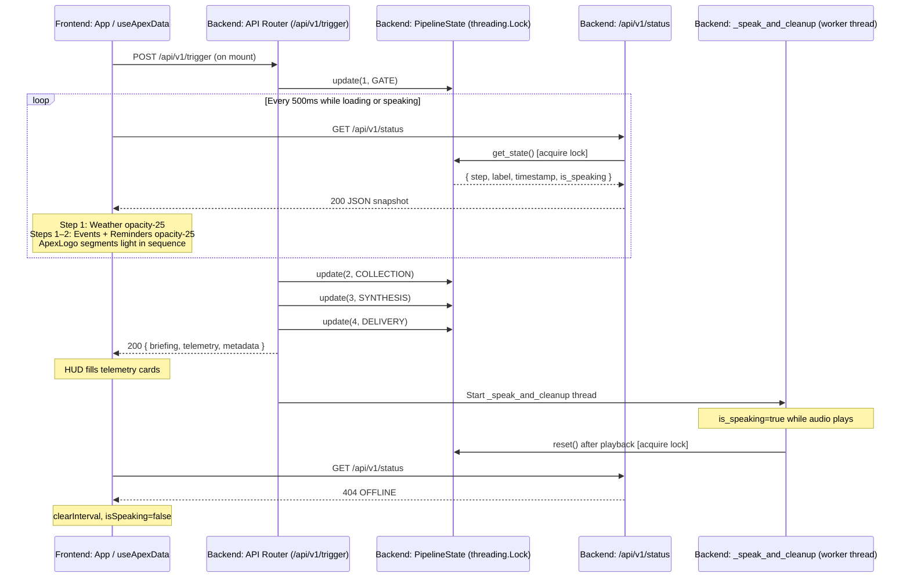

# APEX Architecture

---

## Pipeline Overview

`launcher.py` is the entry point for a full local session. It starts uvicorn and `http.server` as parallel child processes, then polls `GET /` on the API up to 30 times at 500 ms intervals. The browser kiosk window opens only after that health check returns `200`. When the browser window closes, `launcher.py` detects the exit and terminates uvicorn. `atexit` hooks and signal handlers are registered for `Ctrl+C` and `SIGTERM`.

With both servers up, `api.py` listens on `127.0.0.1:8000`. A `POST /api/v1/trigger` runs a four-stage pipeline:

1. **Gate** — `scanner.py` checks home Wi-Fi by SSID, AC power, and a 1-hour cooldown. If any check fails the request is rejected with `403` and nothing runs.
2. **Collection** — each enabled connector fetches its feed in sequence. Disabled connectors are skipped with no API call made.
3. **Synthesis** — raw outputs are joined into a pipe-delimited string and passed to Gemini 2.5 Flash. `brain.py` prepends the persona prompt from `config.json`. A filler phrase plays on a background thread while the model processes. If the Gemini call fails, the raw data string is read out directly so the run never crashes.
4. **Delivery** — the trigger endpoint returns the briefing text and a telemetry object as JSON. TTS playback runs on a separate worker thread (`_speak_and_cleanup`). `global_pipeline_state.reset()` is called inside that thread after playback finishes, keeping `/api/v1/status` active with `is_speaking: true` for the full duration audio plays.

With `DEV_MODE=true`, the scanner bypasses hardware and cooldown gates and run logging. Gemini synthesis is bypassed unless `DEV_AI_SYNTHESIS=llm`. Gmail and Calendar connectors still execute and make live OAuth-authenticated requests; returned content is masked to `[HIDDEN]`. Reminder dismissal is always an explicit user action through `/api/v1/reminders/read` and is not affected by `DEV_MODE`. Servers, weather/sports/news connectors, and the database remain active.

---

## FastAPI Pipeline Telemetry & Polling

A full briefing run is a blocking HTTP call. Rather than streaming partial JSON out of the trigger response, execution and observation are kept separate. `useApexData` fires a single `POST /api/v1/trigger` and holds it open, while a `setInterval` loop at **500 ms** inside the same hook polls `GET /api/v1/status`.

On the backend, `core/api.py` calls `global_pipeline_state.update(step, label)` at each stage boundary. The state is read under a `threading.Lock` on every poll. At step 4 (Delivery), the trigger response returns while TTS plays on a worker thread. Once `_speak_and_cleanup` calls `global_pipeline_state.reset()`, the next poll returns `404`. The hook treats `404` as idle, clears the interval, and the HUD fills its cards from the trigger response body.



---

## Demo Mode Simulation

When `DEMO_MODE=true` in `.env`, the trigger endpoint branches into `_run_demo_briefing()` before the normal pipeline runs. The simulation:

1. Advances `global_pipeline_state` through all four stages with a **1.5-second delay** between each step so the frontend polling loop has time to observe each stage.
2. Loads static mock telemetry from `core/mock/telemetry.json` via `_load_mock_telemetry()`.
3. Returns a deterministic briefing string built by `_build_demo_briefing()`.
4. Starts `_speak_and_cleanup` with the `DEMO_TTS` engine override.

The `metadata.demo_mode_active` field is `true` in the trigger response. `useApexData` reads this and sets `demoModeActive` on `ApexDataState`, which `App.tsx` uses to render an amber "DEMO MODE ACTIVE" badge in the header. No data connectors, external APIs, or database writes are involved in the demo path.

---

## Project Structure

```
apex/
├── core/
│   ├── api.py           # FastAPI app — routes, PipelineState, Pydantic models, clean_for_tts
│   ├── brain.py         # Briefing synthesis via Gemini 2.5 Flash (google-genai)
│   ├── scanner.py       # Environment gate (Wi-Fi, power, cooldown) + sample_system_vitals()
│   ├── speaker.py       # TTS fallback chain: Google Cloud TTS → pyttsx3; pre-warmed singletons, _SPEAK_LOCK
│   ├── database.py      # SQLite session logging and reminder CRUD
│   ├── config.py        # Feature flags, module flags, system prompt, TTS settings loader
│   ├── mock/
│   │   └── telemetry.json   # Static telemetry payload for DEMO_MODE runs
│   └── __init__.py
├── clients/
│   ├── weather_client.py    # OpenWeatherMap connector
│   ├── sports_client.py     # F1 (Jolpica/Ergast) + 24-hr file cache; FC Barcelona fixture connector
│   ├── news_client.py       # GNews API — AI and Global Events headlines
│   ├── gmail_client.py      # Gmail API v1 — unread primary inbox extraction; DEV_MODE PII masking
│   ├── calendar_client.py   # Google Calendar — 48-hr upcoming events; DEV_MODE PII masking
│   ├── google_auth.py       # Centralized OAuth2 helper for Gmail and Calendar
│   ├── .f1_cache.json       # Auto-generated F1 cache — 24-hr TTL (gitignored)
│   └── __init__.py
├── frontend/                # React/TypeScript source — compiled by Vite
│   ├── src/
│   │   ├── hooks/
│   │   │   ├── useApexData.ts           # Central hook: trigger, polling, telemetry, reminder state
│   │   │   └── useSystemDiagnostics.ts  # 1,000 ms diagnostics poller
│   │   ├── types/
│   │   │   └── telemetry.ts             # TelemetryPayload, ApexDataState, PipelineState, SystemDiagnostics, AtmosphericTheme, WeatherConditionArchetype
│   │   ├── context/
│   │   │   └── AtmosphericThemeContext.tsx  # React context theme provider
│   │   ├── components/
│   │   │   ├── ApexLogo.tsx             # State-driven SVG reactor: segment activation by pipeline step
│   │   │   ├── BriefingPanel.tsx        # Briefing text with curtain-reveal and speaking border mask
│   │   │   ├── CelestialBackground.tsx  # Seeded starfield — 80 stars across three twinkling tiers
│   │   │   ├── TelemetryCard.tsx        # Shared card frame, VTE interpolation, F1 renderer, weather glow
│   │   │   ├── SystemDiagnostics.tsx    # Three-gauge CPU/RAM/disk grid with severity glow
│   │   │   ├── RingGauge.tsx            # Stateless SVG circular gauge with arc and N/A fallback
│   │   │   ├── VocalOrb.tsx             # SVG speaking-state indicator (stasis line → gyro rings)
│   │   │   ├── ReminderTerminal.tsx     # Reminder input dock (POST /api/v1/reminders)
│   │   │   └── ReminderListRow.tsx      # Per-item reminder display with optimistic dismissal
│   │   ├── App.tsx          # Root layout: three-column bento grid, nebula glow, demo badge
│   │   └── main.tsx         # Vite entry point
│   ├── index.html
│   ├── package.json
│   ├── vite.config.ts
│   └── tsconfig.json
├── dist/                    # Compiled Vite output — served by http.server
├── launcher.py              # Orchestrator: servers, readiness polling, kiosk browser, shutdown hooks
├── config.json              # Persona prompt, feature toggles, TTS settings (committed)
├── CHANGELOG.md             # Full version history
├── LICENSE
├── apex_memory.db           # Auto-generated on first run (gitignored)
├── credentials.json         # Google OAuth client ID (BYOK — gitignored)
├── service_account.json     # Google Cloud TTS service account key (BYOK — gitignored)
├── token.json               # Auto-generated user OAuth token (gitignored)
├── .env                     # Local environment variables (gitignored)
└── .env.example             # Environment variable template with placeholders
```

---

## Backend Modules

### `core/scanner.py`

`should_run()` is the gate function called at the start of every trigger. It branches in order:

1. If `DEV_MODE=true` → return `True` immediately (no checks run).
2. If `ENABLE_STARTUP_GATE=false` → return `True` immediately (hardware/cooldown bypassed, live APIs remain active).
3. Otherwise → call `_enforce_production_gate()`, which checks SSID against `HOME_SSID`, calls `psutil.sensors_battery()` to verify AC power, and queries the database for the last run timestamp.

`check_power()` returns `psutil.sensors_battery().power_plugged` when a battery sensor is present, and `False` when `psutil.sensors_battery()` returns `None`. On desktop machines with no battery, the gate fails unless `ENABLE_STARTUP_GATE=false` or `DEV_MODE=true`.

`sample_system_vitals()` queries CPU percent, CPU frequency, virtual memory, and root-disk usage via psutil. Each query is isolated in a `try/except`; a single failure returns `0.0` for that field without crashing the response.

### `core/brain.py`

`process_telemetry(raw_data)` constructs a `genai.Client` with `GEMINI_API_KEY`, prepends `SYSTEM_PROMPT` from `config.json`, and calls `gemini-2.5-flash`. When `DEV_MODE=true`:

- `DEV_AI_SYNTHESIS=raw` — returns the raw data string directly, no model call.
- `DEV_AI_SYNTHESIS=slm` — returns a placeholder string. Local SLM integration is not yet implemented.
- `DEV_AI_SYNTHESIS=llm` — falls through to the live Gemini call and logs a network-leakage warning.

On any exception (missing key, empty response, API error), the function catches it, logs diagnostics, and returns the raw data as a plain text fallback so the run completes.

### `core/speaker.py`

Two warm-up functions run at module import time:

- `_warm_system_subsystems()` — calls `pygame.mixer.init()` once and holds the channel open. `SDL_VIDEODRIVER=dummy` is set at import to prevent crashes when no display is attached.
- `_warm_cloud_clients()` — instantiates a `TextToSpeechClient` singleton when `GOOGLE_APPLICATION_CREDENTIALS` is present. Logs a skip message when absent rather than raising.

`speak(text, *, tts_override=None)` acquires `_SPEAK_LOCK` (a module-level `threading.Lock`) before routing. All concurrent invocations serialize through this lock, preventing audio interleaving. Routing order:

1. If `tts_override` is set, route directly to the named engine (used by `DEMO_MODE`).
2. If `DEV_MODE=true`, route to `DEV_TTS_PLAYBACK`.
3. Otherwise route to `PRIMARY_TTS` from `config.json`.

`_route_tts_playback` handles `"google"` (tries cloud, falls back to pyttsx3 on failure), `"pyttsx3"` (direct local), and `"elevenlabs"` (logs a notice and returns without audio; not yet deployed).

`is_speaking()` returns `True` when `_SPEAK_LOCK` is held or `pygame.mixer.music.get_busy()` is active. This is the value exposed through `GET /api/v1/status`.

### `core/database.py`

SQLite database file: `apex_memory.db`. Two tables, both created by `initialize_db()`:

- `runs (id INTEGER PRIMARY KEY, timestamp TEXT)` — written by `log_run()` on each production trigger; read by `get_last_run()` for cooldown enforcement.
- `reminders (id INTEGER PRIMARY KEY, note TEXT, is_read INTEGER DEFAULT 0)` — managed by `save_reminder()`, `fetch_unread_reminders()`, and `mark_reminders_read()`.

`initialize_db()` is called at the start of `should_run()`, ensuring the schema exists before any read or write.

### `core/config.py`

Loads `config.json` at module import. All environment flags (`DEV_MODE`, `DEMO_MODE`, `ENABLE_STARTUP_GATE`, `DEV_AI_SYNTHESIS`, `DEV_TTS_PLAYBACK`, `DEMO_TTS`) are parsed via `_parse_env_bool()` or typed literal validators with normalization and logged fallbacks for unrecognized values. If `config.json` is missing or malformed, feature flags default to `False` and `SYSTEM_PROMPT` falls back to a neutral placeholder.

---

## Frontend Components

### `App.tsx`

Root layout. Renders a three-column bento grid (`md:grid-cols-2 xl:grid-cols-3`). Manages:

- `glowColor` — a CSS RGB tuple that drives the nebula blobs; green (`57, 255, 136`) during pipeline stages 1–3, gold (`251, 191, 36`) at stage 4 and after delivery.
- `reminderPulseCount` — incremented on successful reminder submission, passed to `ApexLogo` to trigger an 800 ms blue surge.
- `demoModeActive` — renders an amber "DEMO MODE ACTIVE" badge in the header when `true`.
- A header `headerTicker` that shows the active pipeline stage label, "SYSTEM OPERATIONAL", or "SYSTEM FAULT" depending on status.

Step-driven card opacity: Weather dims at step 1; Events and Reminders dim at steps 1 and 2.

### `CelestialBackground.tsx`

A persistent `memo`-wrapped starfield rendered behind all HUD content. Uses a seeded `mulberry32` PRNG (seed `0x41504558`) to generate 80 deterministic stars across three size tiers (48 slow-twinkle, 24 medium-twinkle, 8 fast-twinkle). Positioned with `position: absolute` at `z-[var(--z-celestial-stars)]`. Stars are built once at module load and never recomputed.

### `ApexLogo.tsx`

A multi-layer SVG reactor in the center column. Five inline gradient definitions back stage-gated segment activation. The inner core transitions through: dormant (dim) → green (processing, steps 1–3) → gold (delivered / speaking, step 4 and `status === 'success'`) → red (error). An `isSpeaking` prop drives a pulsing gold core. `reminderPulseCount` triggers an 800 ms blue surge.

### `VocalOrb.tsx`

SVG speaking-state indicator mounted in the header. In stasis: a single horizontal line. When `isSpeaking=true`: two counter-rotating dashed rings expand around a glowing gold core using `gyroClockwise` / `gyroCounter` CSS keyframe animations.

### `BriefingPanel.tsx`

Renders the synthesized briefing text with a `clip-path` curtain-reveal animation on delivery. A `SpeakingBorderMask` activates at pipeline stage 4: a spinning conic-gradient border overlay that persists while `isSpeaking && activeStep === 4`.

### `TelemetryCard.tsx`

Shared card frame. Additional responsibilities:

- **F1 renderer** — activates when `title` trims and lowercases to `"next f1 race"`. Parses `F1_DATA:` prefix from `rawScheduleText` using `extractF1DataJson` (balanced-brace walker) and renders race details with a country flag from the CDN or a `🏁` checkered fallback.
- **VTE** — when `primaryTemperatureF` is provided, applies `resolveTemperatureFontWeight()` as an inline `style` on the temperature readout.
- **Weather glow** — per-archetype animated background glow and border color driven by `weatherCondition`.

### `SystemDiagnostics.tsx` and `RingGauge.tsx`

`SystemDiagnostics` assembles a three-gauge grid (CPU / RAM / Disk) in the full-width footer card. Each gauge is a `RingGauge` SVG component. Arc color thresholds: blue (< 80%), amber (≥ 80%), red (≥ 90%). Sub-text shows CPU frequency in GHz and RAM/disk as used/total GB. An ambient severity glow shifts color to the highest active threshold. A looping scan sweep animation fires continuously in the background.

### `ReminderTerminal.tsx`

An inline collapsible dock inside the Reminders card. A dock button expands to a form. Submitting calls `POST /api/v1/reminders`, clears the input, fires `onReminderSaved`, and auto-collapses. `Escape` key press and focus-out also collapse. Submitting while a previous request is in flight is blocked by an `isSubmitting` guard. Mounted via `createPortal` to resolve z-index stacking.

### `ReminderListRow.tsx`

Per-item reminder display with optimistic dismissal. Removal is applied to local state before the `POST /api/v1/reminders/read` call; the item is restored if the call fails. The API call fires before any dismiss animation starts to avoid state drift on unmount.

---

## Data Hooks

### `useApexData`

The single data hook for the entire HUD. On mount it:

1. Sets `status` to `loading`.
2. Fires `POST /api/v1/trigger` with an `AbortController` signal.
3. Starts a `setInterval` at 500 ms to poll `GET /api/v1/status`.
4. On trigger resolution, fetches `GET /api/v1/reminders` to populate `activeReminders`.
5. Parses weather string fields via `resolvePipelineTemperatureF` and `resolveWeatherDetail`.
6. Derives `weatherCondition` via `resolveWeatherCondition`.
7. Clears the polling interval when `/api/v1/status` returns `404`.

Exposes `refreshReminders` (best-effort re-sync after new submission) and `markReminderAsRead` (optimistic remove with rollback).

### `useSystemDiagnostics`

Polls `GET /api/v1/diagnostics` every 1,000 ms. Exposes `{ diagnostics, status }`. No dependency on the trigger or pipeline state.

---

## Context and Types

### `AtmosphericThemeContext.tsx`

Scans the weather string for exact substring tokens in priority order and resolves an `AtmosphericTheme`:

| Token | `bgColors` | `accentColor` | `condition` |
|---|---|---|---|
| `"Thunderstorm"` | `#1a202c` (dark charcoal) | `#06b6d4` (cyan) | `stormy` |
| `"Clear"` | `#020617` (deep night) | `#eab308` (amber) | `clear` |
| _(no match)_ | `#0a0f1d` (default navy) | `#3b82f6` (blue) | `neutral` |

`App.tsx` passes `data?.weather` as the `weatherReport` prop. `useAtmosphericTheme()` exposes `{ theme, updateThemeFromTelemetry }` to any descendant.

### `telemetry.ts`

Central type file. Key interfaces: `TelemetryPayload`, `ApexDataState`, `PipelineState`, `SystemDiagnostics`, `AtmosphericTheme`, `WeatherConditionArchetype`.

`WeatherConditionArchetype` union: `'clear_day' | 'clear_night' | 'clouds' | 'rain' | 'thunderstorm'`. The `clear_day` / `clear_night` split is resolved against the local clock hour at parse time (before 06:00 or from 18:00 → `clear_night`).

---

## Theming Systems

### Weather Condition Micro-Climate

`resolveWeatherCondition()` in `useApexData.ts` maps the parsed condition detail string to a `WeatherConditionArchetype`. This archetype drives per-card animated background glow, border color, and condition icon (`CloudLightning`, `CloudRain`, `Cloud`, `Sun`, `Moon` from lucide-react) in `TelemetryCard.tsx`.

### Variable Typography Engine (VTE)

Maps ambient temperature in Fahrenheit to a CSS `font-weight` integer via linear interpolation over a clamped domain:

- **Temperature domain:** [40°F, 90°F] — clamped before interpolation
- **Font weight range:** [300, 800]
- **Formula:** `weight = 300 + ((clampedTemp − 40) / 50) × 500`, rounded to the nearest integer

Applied as an inline `style` on the temperature readout `<p>` tagged `data-vte="primary-temperature-readout"`. `resolveTemperatureFontWeight(input)` is exported as a named function.

### Nebula Glow Layer

Three animated radial-gradient blobs in `App.tsx` appear when a pipeline run is active (`showGlow`). Blob color shifts by stage via the `--glow-color` CSS custom property: green for stages 1–3, gold at stage 4 and after `status === 'success'`. Blobs are positioned at top-right, bottom-left, and a center-diagonal offset; each uses a distinct CSS keyframe animation for continuous drift.

---

## F1 Data Contract

### File-Backed Cache

`sports_client.py` maintains `clients/.f1_cache.json`. On each run:

1. `_read_f1_cache()` loads the file. Missing, unreadable, or malformed → `None`, network fetch runs.
2. `_is_f1_cache_fresh()` checks the `cached_at` ISO timestamp against current UTC. TTL is 24 hours. A timezone-naive or invalid timestamp counts as stale.
3. Fresh hit → use cached `f1_map`, no HTTP request.
4. Stale or missing → `GET https://api.jolpi.ca/ergast/f1/current/next.json`. On success, `_write_f1_cache()` writes the new map with compact separators and a fresh `cached_at` timestamp.
5. Network failure with stale cache on disk → use stale map. No cache on disk → emit `"F1 race telemetry unavailable."`.

### `F1_DATA` Payload Format

The F1 map is emitted as a prefixed compact JSON object in the pipe-delimited sports string:

```
F1_DATA:{"raceName":"...","round":"...","country":"...","raceDateTimeEST":"...","relativeWeek":"...","sprintScheduled":true,"sprintDateTimeEST":"..."}
```

`_build_f1_map_from_race()` always emits all seven fields:

| Field | Type | Fallback |
|---|---|---|
| `raceName` | string | `"Unknown"` |
| `round` | string | `"Unknown"` |
| `country` | string | `"Unknown"` |
| `raceDateTimeEST` | string | `"Unscheduled"` |
| `relativeWeek` | string | `"This week"` / `"Next week"` / `"In N weeks"` |
| `sprintScheduled` | boolean | `false` |
| `sprintDateTimeEST` | string | `"Unscheduled"` |

All datetimes use `ZoneInfo("America/New_York")` and format to `"%A, %B %d at %I:%M %p %Z"`. Falls back to `timezone.utc` at import time when `zoneinfo` is unavailable.

### Frontend Parsing

`extractF1DataJson()` locates the `F1_DATA:` prefix, then uses `extractBalancedJsonObject()` — a balanced-brace walker that tracks nesting depth and handles escaped characters inside strings — to extract the JSON payload. More reliable than a naive `indexOf('}')` approach. A parse failure returns `null` and the card renders nothing.

### Country Flag Lookup

`COUNTRY_FLAG_MAP` in `TelemetryCard.tsx` maps lowercase country names to ISO 3166-1 alpha-2 codes. Flag images are pulled from `https://cdnjs.cloudflare.com/ajax/libs/flag-icon-css/3.4.6/flags/4x3/{code}.svg` with `loading="lazy"` and `decoding="async"`. An `onError` handler replaces a broken image with the `🏁` checkered flag fallback.

---

## Pipeline String Format Contract

`weather_client.py` produces a fixed-format string:

```
Current temperature is {temp} degrees with {condition}.
```

Two parser functions in `useApexData.ts` extract structured fields:

| Field | Function | Regex | Return type |
|---|---|---|---|
| Integer °F | `resolvePipelineTemperatureF` | `/Current temperature is\s+(-?\d+)\s+degrees/` | `number \| null` |
| Condition text | `resolveWeatherDetail` | `/with\s+([^.]+)/` | `string` |

Both return safe fallbacks (`null` or `'No Atmospheric Data'`) when input does not match rather than throwing into the render tree. If an upstream format change breaks either regex, the temperature readout goes blank and VTE interpolation is skipped cleanly. Both failures are immediately visible in the HUD.

---

## Launcher Environment Isolation

`launcher.py` passes different environments to each child process:

- **uvicorn** — receives `os.environ.copy()` plus a stable `PYTHONPATH` rooted at the project directory. All `.env` keys are present.
- **http.server and browser** — receive a stripped copy with only `PATH`, `SYSTEMROOT`, `TEMP`, `TMP`, and `PYTHONPATH`. No API keys or credentials reach these processes.

The `webbrowser` fallback path (used when no supported browser binary is found) does not provide a `Popen` handle, so browser-window lifecycle detection is not available. The orchestrator falls back to a `Ctrl+C` loop in that case.

---

## Logging Conventions

Every module prefixes terminal output with a bracketed tag:

| Tag | Module |
|---|---|
| `[BRAIN]` | `core/brain.py` |
| `[SCANNER]` | `core/scanner.py` |
| `[SPEAKER]` | `core/speaker.py` |
| `[WEATHER]` | `clients/weather_client.py` |
| `[SPORTS]` | `clients/sports_client.py` |
| `[NEWS]` | `clients/news_client.py` |
| `[GMAIL]` | `clients/gmail_client.py` |
| `[CALENDAR]` | `clients/calendar_client.py` |
| `[SYSTEM]` | `core/api.py` |
| `[LAUNCHER]` | `launcher.py` |
