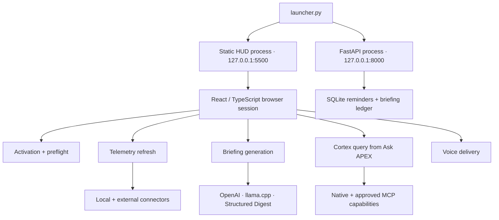
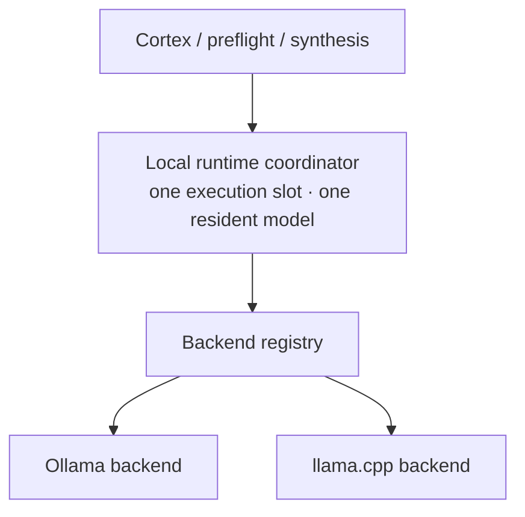

# APEX Architecture

This reference explains the current system model: which process owns each responsibility, how independently triggered operations exchange state, where data crosses trust boundaries, and how APEX degrades when an optional dependency fails. Configuration belongs in [Configuration](configuration.md), HTTP usage in [API](api.md), design rules in the [Design System](design-system.md), and rationale in [Engineering Decisions](decisions.md).

## Canonical taxonomy

For the meanings and design rationale behind these terms, see
[Identity and Naming](identity-and-naming.md).

- **APEX** is the standalone product and operational entity.
- **Apex Agents** are specialized workers such as Apex Panthera and Apex Apodemus.
- **Cortex Engine** is the backend subsystem that executes, orchestrates, tools, sessions, and manages model lifecycle.
- **Cortex workspace** is the interface for operating and configuring Apex Agents.
- **Home workspace** presents telemetry, briefings, connector health, and compact Ask APEX access.

Home/Cortex switching changes only what is visible. It never cancels active Cortex Engine turns, polling, speech, briefings, or local-model lifecycle work.

## Architecture in 60 seconds

`launcher.py` starts two loopback-bound child processes: FastAPI on port 8000 and a static server for the compiled React HUD on port 5500. The browser owns the interactive session; FastAPI owns connectors, runtime settings, model and tool execution, speech, and SQLite persistence.

The HUD starts in standby. Activation, telemetry refresh, briefing synthesis, interactive Agent requests, and voice delivery are separate operations. The legacy/full-run trigger remains available when one request should refresh telemetry, generate a briefing, persist it, and optionally start speech.

```mermaid
flowchart TB
    Launcher["launcher.py"] --> API["FastAPI process · 127.0.0.1:8000"]
    Launcher --> Static["Static HUD process · 127.0.0.1:5500"]
    Static --> Browser["React / TypeScript browser session"]

    Browser --> Activation["Activation + preflight"]
    Browser --> Telemetry["Telemetry refresh"]
    Browser --> Briefing["Briefing generation"]
    Browser --> Cortex["Cortex query from Ask APEX"]
    Browser --> Voice["Voice delivery"]

    Telemetry --> Connectors["Local + external connectors"]
    Briefing --> Models["OpenAI · llama.cpp · Structured Digest"]
    Cortex --> Capabilities["Native + approved MCP capabilities"]
    API --> SQLite["SQLite reminders + briefing ledger"]
```

| Runtime path | Trigger | Primary owner | Durable state | External work |
|---|---|---|---|---|
| Activation | Start APEX | Browser `useAppActivation` | None | Advisory preflight; telemetry refresh follows |
| Telemetry | Refresh all or selected connectors | Process-local telemetry service | Current snapshot is memory-only | Enabled connectors |
| Briefing | Current snapshot or full trigger | Briefing orchestration | Normal-mode briefing ledger | Panthera/OpenAI, Apodemus/llama.cpp, or Structured Digest |
| Cortex query | User prompt | Browser history plus backend turn execution | No chat-session store | Selected Agent and approved capabilities |
| Voice | Manual or automatic delivery | Voice hook and backend speaker | None | Selected TTS engine |
| Settings | Runtime Settings save | Runtime settings store | `config.local.json` | MCP reconciliation when provider enablement changes |

```mermaid
flowchart LR
    USER["Operator"]

    USER --> ACTIVATE["Activate Home"]
    USER --> REFRESH["Refresh telemetry"]
    USER --> BRIEF["Generate briefing"]
    USER --> ASK["Ask an Apex Agent"]
    USER --> SPEAK["Speak transcript"]

    ACTIVATE --> PREFLIGHT["Advisory preflight"]
    ACTIVATE --> REFRESH

    REFRESH --> CONNECTORS["Enabled connectors"]
    CONNECTORS --> SNAPSHOT["Process-current telemetry snapshot"]

    SNAPSHOT --> BRIEF
    BRIEF --> SYNTHESIS["Panthera, Apodemus, or Structured Digest"]
    SYNTHESIS --> LEDGER[("SQLite briefing ledger")]

    ASK --> CORTEX["Cortex Engine"]
    CORTEX --> TOOLS["Approved native and MCP capabilities"]

    SPEAK --> VOICE["Selected speech engine"]

    FULL["Compatibility full trigger"]
    FULL -.-> REFRESH
    FULL -.-> BRIEF
    FULL -.-> SPEAK
```

## Process model and startup

The launcher gives each child a different environment:

- **FastAPI** receives the backend environment, including connector and provider credentials.
- **Static server and browser** receive only process essentials such as `PATH`, `SYSTEMROOT`, temporary directories, and `PYTHONPATH`.

The launcher polls `GET /api/v1/health/ready` and frontend HTTP availability at 500 ms intervals. Readiness loads the runtime settings snapshot and performs a lightweight SQLite query; it intentionally excludes optional connectors, MCP providers, optional model providers, and local runtimes. A timeout, bind conflict, or early child exit prevents browser launch and tears both children down.

When Chrome or Edge is launched with a process handle, closing the kiosk window stops both servers. The default-browser fallback has no process handle and relies on `Ctrl+C`.

FastAPI's lifespan initializes the database and Microsoft To Do services, starts the provider-neutral local-runtime idle-model monitor whenever a local backend is enabled, and owns one MCP client manager. MCP discovery runs independently of readiness so an offline optional provider cannot prevent the local service from starting.

## Frontend state ownership

`App.tsx` composes focused hooks instead of using the historical single-pipeline state model:

| Owner | Responsibility |
|---|---|
| `useApexData` | Boot configuration, reminder state, and compatibility trigger state |
| `useAppActivation` | Standby versus activated session state |
| `usePreflight` | Advisory warning and hard-blocker interaction |
| `useTelemetrySnapshot` | Current process-local telemetry snapshot and refresh state |
| `useBriefingPipeline` | Briefing generation, trigger/status polling, digest, and transcript |
| `useVoiceDelivery` | Manual and automatic speech requests |
| `useCortex` | Browser-held conversation, Agent status, query submission, tool traces, and returned tool cards |
| `useToolCatalog` | Agent-specific tool catalog, profile application, and session-persistent selection |
| `useToolPreflight` | Debounced next-request tool and context token estimates |
| `useMarketData` | Independent market polling and stale fallback |
| `useSystemDiagnostics` | Independent CPU, memory, disk, network, and clock polling |

The browser holds activation state and Agent history for the tab lifetime. Reloading the page returns the UI to standby and clears conversation history, but it does not erase reminders or persisted briefing history.

## Telemetry snapshots

`core/telemetry/` owns a single process-current `TelemetrySnapshot`. A refresh may collect all enabled connectors or a requested subset. Each module entry contains typed status, freshness, reason, observation time, display text, and structured data.

Normal refresh can reuse a snapshot younger than five minutes unless the request forces collection. A competing refresh receives `409` instead of silently queuing. On a connector failure, the service can retain usable prior data as stale while reporting the new failure reason.

Snapshots are intentionally process-local:

- They avoid writing high-frequency or ephemeral connector state to SQLite.
- A server restart invalidates the previous `snapshot_id`.
- Briefing generation from an existing snapshot requires the current ID and returns `409` when it is absent or stale.

Connector statuses feed equal-weight Sync Health scoring. Disabled connectors are excluded; they make no network or authentication attempt.

## Briefing generation

### Generate from the current snapshot

`POST /api/v1/briefings/generate` synthesizes from an existing process-current snapshot without calling connectors. The caller supplies both `snapshot_id` and briefing mode.

Briefing orchestration converts structured module data into a bounded `SynthesisInput`. Panthera/OpenAI and Apodemus/llama.cpp receive the same selected facts wrapped in `<untrusted_connector_data>` markers. Display strings, Agent history, and Agent tools are not forwarded to the briefing model.

The current briefing modes are:

| Mode | Provider | Current model or behavior |
|---|---|---|
| Panthera | OpenAI | `gpt-5.6-luna` at fixed Light effort |
| Apodemus | llama.cpp | `gemma-4-E2B-Q4_K_M.gguf`, cold-load synthesis at 16K |
| Structured Digest | None | Deterministic synthesis from typed facts |

An explicit local mode is not silently replaced by another local Agent. The Panthera path falls back to Apodemus once, then Structured Digest; an explicit Apodemus failure goes directly to Structured Digest. Runtime metadata records the requested mode, resolved provider/Agent/model, ordered fallback steps, usage, timings, and estimated provider cost. Every unsuccessful model path terminates in Structured Digest with a stable fallback reason.

Normal-mode generation persists the transcript, digest, and runtime metadata to the SQLite briefing ledger and prunes the ledger to 50 rows. Demo mode returns static history and performs no normal-mode write.

### Full trigger compatibility path

`POST /api/v1/trigger` remains the one-call orchestration path. It force-refreshes telemetry, synthesizes with the requested or configured mode, persists the normal-mode result, and applies automatic voice-delivery rules.

This path exposes a four-stage compatibility status (`GATE`, `COLLECTION`, `SYNTHESIS`, `DELIVERY`) through `GET /api/v1/status`. The frontend polls every 500 ms while a full run or speech is active. Pipeline state resets after audio finishes so `is_speaking` remains accurate for the whole delivery.

The four-stage path is supported behavior, but it is no longer the only way to use the HUD.

## Cortex Engine execution

`POST /api/v1/cortex/query` performs one bounded Cortex Engine turn. The browser sends the current prompt and its bounded conversation history. The backend does not look up a default chat session and does not persist the returned conversation.

HUD context is explicit:

- `briefing_id` attaches one existing briefing and its selected insights when that record exists.
- `snapshot_id` attaches the current telemetry snapshot only when the identifier still matches.
- Omitting both identifiers injects no HUD context.

Attached context and tool results are separately marked as untrusted model data. Unknown or stale identifiers are omitted rather than replaced with another record.

### Cloud Agents

| Agent | Provider and model | Effort | Maximum tool loop |
|---|---|---|---|
| Acinonyx 1.0 | Gemini `gemini-3.5-flash-lite` | Light, Focused, Extended; development-only | Up to 4 turns / 6 calls; non-personal allowlist only |
| Panthera 1.0 | OpenAI `gpt-5.6-luna` | Light, Focused, Extended | Up to 6 turns / 10 calls |
| Neofelis 1.0 | Gemini `gemini-3.6-flash` | Light, Focused, Extended | Up to 4 turns / 6 calls |
| Delphinus 1.0 | xAI `grok-4.3` | Light, Focused, Extended | Up to 4 turns / 6 calls |
| Orcinus 1.0 | xAI `grok-4.5` | Light, Focused, Extended | Up to 4 turns / 6 calls |

The final permitted turn is answer-only, preventing a model from requesting a tool call that cannot receive a follow-up response.

Each non-demo Agent request begins with the selected Agent's immutable identity instruction, followed by prompt behavior loaded exclusively from `config.json`, an optional user designation from the local runtime settings snapshot, scoped context, and the security boundary. Agent identity describes the active Agent and its model; it does not grant capabilities or override tool and privacy policy.

Panthera, Neofelis, Delphinus, and Orcinus receive the general APEX capability registry. Brave MCP is the only general web-search path. Neofelis can receive Google Maps and Google Search grounding when their persisted controls are enabled. Delphinus and Orcinus can receive X Search when their respective controls are enabled; xAI general web search and OpenAI hosted search remain disabled. Acinonyx uses an execution-enforced restricted development allowlist containing weather, Formula 1, Brave, and Alpha Vantage only.

`GET /api/v1/agents` is the backend-owned Agent catalog. It publishes product ordering, Agent content, available effort levels, selectable local context and reasoning metadata, effective grounding state, pricing metadata, and sanitized availability. Cortex owns only presentation and interaction, while retaining compatibility writes to the existing settings fields. Cloud availability is configured until a user-triggered metadata probe or real inference provides stronger evidence; Agent polling never performs a provider probe.

The Home command rail owns the visible briefing-mode selector. It persists `briefing.default_mode` immediately so the last selected mode is restored from boot configuration after a restart; the Settings panel keeps the schema field for compatibility but does not render a duplicate selector.

### Local Agents and explicit tool selection

The normal local roster consists of Apodemus and Neotoma. Sorex, Mus, and the Unnamed Experimental Agent are development roster entries surfaced only in `DEV_MODE`. All use the same local runtime path; the experimental target is a separate technical target outside the genus-based Agent family. Prompts and context remain separate from briefing generation. One non-blocking execution lock covers all local inference. A concurrent request receives `429`; a cold load that fails availability or resource checks receives `503`.

Local and cloud queries use the same explicit capability descriptor list. The browser's Tools selector sends stable selected names and an optional profile ID; an empty list means no APEX-managed or MCP schemas. Omitted selection preserves the migration default of All APEX Tools for cloud Agents and No APEX Tools for local Agents. The resolver intersects selection with Agent policy, `expose_to_agent`, permitted risk, runtime availability, and persistent MCP allowlists. It returns structured per-tool failures instead of silently dropping a request. Generic local context preflight is a warning-only estimate; the provider serializes the actual request, trims complete older interactions, and applies its template allowance and safety margin before deciding whether the current interaction fits. Provider-hosted Google and X grounding remains outside these schema profiles and is controlled separately.

## Capability and MCP boundary

`core/agent/capabilities.py` provides one concurrency-safe registry for native and imported tools. Every descriptor declares its JSON input schema, origin, risk classification, exposure surfaces, timeout, and output bound.

Native capabilities are read-only. MCP discovery registers only allowlisted tools with explicit local risk classifications. Imported tools are namespaced on collision, bounded before model and client display, and never re-exported as an APEX MCP server.

The Tools selector exposes only the canonical resolved descriptor list:
`selected tools ∩ Agent policy ∩ runtime availability ∩ persistent MCP
allowlists`. It can narrow a turn but cannot enable a provider, modify an
allowlist, or bypass Acinonyx restrictions. Catalog and preflight responses use
the same projected descriptors that provider turns receive.

Provider-hosted Search, Maps, and X activity is normalized separately from APEX tool calls. Successful billable uses carry provider-origin traces, citations where available, attributed latency, and versioned cost estimates.

The MCP manager owns provider connection, discovery, registration, reconciliation, recovery, and shutdown. Transient connection, discovery, and active-transport failures retire the affected client, unregister its capabilities, and schedule one generation-guarded recovery attempt with bounded backoff. Disabling a provider unregisters its capabilities before closing the transport and cancels pending recovery, preventing new calls from entering a connection being torn down.

## Local model lifecycle

Local Agents share one provider-neutral local runtime coordinator over Ollama
and llama.cpp:

```mermaid
flowchart TB
    APP["Cortex / preflight / synthesis"]
    COORD["Local runtime coordinator<br/>one execution slot · one resident model"]
    REG["Backend registry"]
    OLLAMA["Ollama backend"]
    LLAMA["llama.cpp backend"]

    APP --> COORD
    COORD --> REG
    REG --> OLLAMA
    REG --> LLAMA
```

- Only one local generation can run at a time across both backends.
- Only one APEX-selected model remains resident; identity is provider-qualified
  (`ollama`/`qwen3:…` or `llama_cpp`/`<agent>-<context>`).
- CPU and RAM percentage gates apply before a cold load.
- An already resident target model skips the cold-load resource gate.
- A different target unloads other known APEX local models before warming the new one.
- Unknown externally loaded models remain visible but are not silently unloaded.
- Activity resets the idle timer; the lifespan monitor unloads an idle model.
- Manual load and unload are rejected while local inference or another lifecycle action is busy.
- A manual load is a pre-warm; normal request routing can still load a selected model.
- Lifecycle success is verified against the provider backend before the HUD reports it.

APEX does not embed llama.cpp or ship its binaries or weights. Inference still
uses the OpenAI-compatible HTTP router. Operators may start that router
externally, or enable managed mode so APEX starts a user-installed
`llama-server` when the configured loopback URL is unreachable. APEX terminates
only a child process it owns. Inference and property probes pass
`autoload=false` so the server cannot bypass APEX admission, resource gates, or
explicit load.

Application orchestration routes through the coordinator and backend registry.
Provider-specific discovery, warmup, unload, and residency probes remain inside
each backend. This same lifecycle serves briefings and Agent turns, exposing
contention immediately rather than hiding it behind an unbounded queue.

## Voice delivery

Voice is independent of synthesis. `POST /api/v1/voice/speak` accepts an existing transcript and serializes playback through the backend speaker lock.

Google Cloud TTS falls back to pyttsx3. Kokoro, when selected and installed, falls back to Google and then pyttsx3. The speaker state is backend-owned; the frontend does not infer completion from an animation timer.

Delivery mode controls orchestration:

- `off` disables speech.
- `manual` exposes Speak/Replay for an existing transcript.
- `automatic` starts delivery after successful normal-mode briefing generation.

## Persistence

`core/database.py` owns SQLite transactions and readiness probing. `apex_memory.db` stores:

- normal-mode run timestamps;
- active and dismissed reminders;
- the most recent 50 normal-mode briefings;
- structured digests and runtime metadata, including `run_id` and snapshot identity.

New timestamps are timezone-aware UTC. Legacy timezone-naive run timestamps remain readable as local wall-clock values without a destructive migration. Database writes use transactions; failed writes do not publish partial state.

The database is not encrypted by APEX. Filesystem and operating-system account protections are the at-rest boundary.

## Concurrency and failure model

| Contended resource | Behavior |
|---|---|
| Telemetry refresh | Competing refresh returns `409` |
| Full briefing trigger | Non-blocking run ownership rejects overlap |
| Local inference | Competing generation returns `429` |
| Local model cold load | Availability or resource failure returns `503` |
| Speech | Backend lock serializes playback |
| Runtime settings write | Transactional file replace; active snapshot changes only after success |
| MCP reconciliation | Serialized provider changes reject stale discovery results |

Optional failures remain local to their path. A connector outage lowers telemetry health; an MCP outage degrades that provider; a model failure falls back; a speech failure does not erase the transcript. Readiness fails only for local configuration or database conditions required to operate the service.

## Compact module map

| Area | Primary responsibility |
|---|---|
| `core/api/` | FastAPI app, routers, public models, orchestration, pipeline state |
| `core/telemetry/` | Snapshot collection, freshness, preflight, and process-local store |
| `core/connectors/` and `clients/` | Typed collection and external service adapters |
| `core/synthesis/` | Bounded briefing input, cloud/local routing, deterministic fallback |
| `core/agent/` | Agent catalog, bounded model loop, explicit tool selection, native capabilities |
| `core/mcp/` | External MCP client configuration and lifecycle |
| `core/settings/` | Typed overlay, normalization, transactional local persistence |
| `core/database.py` | SQLite reminders, run records, briefing ledger, readiness query |
| `core/speaker.py` | TTS routing, fallback, and serialized playback |
| `frontend/src/hooks/` | Focused browser state owners and API workflows |
| `frontend/src/components/` | HUD surfaces, controls, console, telemetry, and result cards |

## Logging and trust boundaries

Operational logging uses module loggers and propagates a briefing `run_id` into pipeline state, persisted metadata, and worker-thread context. Failures log stable categories, component names, and exception types rather than connector payloads, prompts, briefing text, or credentials.

The browser and API are local, but enabled providers can still receive selected data. See [Privacy and Data Boundaries](privacy.md) for the complete disclosure and persistence model.
