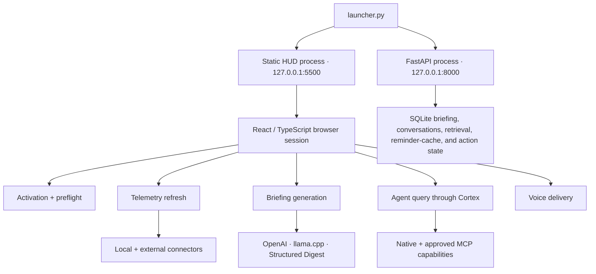
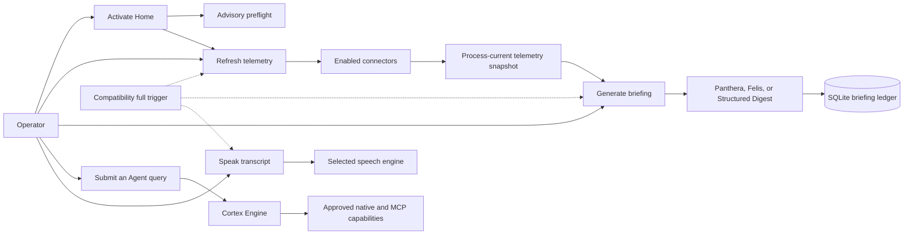
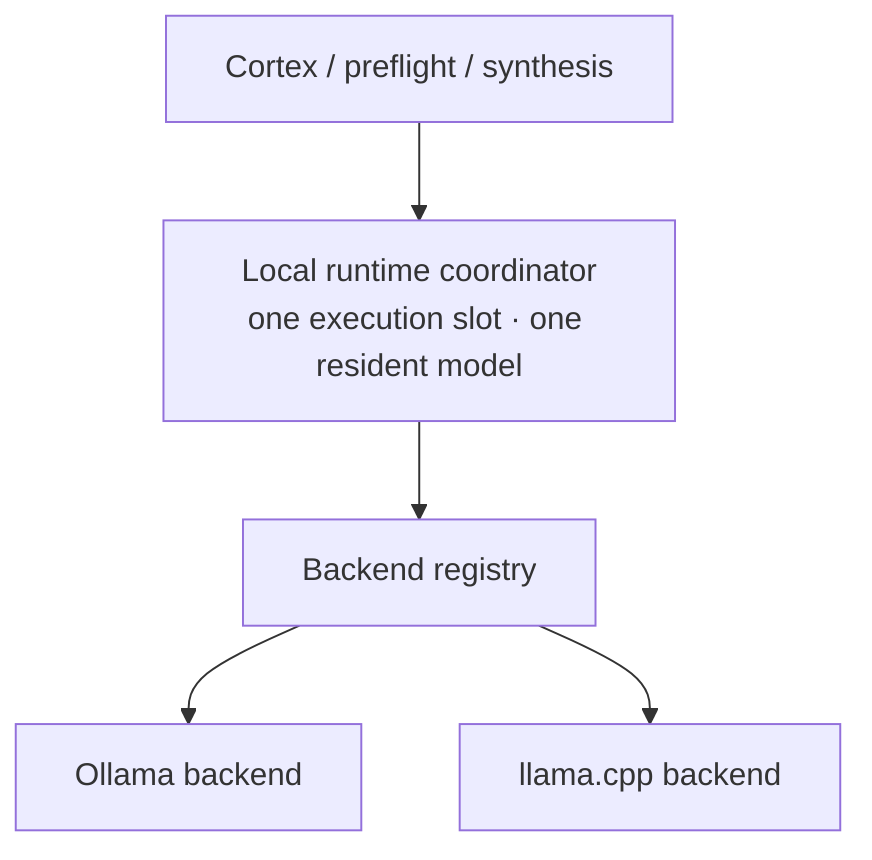

# APEX Architecture

This reference explains the current system: which process owns each responsibility, how separate operations share state, where data crosses trust boundaries, and what happens when an optional dependency fails. Configuration belongs in [Configuration](configuration.md), HTTP usage in [API](api.md), design rules in the [Design System](design-system.md), and rationale in [Engineering Decisions](decisions.md).

## Canonical taxonomy

For the meanings and design rationale behind these terms, see [Identity and Naming](identity-and-naming.md).

- **APEX** is the complete product and local operating environment.
- **Apex Agents** are named workers: Apex Panthera for cloud work and Apex Felis for local work.
- **Cortex Engine** is the backend that runs Agent requests, coordinates context and tools, calls providers, and manages local-model lifecycle.
- **Cortex workspace** is the interface for operating and configuring Apex Agents.
- **Home workspace** presents telemetry, briefings, connector health, reminders, and compact Agent access.

Switching between Home and Cortex changes only what is visible. It does not cancel active Agent turns, polling, speech, briefings, or local-model work.

## Architecture in 60 seconds

`launcher.py` starts two loopback-bound child processes: FastAPI on port 8000 and a static server for the compiled React HUD on port 5500. The browser owns the interactive session; FastAPI owns connectors, runtime settings, model and tool execution, speech, and SQLite persistence. The retrieval domain owns local FTS and optional embedding indexes in that same database.

The HUD starts in standby. Activation, telemetry refresh, briefing generation, Agent requests, and voice delivery are separate operations. The full-run trigger remains available when one request should refresh telemetry, generate and persist a briefing, and optionally start speech.

```mermaid
flowchart TB
    Launcher["launcher.py"] --> API["FastAPI process · 127.0.0.1:8000"]
    Launcher --> Static["Static HUD process · 127.0.0.1:5500"]
    Static --> Browser["React / TypeScript browser session"]

    Browser --> Activation["Activation + preflight"]
    Browser --> Telemetry["Telemetry refresh"]
    Browser --> Briefing["Briefing generation"]
    Browser --> Cortex["Agent query through Cortex"]
    Browser --> Voice["Voice delivery"]

    Telemetry --> Connectors["Local + external connectors"]
    Briefing --> Models["OpenAI · llama.cpp · Structured Digest"]
    Cortex --> Capabilities["Native + approved MCP capabilities"]
    API --> SQLite["SQLite briefing, conversations, retrieval, reminder-cache, and action state"]
```

| Runtime path | Trigger | Primary owner | Durable state | External work |
|---|---|---|---|---|
| Activation | Start APEX | Browser `useAppActivation` | None | Advisory preflight; telemetry refresh follows |
| Telemetry | Refresh all or selected connectors | Process-local telemetry service | Current snapshot is memory-only | Enabled connectors |
| Briefing | Current snapshot or full trigger | Briefing orchestration | Normal-mode briefing ledger | Panthera/OpenAI, Felis/llama.cpp, or Structured Digest |
| Cortex query | User prompt | `ApexAssistantRuntime` bridge plus backend turn execution | SQLite conversation tree and response metadata | Selected Agent and approved capabilities |
| Retrieval | Explicit status/prepare or completed conversation turn | Retrieval service | SQLite retrieval items, FTS mirror, and optional vectors | None during normal search; explicit local model preparation only |
| Voice | Manual or automatic delivery | Voice hook and backend speaker | None | Selected TTS engine |
| Settings | Runtime Settings save | Runtime settings store | `config.local.json` | MCP reconciliation when provider enablement changes |

```mermaid
flowchart LR
    USER["Operator"]

    USER --> ACTIVATE["Activate Home"]
    USER --> REFRESH["Refresh telemetry"]
    USER --> BRIEF["Generate briefing"]
    USER --> ASK["Submit an Agent query"]
    USER --> SPEAK["Speak transcript"]

    ACTIVATE --> PREFLIGHT["Advisory preflight"]
    ACTIVATE --> REFRESH

    REFRESH --> CONNECTORS["Enabled connectors"]
    CONNECTORS --> SNAPSHOT["Process-current telemetry snapshot"]

    SNAPSHOT --> BRIEF
    BRIEF --> SYNTHESIS["Panthera, Felis, or Structured Digest"]
    SYNTHESIS --> LEDGER[("SQLite briefing ledger")]

    ASK --> CORTEX["Cortex Engine"]
    CORTEX --> TOOLS["Approved native and MCP capabilities"]

    SPEAK --> VOICE["Selected speech engine"]

    FULL["Compatibility full trigger"]
    FULL -.-> REFRESH
    FULL -.-> BRIEF
    FULL -.-> SPEAK
```

## Process model and startup

The launcher gives each child a different environment:

- **FastAPI** receives the backend environment, including connector and provider credentials.
- **Static server and browser** receive only process essentials such as `PATH`, `SYSTEMROOT`, temporary directories, and `PYTHONPATH`.

The launcher polls `GET /api/v1/health/ready` and frontend HTTP availability at 500 ms intervals. Readiness loads the runtime settings snapshot and performs a lightweight SQLite query; it intentionally excludes optional connectors, MCP providers, optional model providers, and local runtimes. A timeout, bind conflict, or early child exit prevents browser launch and tears both children down.

When Chrome or Edge is launched with a process handle, closing the kiosk window stops both servers. The default-browser fallback has no process handle and relies on `Ctrl+C`.

FastAPI's lifespan initializes the database, Microsoft To Do client, action service, and one `ReminderService` before requests are accepted. It recovers interrupted actions and reconciles linked local reminder rows at startup. The reminder service owns selected-list resolution, live and stale reads, exact task detail, completed-task reads, local queueing, and direct operator reminder changes. The active-task cache stays bounded; completed history is live-only and is never persisted or sent to briefing synthesis. MCP discovery runs independently of readiness so an offline optional provider cannot prevent the local service from starting. Demo mode uses static reminder fixtures and does not construct the production reminder service or access the action ledger.

The HUD and `uv run apex` CLI are separate clients of the same loopback API. The CLI owns no connector, Agent, reminder, action, or database logic; it never starts the backend or reaches a remote URL. Its action commands read the current action version and submit it back to the action API, preserving the same conflict checks and no-replay behavior as the HUD.

## Frontend state ownership

`App.tsx` composes focused hooks instead of using the historical single-pipeline state model:

| Owner | Responsibility |
|---|---|
| `useApexData` | Boot configuration, reminder state, and compatibility trigger state |
| `useAppActivation` | Standby versus activated session state |
| `usePreflight` | Advisory warning and hard-blocker interaction |
| `useTelemetrySnapshot` | Current process-local telemetry snapshot and refresh state |
| `useBriefingPipeline` | Briefing generation, trigger/status polling, digest, and transcript |
| `useVoiceDelivery` | Manual and automatic speech requests |
| `useCortex` | Agent status, verification, polling, and local-model lifecycle |
| `ApexAssistantRuntime` | Replaceable assistant-ui thread state, conversation navigation, preference bridge, one-turn submission, branch persistence, and response metadata; it never becomes a persistence authority |
| `CortexWorkspace` | APEX composer chrome and response rendering, including Markdown, citations, metrics, traces, tool cards, and action proposals |
| `useActions` | Cortex-visible action list, expanded audit detail, bounded polling, and versioned action controls |
| `useToolCatalog` | Agent-specific tool catalog, profile application, and session-persistent selection |
| `useToolPreflight` | Debounced next-request tool and context token estimates |
| `useMarketData` | Independent market polling and stale fallback |
| `useSystemDiagnostics` | Independent CPU, memory, disk, network, and clock polling |

The browser holds activation state and transient assistant-ui thread state, while APEX owns Cortex conversations in SQLite. `ApexAssistantRuntime` pins `@assistant-ui/react` to `0.15.1` and contains every assistant-ui-specific and unstable-identifier reference: only canonical UUIDs cross into the APEX turn API, and response metadata remains APEX data. Reloading Cortex rehydrates the authoritative branch from the current server-derived partition. Home and Cortex submit through this same bridge, so only one synchronous APEX turn can run at a time; assistant-ui cancellation is intentionally not exposed until the backend has a stop protocol.

When Cortex is visible in normal mode, its inspector owns action review. `useActions` reads the newest 50 durable actions, fetches audit detail only for an expanded item, and polls every five seconds only while the browser tab remains visible. It submits the backend-provided action version for approval, rejection, and verification retry, then refetches the current ledger state. Conversation cards only identify newly proposed actions and direct the operator to the inspector; they never resolve an action themselves. Demo mode does not access the action API.

## Telemetry snapshots

`core/telemetry/` owns a single process-current `TelemetrySnapshot`. A refresh may collect all enabled connectors or a requested subset. Each module entry contains typed status, freshness, reason, observation time, display text, and structured data.

Normal refresh can reuse a snapshot younger than five minutes unless the request forces collection. A competing refresh receives `409` instead of silently queuing. On a connector failure, the service can retain usable prior data as stale while reporting the new failure reason.

Snapshots are intentionally process-local:

- They avoid writing high-frequency or temporary connector state to SQLite.
- A server restart invalidates the previous `snapshot_id`.
- Briefing generation from an existing snapshot requires the current ID and returns `409` when it is absent or stale.

Connector statuses feed equal-weight Sync Health scoring. Disabled connectors are excluded; they make no network or authentication attempt.

## Briefing generation

### Generate from the current snapshot

`POST /api/v1/briefings/generate` generates a briefing from the current process snapshot without calling connectors. The caller supplies both `snapshot_id` and briefing mode.

Briefing orchestration converts structured module data into a bounded `SynthesisInput`. Panthera/OpenAI and Felis/llama.cpp receive the same selected facts wrapped in `<untrusted_connector_data>` markers. Display strings, Agent history, and Agent tools are not forwarded to the briefing model.

The current briefing modes are:

| Mode | Provider | Current model or behavior |
|---|---|---|
| Panthera | OpenAI | `gpt-5.6-luna` at fixed `none` reasoning |
| Felis | llama.cpp | `gemma-4-E2B-Q4_K_M.gguf`, cold-load synthesis at 16K |
| Structured Digest | None | Deterministic synthesis from typed facts |

An explicit local mode is not silently replaced by another local model. The Panthera path falls back to Felis once, then Structured Digest; an explicit Felis failure goes directly to Structured Digest. Runtime metadata records the requested mode, resolved provider/Agent/model, fallback steps, usage, timings, and estimated provider cost. Every unsuccessful model path ends in Structured Digest with a stable fallback reason.

Normal-mode generation persists the transcript, digest, and runtime metadata to the SQLite briefing ledger and keeps the newest 50 rows. Demo mode returns static history and performs no normal-mode write.

### Full trigger compatibility path

`POST /api/v1/trigger` remains the one-call path. It force-refreshes telemetry, generates a briefing with the requested or configured mode, persists the normal-mode result, and applies automatic voice-delivery rules.

This path exposes a four-stage compatibility status (`GATE`, `COLLECTION`, `SYNTHESIS`, `DELIVERY`) through `GET /api/v1/status`. The frontend polls every 500 ms while a full run or speech is active. Pipeline state resets after audio finishes so `is_speaking` remains accurate for the whole delivery.

The four-stage path is supported behavior, but it is no longer the only way to use the HUD.

## Cortex Engine execution

`POST /api/v1/cortex/conversations/{conversation_id}/turns` performs one bounded Cortex Engine turn. The backend stores a pending Agent placeholder, reconstructs the selected branch, and persists the final client-visible response metadata after execution.

The frontend runtime loads every stored message node, including parent IDs, timestamps, statuses, response metadata, and the persisted active leaf. HUD-created empty threads remain transient until their first accepted turn; the turn path initializes the durable conversation immediately before submitting that turn. Editing creates a new user sibling; retrying reuses the user node and creates a new Agent sibling. Selecting a branch patches the terminal leaf back to APEX and reloads the thread if that patch fails. Individual message callbacks do not write to the backend because the turn endpoint commits the user and Agent pair transactionally. Archived conversations may be permanently deleted through the archived-only API route.

HUD context is explicit:

- `briefing_id` attaches one existing briefing and its selected insights when that record exists.
- `snapshot_id` attaches the current telemetry snapshot only when the identifier still matches.
- Omitting both identifiers injects no HUD context.

Attached context and tool results are separately marked as untrusted model data. Unknown or stale identifiers are omitted rather than replaced with another record.

### Panthera and Felis

APEX runs two Agent roles. Panthera selects from registered cloud models, while Felis selects from registered local models. The selected model determines the provider or local runtime and which reasoning, hosted-tool, context, and local-runtime controls apply.

| Agent | Default model | Reasoning | Maximum tool loop |
|---|---|---|---|
| Panthera | OpenAI `gpt-5.6-luna` | `none`, `minimal`, `low`, `medium`, `high`, `xhigh` when supported | Up to 6 turns / 10 calls on the default model |
| Felis | llama.cpp `gemma-4-E2B-Q4_K_M.gguf` | Model-supported local reasoning modes | Up to 4 turns / 4 calls on default llama.cpp models |

Other registered cloud and local models keep their own loop limits and optional hosted-tool support. Development-only models appear in each Agent's model catalog only when `DEV_MODE` is active.

The final permitted turn is answer-only, preventing a model from requesting a tool call that cannot receive a follow-up response.

Each non-demo Agent request begins with the selected Agent's identity instruction, followed by prompt behavior loaded from `config.json`, an optional user designation from local settings, scoped context, and the security boundary. Agent identity describes the active Agent and its selected model; it does not grant tools or override privacy policy.

Panthera can receive the general APEX capability registry. Brave MCP is the only general web-search path. Optional Google Search, Google Maps, and X Search attach only when the selected Panthera model and persisted hosted-tool settings allow them. `DEV_MODE` sandbox queries use a restricted non-personal allowlist instead of the full registry.

`GET /api/v1/agents` is the backend-owned Agent catalog. It publishes Panthera and Felis, their selected models and provider/runtime, each model catalog, model-native reasoning metadata, selectable local context and reasoning metadata, grounding state, pricing metadata, and safe availability information. Cortex owns presentation and interaction. Agent polling never performs a provider probe; cloud availability becomes stronger only after an explicit check or real inference.

The Home command rail owns the visible briefing-mode selector. It saves `briefing.default_mode` immediately so the last selected mode is restored after restart; Settings keeps the field for compatibility but does not render a duplicate control.

### Explicit tool selection

Panthera and Felis use the same explicit capability descriptors. The browser's Tools selector sends stable selected names and an optional profile ID; an empty list means no APEX-managed or MCP schemas. Omitted selection preserves the migration default of All APEX Tools for Panthera and No APEX Tools for Felis. The resolver combines the selection with Agent policy, `expose_to_agent`, permitted risk, runtime availability, and persistent MCP allowlists. It returns per-tool failures instead of silently dropping a request. Local context preflight is only an estimate; the provider serializes the real request, trims older complete interactions, and applies its own allowance and safety margin before deciding whether the request fits. Provider-hosted Google and X grounding remains outside these profiles and is controlled separately.

One non-blocking execution lock covers local inference across providers. A concurrent Felis request receives `429`; a cold load that fails availability or resource checks receives `503`.

## Capability and MCP boundary

`core/agent/capabilities.py` provides one thread-safe registry for native and imported tools. Every descriptor declares its JSON input schema, origin, risk classification, exposure surfaces, timeout, and output limit. Supported native write and destructive capabilities are validated without running them and become durable action proposals. Only local API approval may execute and verify them. MCP write and destructive tools remain unavailable to Cortex.

Production native capabilities are mostly read-only, with a small set of approval-gated Microsoft To Do writes. An Agent can propose them, but only local approval can execute them. Executors save limited execution evidence before verification; verifiers reload that saved evidence and read Microsoft Graph again to confirm the result, including after restart. A changed `last_modified_at` target is rejected before writing. An ambiguous write remains `outcome_unknown` and is never replayed automatically.

MCP discovery registers only allowlisted tools with explicit local risk classifications. Imported tools are namespaced when needed, limited in size before model and client display, and never re-exported as an APEX MCP server.

The Tools selector can only narrow what is already allowed. It cannot enable an MCP provider, change its allowlist, or bypass sandbox restrictions in `DEV_MODE`. Catalog and preflight responses use the same descriptors that provider turns receive.

Provider-hosted Search, Maps, and X activity is tracked separately from APEX tool calls. Successful billable uses can include provider-origin traces, citations where available, latency, and cost estimates.

The MCP manager owns connection, discovery, registration, recovery, and shutdown. Temporary connection or transport failures retire the affected client, unregister its tools, and schedule one guarded recovery attempt with bounded backoff. Disabling a provider unregisters its tools before closing the transport and cancels pending recovery.

## Local model lifecycle

Local Felis work shares one runtime coordinator across Ollama and llama.cpp:

```mermaid
flowchart TB
    APP["Cortex / preflight / synthesis"]
    COORD["Local runtime coordinator<br/>one execution slot · one resident model"]
    REG["Backend registry"]
    OLLAMA["Ollama backend"]
    LLAMA["llama.cpp backend"]

    APP --> COORD
    COORD --> REG
    REG --> OLLAMA
    REG --> LLAMA
```

- Only one local generation can run at a time across both backends.
- Only one APEX-selected model remains resident; identity includes both provider and model.
- CPU and RAM percentage gates apply before a cold load.
- An already resident target model skips the cold-load resource gate.
- A different target unloads other known APEX local models before warming the new one.
- Unknown externally loaded models remain visible but are not silently unloaded.
- Activity resets the idle timer; the lifespan monitor unloads an idle model.
- Manual load and unload are rejected while local inference or another lifecycle action is busy.
- A manual load is only a pre-warm; a normal request can still load its selected model.
- A successful load or unload is checked against the provider before the HUD reports it.

APEX does not embed llama.cpp or ship its binaries or weights. It talks to the OpenAI-compatible HTTP router. The operator can start that router externally, or enable managed mode so APEX starts a user-installed `llama-server` when the configured loopback URL is unreachable. APEX stops only a child process it launched. Requests use `autoload=false` so the server cannot bypass APEX's own loading and resource checks.

Provider-specific discovery, warmup, unload, and residency checks stay inside each backend. Briefings and Agent turns share the same lifecycle, so local contention is visible instead of hidden behind a queue.

## Voice delivery

Voice is independent of briefing generation. `POST /api/v1/voice/speak` accepts an existing transcript and serializes playback through the backend speaker lock.

Google Cloud TTS falls back to pyttsx3. Kokoro also falls back to pyttsx3, but never to Google, so choosing a local speech engine cannot silently send transcript text to the cloud. The speaker state is backend-owned; the frontend does not guess completion from an animation timer.

Delivery mode controls orchestration:

- `off` disables speech.
- `manual` exposes Speak/Replay for an existing transcript.
- `automatic` starts delivery after successful normal-mode briefing generation.

## Persistence

`core/database.py` initializes the shared SQLite database, legacy tables, and readiness probe. The action store owns the action tables and their lifecycle transactions. `apex_memory.db` stores:

- normal-mode run timestamps;
- legacy reminder/archive rows, the selected-list cache, and local reminder outbox rows;
- the most recent 50 normal-mode briefings;
- structured digests and runtime metadata, including `run_id` and snapshot identity;
- action proposals and their ordered audit events.
- durable Cortex conversations plus the retrieval item's FTS mirror and optional local embeddings.

Action records keep the Agent, capability, proposal arguments, target, risk, summary, state, timestamps, and proposal hash. Transition events keep limited execution or verification evidence and stable result codes; each state change and matching event commit together.

New timestamps are timezone-aware UTC. Legacy timezone-naive run timestamps remain readable as local wall-clock values without a destructive migration. Database writes use transactions; failed writes do not publish partial state.

The action lifecycle is `proposed`, `approved`, `executing`, `verifying`, and `verified`, with explicit rejected, expired, failed, and unknown-outcome paths. Proposals expire after 24 hours while they remain `proposed`; an approved action can still execute after that deadline. A positive verifier result, not executor success alone, moves an action to `verified`. Execution failures are terminal, while verification failures and unknown outcomes can retry verification without replaying the write. Restart recovery marks interrupted execution outcomes unknown and interrupted verification failed for an explicit later verification attempt.

FastAPI owns one normal-mode `ActionService`, recovers interrupted records before requests are accepted, and clears it at shutdown. Proposal creation never invokes a capability handler. The atomic execution claim ensures only one concurrent approval can execute an action. Demo mode creates, executes, expires, and reads no actions.

The database is not encrypted by APEX. Filesystem and operating-system account protections are the at-rest boundary.

Retrieval preparation is an explicit operator action. APEX keeps conversation
text local, does not download embedding weights during startup or normal search,
and falls back to SQLite FTS when the ignored `weights/fastembed/` cache is
missing or unusable. Retrieval status exposes only stable categories; it never
returns request metadata, response metadata, tool payloads, vectors, or raw
model exceptions.

## Concurrency and failure model

| Contended resource | Behavior |
|---|---|
| Telemetry refresh | Competing refresh returns `409` |
| Full briefing trigger | Non-blocking run ownership rejects overlap |
| Local inference | Competing generation returns `429` |
| Local model cold load | Availability or resource failure returns `503` |
| Speech | Backend lock serializes playback |
| Runtime settings write | Transactional file replace; active snapshot changes only after success |
| MCP reconciliation | Serialized provider changes reject stale discovery results |

Optional failures remain local to their path. A connector outage lowers telemetry health; an MCP outage degrades that provider; a model failure falls back; a speech failure does not erase the transcript. Readiness fails only for local configuration or database conditions required to operate the service.

## Compact module map

| Area | Primary responsibility |
|---|---|
| `core/api/` | FastAPI app, routers, public models, orchestration, pipeline state |
| `core/telemetry/` | Snapshot collection, freshness, preflight, and process-local store |
| `core/connectors/` and `clients/` | Typed collection and external service adapters |
| `core/synthesis/` | Bounded briefing input, cloud/local routing, deterministic fallback |
| `core/agent/` | Agent catalog, bounded model loop, explicit tool selection, native capabilities |
| `core/mcp/` | External MCP client configuration and lifecycle |
| `core/settings/` | Typed overlay, normalization, transactional local persistence |
| `core/actions/` | Durable action models, lifecycle orchestration, SQLite action persistence, and audit events |
| `core/database.py` | Shared SQLite initialization, reminders, run records, briefing ledger, readiness query |
| `core/speaker.py` | TTS routing, fallback, and serialized playback |
| `frontend/src/hooks/` | Focused browser state owners and API workflows |
| `frontend/src/components/` | HUD surfaces, controls, console, telemetry, and result cards |

## Logging and trust boundaries

Operational logging uses module loggers and carries a briefing `run_id` through pipeline state, persisted metadata, and worker-thread context. Failures log stable categories, component names, and exception types rather than connector payloads, prompts, briefing text, or credentials.

The browser and API are local, but enabled providers can still receive selected data. See [Privacy and Data Boundaries](privacy.md) for the complete disclosure and persistence model.
