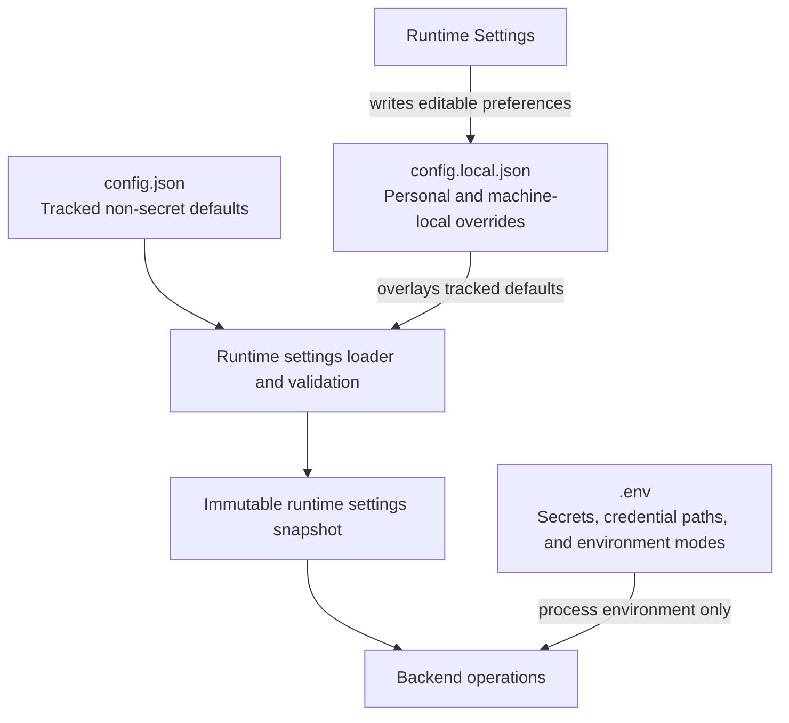

# Configuration

This is the main operator reference for APEX settings, runtime modes, credentials, and optional integrations. It explains where settings belong and how they behave; [`.env.example`](../.env.example) remains the complete list of supported environment keys and placeholders.

## Configuration ownership

| Surface | Contains | Version control |
|---|---|---|
| `.env` | Secrets, credential paths, and environment-only modes | Never committed |
| `config.json` | Tracked non-secret defaults, prompt text, feature flags, model behavior, and provider presets | Committed |
| `config.local.json` | Personal or machine-local runtime overrides, including the optional user designation and llama.cpp executable/preset paths | Gitignored |
| Runtime Settings | Editable subset of resolved settings | Persists to `config.local.json` |



Runtime Settings writes only to the gitignored local overlay. APEX validates the resolved configuration before publishing a new immutable runtime snapshot.

At runtime, APEX loads `config.json`, recursively overlays valid values from `config.local.json`, and publishes an immutable settings snapshot. Errors in a local editable layer discard that layer as a whole and are reported through the settings API; a later valid patch repairs the file before the new snapshot is published. Invalid MCP shapes are warning-only: the affected field or provider fails closed while other valid local values remain active.

Arrays replace their tracked counterparts rather than merging item by item. This matters for `football.teams` and custom file-level MCP configuration.

## Runtime-editable settings

The HUD Runtime Settings panel and `GET` / `PATCH /api/v1/settings` expose schema version `15`.

| Group | Editable values |
|---|---|
| Connectors | Weather, sports, news, email, calendar, market |
| Sports modules | Formula 1 and football |
| Football teams | Up to three football-data.org team IDs with display names |
| Market symbols | Up to eight ticker symbols for the HUD monitor |
| Personalization | Optional user designation used when addressing the user; persisted only to `config.local.json` |
| Agent queries | Global enablement switch, local context preferences, and grounding selection; Cortex owns Agent, effort, and grounding selection |
| Tool profiles | Saved custom tool profiles and per-Agent defaults; edited through Cortex Tools and persisted in `config.local.json` |
| Briefing | Panthera, Lynx, or Structured Digest mode selected in the Home command rail |
| Voice | Google, pyttsx3, or Kokoro engine; male/female voice; off/manual/automatic delivery |
| MCP | Global client runtime and tracked GitHub, Brave, and Alpha Vantage presets |
| llama.cpp | Enablement, loopback router URL, and optional managed-server paths |

Prompt text remains exclusively in tracked `config.json`; it is not editable through Runtime Settings. Ollama host and resource gates, llama.cpp resource gates and timeouts, router presets, MCP endpoints and allowlists, credentials, and environment modes remain file-configured.

`tool_profiles` is part of the resolved settings snapshot and local overlay. Cortex owns the profile editing workflow through the dedicated tool-profile routes; the generic settings patch accepts the complete group only as a lower-level compatibility contract.

### When changes take effect

- Connector and sports flags are captured when telemetry collection begins.
- The Home command rail saves the selected default briefing mode immediately; it applies to the next generation request unless that request supplies an override.
- Agent query enablement, Agent selection, effort, and grounding are checked when a query begins; an in-flight query finishes with the settings it started with.
- Voice engine, gender, and delivery mode bind when speech delivery begins.
- Market enablement starts or stops HUD polling immediately; symbol changes apply on the next poll.
- Tracked MCP preset changes reconcile after the settings write succeeds and do not require a restart.
- llama.cpp enablement, router URL, and managed-server settings apply after a successful settings write; APEX invalidates the provider status cache and reconciles an APEX-owned server when configured.

## Runtime modes

### Normal mode

With `DEV_MODE=false` and `DEMO_MODE=false`, APEX calls only enabled connectors, persists normal-mode briefing history, and uses the selected cloud, local, or deterministic briefing mode. Operational preflight can warn about network policy, power, refresh frequency, and local-model resources; credentials and unavailable runtime resources remain blockers.

### Development

`DEV_MODE=true` keeps the servers, database, and connectors active while suppressing configured-network warnings and normal-mode run logging. Gmail, Calendar, and reminders can still be collected, but subjects, event details, and reminder text are masked before briefing synthesis or sandbox context use.

`DEV_AI_SYNTHESIS` selects development briefing behavior:

- `raw`: deterministic output without a model call
- `local`: Lynx synthesis with deterministic fallback
- `cloud`: Panthera with Lynx and deterministic fallback

`DEV_TTS_PLAYBACK` selects the development speech engine.

### Demo

`DEMO_MODE=true` takes priority over the normal trigger path. It uses static telemetry, briefing history, reminders, market data, and deterministic Agent responses. It skips live connectors and normal-mode database writes. `DEMO_TTS` selects the optional demo speech engine.

`DEV_MODE` and `DEMO_MODE` are independent environment flags, but demo behavior wins where their paths overlap.

## Features and connectors

Disabling a connector prevents its network or authentication attempt and excludes it from briefing input and Sync Health scoring.

| Feature | Credential or local dependency | Notes |
|---|---|---|
| Weather | `TARGET_LOCATION` | Open-Meteo current conditions and up to 14 forecast days for any location or configured default; no API key is required for personal, non-commercial use |
| Formula 1 | None | Jolpica/Ergast data with a 24-hour file cache |
| Football | football-data.org key | Up to three followed team IDs configured in Runtime Settings; disabled by default |
| News | GNews key | AI and global-events headlines |
| Gmail | Google desktop OAuth | Read-only primary inbox and Agent search/read tools |
| Calendar | Google desktop OAuth | Seven-day telemetry horizon and Agent tools |
| Reminders | Selected Microsoft To Do list, when configured | SQLite is a bounded stale cache and offline/local queue; no list is selected automatically |
| Market | Alpha Vantage key plus Runtime Settings symbols | End-of-day data; absent configuration returns an empty not-configured state |

Football telemetry keeps each configured team's next fixture. Briefing synthesis receives only the earliest eligible fixture within seven days.

Weather resolves the prompt-specified location or `TARGET_LOCATION` through Open-Meteo's geocoding service before requesting the forecast. The free hosted API is limited to non-commercial use and 10,000 calls per day, 5,000 per hour, and 600 per minute. The HUD and Cortex weather results identify Open-Meteo and GeoNames, link to the [CC BY 4.0 licence](https://creativecommons.org/licenses/by/4.0/), and state that APEX adapts the data for display.

## Briefing modes and Agents

APEX exposes two Apex Agents: **Panthera** for cloud work and **Lynx** for local work. Model, context, reasoning, effort, and hosted-tool settings live underneath those identities. The selected model profile determines Panthera's provider or Lynx's local runtime automatically.

Current default model mappings used by documentation checks are `panthera -> gpt-5.6-luna` and `lynx -> gemma-4-E2B-Q4_K_M.gguf`; legacy Agent keys migrate to those models.

### Panthera

| Setting group | Purpose |
|---|---|
| `ask_apex.panthera.model` | Registered cloud model for Panthera |
| `ask_apex.panthera.effort` | Default Light, Focused, or Extended effort for interactive queries |
| `ask_apex.panthera.hosted_tools` | Optional Google Search, Google Maps, and X Search when the selected model supports them |

| Model ID | Provider | Stability | Notes |
|---|---|---|---|
| `gpt-5.6-luna` | OpenAI | Stable | Default Panthera model |
| `gemini-3.6-flash` | Google | Stable | Optional Google Search and Maps grounding |
| `gemini-3.5-flash-lite` | Google | Experimental | `DEV_MODE` only |
| `grok-4.3` | SpaceXAI | Stable | Optional X Search; `DEV_MODE` only |
| `grok-4.5` | SpaceXAI | Stable | Optional X Search; `DEV_MODE` only |

Cloud models run independently of Ollama. Panthera's default model requires `OPENAI_API_KEY`; Gemini models require `GEMINI_API_KEY`; Grok models require `XAI_API_KEY`. Models that support effort expose Light, Focused, and Extended.

Brave MCP is the general web-search capability for Panthera when connected. Provider-hosted general web search is disabled for OpenAI and SpaceXAI. Panthera's hosted-tool toggles apply to subsequent requests only.

### Lynx

| Setting group | Purpose |
|---|---|
| `ask_apex.lynx.model` | Registered local model for Lynx |
| `ask_apex.lynx.context_window` | Selected llama.cpp context preset when applicable |
| `ask_apex.lynx.reasoning_mode` | `none` or `focused` when the selected model supports reasoning |

| Model ID | Runtime | Stability | Notes |
|---|---|---|---|
| `gemma-4-E2B-Q4_K_M.gguf` | llama.cpp | Stable | Default Lynx model |
| `gemma-4-E4B-Q4_K_M.gguf` | llama.cpp | Preview | Larger local option |
| `Qwen3.5-4B-Q4_K_M.gguf` | llama.cpp | Experimental | `DEV_MODE` only |
| `qwen3:1.7b` | Ollama | Stable | Lightweight option; `DEV_MODE` only |
| `qwen3:4b-instruct` | Ollama | Stable | Balanced option; `DEV_MODE` only |

`ollama.host` defaults to `http://localhost:11434`. Tracked `llama_cpp.enabled` and `llama_cpp.managed` default to `false`, and `llama_cpp.host` defaults to `http://127.0.0.1:8080`. Enable llama.cpp and set the loopback router URL in Runtime Settings; local overrides persist to `config.local.json`.

APEX allows one local generation at a time and keeps one selected local model resident across Ollama and llama.cpp. CPU and RAM checks apply before cold loads, and idle models unload after the configured timeout. The user-facing Agent roster is Panthera and Lynx. `DEV_MODE` additionally surfaces development-only models in each Agent's model catalog.

For repeatable Lynx and candidate-model comparisons, see [Local Model Benchmarking](../benchmarks/README.md). Benchmark results remain machine-specific and gitignored.

### Development sandbox mode

`ask_apex.sandbox_mode` applies only when `DEV_MODE=true`. In sandbox mode, Panthera and Lynx queries use a restricted non-personal tool allowlist, keep history in the `sandbox` partition, and can attach only the process-current masked development briefing identified by its matching `snapshot_id`.

#### llama.cpp configuration

| Key | Default | Runtime Settings | Notes |
|---|---|---|---|
| `llama_cpp.enabled` | `false` | Yes | Optional second local backend |
| `llama_cpp.managed` | `false` | Yes | When true, APEX may start a user-installed `llama-server` if the router is unreachable |
| `llama_cpp.host` | `http://127.0.0.1:8080` | Yes | Loopback HTTP router URL only |
| `llama_cpp.executable_path` | `""` | Yes | Machine-local path to `llama-server`; required when managed |
| `llama_cpp.preset_path` | `""` | Yes | Machine-local models preset INI; required when managed |
| `llama_cpp.idle_unload_timeout_minutes` | `5` | No | Same idle range as Ollama |
| `llama_cpp.manual_unload_enabled` | `true` | No | Allows HUD unload |
| `llama_cpp.request_timeout_seconds` | `180` | No | Generation and load wait budget |
| `llama_cpp.resource_gates` entry for `gemma-4-E2B-Q4_K_M.gguf` | RAM/CPU limits | No | Cold-load gates for the default Lynx model |
| `llama_cpp.resource_gates` entry for `gemma-4-E4B-Q4_K_M.gguf` | RAM/CPU limits | No | Cold-load gates for the preview Lynx model |
| `llama_cpp.resource_gates` entry for `Qwen3.5-4B-Q4_K_M.gguf` | RAM/CPU limits | No | Cold-load gates for the development-only evaluation model |

Optional router authentication uses `LLAMA_CPP_API_KEY` in `.env` only. APEX sends `Authorization: Bearer …` when the variable is set and never writes the key into settings or docs examples beyond a placeholder.

Machine-local overrides may enable the backend without committing host or path details:

```json
{
  "llama_cpp": {
    "enabled": true,
    "managed": false,
    "host": "http://127.0.0.1:8080",
    "executable_path": "",
    "preset_path": ""
  }
}
```

#### External and managed router modes

APEX does not install, bundle, or update llama.cpp, and it does not download model weights. Two operator modes are supported:

- **External mode** (`managed: false`): you start `llama-server` yourself. APEX only talks to the configured loopback URL over HTTP.
- **Managed mode** (`managed: true`): when llama.cpp is enabled and the router is unreachable, APEX starts your installed executable with the configured preset. If the router is already reachable, APEX uses it as an external server and does not spawn a duplicate process. APEX terminates only a child process it launched, never an externally started server.

Configure Lynx llama.cpp aliases with one preset per exposed context size. A tracked placeholder is in [`docs/examples/llama-cpp-apex-agents.preset.ini`](examples/llama-cpp-apex-agents.preset.ini). Copy it to an untracked machine-local path, replace the GGUF placeholders, and keep absolute paths out of git. Legacy Agent-based alias names such as `apodemus-16k` still resolve, but new presets should use model-based aliases.

```ini
version = 1

[*]
jinja = true
reasoning = auto
parallel = 1

[gemma-4-e2b-4k]
model = C:\path\to\gemma-4-E2B-Q4_K_M.gguf
ctx-size = 4096

; Include the remaining model-based aliases from the tracked preset.
```

Recommended Windows launch for external mode (reconcile flag names against the build's `--help`). Managed mode uses the same argument sequence when APEX starts the process:

```powershell
llama-server.exe `
  --host 127.0.0.1 `
  --port 8080 `
  --models-preset <PATH_TO_MACHINE_LOCAL_PRESET> `
  --models-max 1 `
  --no-models-autoload
```

`--models-max 1` keeps a single resident model at the router. `--no-models-autoload` requires explicit `/models/load` so APEX remains the admission owner. Do not enable llama.cpp idle sleeping in this reference setup; APEX owns the HUD idle unload timer. Initial Windows validation used the `llama-b10276-bin-win-cpu-x64` package without hard-pinning that build in code.

Installed aliases come only from the router's `/models` list. A missing `gemma-4-e2b-16k` (or other selected preset) is reported as not configured rather than fabricated by APEX.

#### Local context preferences

`ask_apex.lynx.context_window` stores the selected llama.cpp context preset for interactive Lynx requests in Cortex. The default Lynx model accepts `4096`, `16384`, `32768`, or `131072` and defaults to `16384`; `gemma-4-E4B-Q4_K_M.gguf` accepts `4096`, `16384`, `32768`, or `65536` and defaults to `16384`; `Qwen3.5-4B-Q4_K_M.gguf` accepts `4096`, `16384`, or `32768` and defaults to `16384`. The default model's `131072` and the E4B model's `65536` presets are marked high-resource in Cortex. The Cortex inspector reads these options from Agent status metadata and changes persist to `config.local.json`; switching context applies the next time Lynx loads without triggering an automatic model load. Briefing synthesis ignores this interactive model selection and always uses `gemma-4-E2B-Q4_K_M.gguf` at its dedicated 16K context.

Model maximum metadata can exceed the presets APEX exposes. The larger native maximum is not fully exposed as a selectable preset.

#### Local reasoning preferences

`ask_apex.lynx.reasoning_mode` stores the reasoning preference for interactive Lynx requests. Lynx defaults to `none`. llama.cpp models that support reasoning expose `none` and `focused`; Ollama development models expose only `none`. The Cortex inspector shows the Reasoning selector only when the active model advertises both modes, and a change applies to the next response without unloading the resident model. Briefing synthesis always disables reasoning.

For llama.cpp, `none` sends `reasoning_effort: "none"` with `chat_template_kwargs.enable_thinking` set to `false`; `focused` omits that request field and sets `enable_thinking` to `true` so the model template can use its native reasoning behavior. Focused llama.cpp profiles use a larger model-configured completion ceiling because native thinking consumes the same completion budget as the visible answer. The server preset therefore uses `reasoning = auto`. Hidden `reasoning_content` and leaked `<think>` blocks continue to be removed before a response reaches Cortex.

Legacy `ask_apex.local_context_windows`, `ask_apex.local_reasoning_modes`, and per-Agent llama.cpp resource-gate keys are migrated into the consolidated Lynx and model-based configuration during settings normalization.

Structured Digest requires no model and is the terminal fallback for every briefing mode.

Panthera is the default cloud briefing engine and always uses Light effort, independently of the selected interactive Agent or effort. On Panthera failure, APEX tries Lynx once before returning Structured Digest. Lynx briefing synthesis is fixed to `gemma-4-E2B-Q4_K_M.gguf` through llama.cpp with no reasoning, independently of the interactive Lynx model, runtime, context, or reasoning settings. An explicit Lynx briefing request falls directly to Structured Digest on failure; it never silently substitutes another local model. Lynx cold-load briefing synthesis uses the dedicated 16K context, while an already-resident compatible Gemma E2B llama.cpp alias can be reused.

## Voice

| Engine | Boundary | Fallback |
|---|---|---|
| Google Cloud TTS | External cloud service | pyttsx3 |
| pyttsx3 | Local operating-system voice | Terminal fallback |
| Kokoro ONNX | Local model when installed | pyttsx3 |

Google TTS requires a service-account key and an absolute `GOOGLE_APPLICATION_CREDENTIALS` path. Kokoro requires its ONNX model and voices file. Voice delivery mode controls whether speech is disabled, manually initiated, or automatic after a briefing.

A Kokoro request never falls through to Google. If Kokoro cannot run, APEX stays local and uses pyttsx3 instead.

## Google OAuth

Gmail and Calendar share a desktop OAuth flow:

1. Enable the Gmail and Calendar APIs in Google Cloud.
2. Create a desktop OAuth client and save it as `credentials.json` in the repository root.
3. Start APEX and complete the browser authorization flow.
4. APEX writes the local `token.json` cache.

Changing scopes requires reauthorization. Both files are gitignored and must remain local.

## Microsoft To Do

Register a public/native Microsoft Entra application, enable device-code flow, grant delegated `Tasks.ReadWrite`, and configure the client ID documented in `.env.example`. The tenant defaults to `common`. Existing `Tasks.Read` authorizations must reconnect to grant the expanded permission.

APEX stores the authorization cache through encrypted operating-system persistence unless an explicit machine path is configured. Runtime Settings exposes `microsoft_todo.reminder_list_id`, an optional opaque identifier selected from the connected account's lists. APEX never selects or clears this value automatically. Once selected, its newest 50 incomplete tasks are authoritative for Home and briefings; SQLite keeps only a cache for stale display and pending/uncertain local rows. Agents can propose bounded Microsoft To Do actions; local approval and exact verification are required before they become verified.

## MCP providers

APEX is an MCP client, not an MCP server. The tracked presets are disabled by default:

- GitHub: read-only repository, code, issue, and pull-request operations
- Brave Search: bounded web and news search through a local Node subprocess
- Alpha Vantage: bounded market research through hosted OAuth

Every imported tool must be allowlisted and assigned a local risk classification before registration. Runtime Settings exposes only preset enablement; it never returns or accepts credentials, endpoints, commands, allowlists, or authorization artifacts.

Provider credentials stay in `.env` or the operating-system credential manager. Advanced endpoints, transports, allowlists, timeouts, and custom servers remain in configuration files.

Transient provider connection, discovery, and transport failures recover automatically with bounded backoff while a preset remains enabled. Invalid configuration and explicit authorization failures do not retry; they remain visible as degraded or authorization-required until corrected through the existing configuration or OAuth flow. Runtime Settings does not expose retry controls or reconnect actions.

## Browser and network boundary

`CUSTOM_BROWSER_PATH` can select a browser executable. The launcher otherwise checks supported Chrome and Edge paths before using the system default.

FastAPI and the static HUD bind to loopback. `APEX_ALLOWED_ORIGINS` controls which browser origins may call the API, but CORS is not authentication and does not make a remote bind safe.

## Secrets checklist

- Never commit `.env`, OAuth tokens, service-account keys, databases, generated audio, caches, or local model files.
- Use absolute paths for machine-specific credentials.
- Keep credentials out of `config.json` and `config.local.json`.
- Keep personal or machine-local non-secret runtime paths in the gitignored local settings layer when APEX exposes them there.
- Review [Privacy and Data Boundaries](privacy.md) before sending personal connector data to a cloud model.
- Use demo mode, a local briefing Agent, or Structured Digest when cloud disclosure is inappropriate.