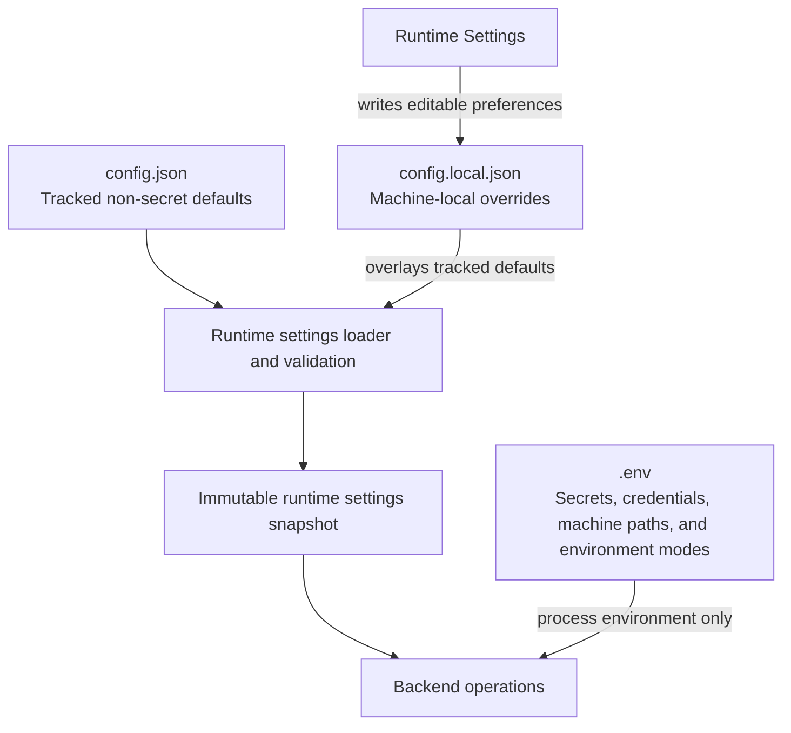

# Configuration

This is the canonical operator reference for APEX settings, runtime modes, credentials, and optional integrations. It explains ownership and behavior; [`.env.example`](../.env.example) remains the exhaustive list of supported environment keys and placeholders.

## Configuration ownership

| Surface | Contains | Version control |
|---|---|---|
| `.env` | Secrets, credential paths, machine paths, and environment-only modes | Never committed |
| `config.json` | Tracked non-secret defaults, prompt text, feature flags, model behavior, and provider presets | Committed |
| `config.local.json` | Machine-local runtime-setting overrides, including the optional user designation | Gitignored |
| Runtime Settings | Editable subset of resolved settings | Persists to `config.local.json` |

Runtime Settings writes only to the gitignored local overlay. APEX validates the resolved configuration before publishing a new immutable runtime snapshot.

At runtime, APEX loads `config.json`, recursively overlays valid values from `config.local.json`, and publishes an immutable settings snapshot. Errors in a local editable layer discard that layer as a whole and are reported through the settings API; a later valid patch repairs the file before the new snapshot is published. Invalid MCP shapes are warning-only: the affected field or provider fails closed while other valid local values remain active.

Arrays replace their tracked counterparts rather than merging item by item. This matters for `football.teams` and custom file-level MCP configuration.

## Runtime-editable settings

The HUD Runtime Settings panel and `GET` / `PATCH /api/v1/settings` expose schema version `9`.

| Group | Editable values |
|---|---|
| Connectors | Weather, sports, news, email, calendar, market |
| Sports modules | Formula 1 and football |
| Personalization | Optional user designation used when addressing the user; persisted only to `config.local.json` |
| Ask APEX | Global enablement switch; Cortex owns Agent, effort, and grounding selection |
| Briefing | Panthera, Mus, Sorex, or Structured Digest mode selected in the Home command rail |
| Voice | Google, pyttsx3, or Kokoro engine; male/female voice; off/manual/automatic delivery |
| Local runtime | Single loaded-model policy, manual unload, and idle-unload timeout |
| MCP | Global client runtime and tracked GitHub, Brave, and Alpha Vantage presets |

Prompt text remains exclusively in tracked `config.json`; it is not editable through Runtime Settings. Followed football teams, Ollama host and resource gates, MCP endpoints and allowlists, credentials, and environment modes remain file-configured.

### When changes take effect

- Connector and sports flags are captured when telemetry collection begins.
- The Home command rail persists the selected default briefing mode immediately; it applies to the next generation request unless that request supplies an override.
- Ask APEX enablement, Agent selection, effort, and grounding are checked when a query begins; an in-flight query finishes.
- Voice engine, gender, and delivery mode bind when speech delivery begins.
- Market enablement starts or stops HUD polling immediately.
- Tracked MCP preset changes reconcile after the settings write succeeds and do not require a restart.

## Runtime modes

### Production

With `DEV_MODE=false` and `DEMO_MODE=false`, APEX calls only enabled connectors, persists production briefing history, and uses the selected cloud, local, or deterministic briefing mode. Operational preflight can warn about network policy, power, refresh frequency, and local-model resources; credentials and unavailable runtime resources remain blockers.

### Development

`DEV_MODE=true` keeps the servers, database, and connectors active while suppressing configured-network warnings and production run logging. Gmail, Calendar, and reminders can still be collected, but subjects, event details, and reminder text are masked before briefing synthesis or Acinonyx context use.

`DEV_AI_SYNTHESIS` selects development briefing behavior:

- `raw` — deterministic output without a model call
- `local` — selected local behavior with deterministic fallback
- `cloud` — configured cloud briefing path with eligible local and deterministic fallback

`DEV_TTS_PLAYBACK` selects the development speech engine.

### Demo

`DEMO_MODE=true` takes priority over the normal trigger path. It uses static telemetry, briefing history, reminders, market data, and deterministic Agent responses. It skips live connectors and production database writes. `DEMO_TTS` selects the optional demo speech engine.

`DEV_MODE` and `DEMO_MODE` are independent environment flags, but demo behavior wins where their paths overlap.

## Features and connectors

Disabling a connector prevents its network or authentication attempt and excludes it from briefing input and Sync Health scoring.

| Feature | Credential or local dependency | Notes |
|---|---|---|
| Weather | OpenWeatherMap API key and target location | Current conditions and forecast facts |
| Formula 1 | None | Jolpica/Ergast data with a 24-hour file cache |
| Football | football-data.org key | One to three configured team IDs; disabled by default |
| News | GNews key | AI and global-events headlines |
| Gmail | Google desktop OAuth | Read-only primary inbox and Agent search/read tools |
| Calendar | Google desktop OAuth | Seven-day telemetry horizon and Agent tools |
| Reminders | SQLite | Always local; independent of Microsoft To Do |
| Market | Alpha Vantage key plus symbols | End-of-day data; absent configuration returns an empty not-configured state |

Football telemetry keeps each configured team's next fixture. Briefing synthesis receives only the earliest eligible fixture within seven days.

## Briefing modes and Agents

### Cloud Agents

| Agent key and display name | Provider and model | Role |
|---|---|---|
| `acinonyx` — Acinonyx 1.0 | Gemini `gemini-3.5-flash-lite` | Development-only sandbox with isolated history, masked current briefing context, and non-personal tools |
| `panthera` — Panthera 1.0 | OpenAI `gpt-5.6-luna` | Default cloud Agent |
| `neofelis` — Neofelis 1.0 | Gemini `gemini-3.6-flash` | Persisted optional Google Search and Maps grounding |
| `delphinus` — Delphinus 1.0 | xAI `grok-4.3` | Focused xAI cloud Agent with persisted optional X Search |
| `orcinus` — Orcinus 1.0 | xAI `grok-4.5` | Extended xAI cloud Agent with persisted optional X Search |

Cloud Agents run independently of Ollama. Panthera requires `OPENAI_API_KEY`; Neofelis requires `GEMINI_API_KEY`; Delphinus and Orcinus require `XAI_API_KEY`; and Acinonyx requires `GEMINI_SANDBOX_API_KEY`. All cloud Agents support Light, Focused, and Extended effort. In development mode Acinonyx remains the effective Agent while preserving the saved cloud effort.

Brave MCP is the general web-search capability for every cloud Agent when connected. Provider-hosted general web search is disabled for OpenAI and xAI. Neofelis's Google Search and Maps controls, and the X Search controls for Delphinus and Orcinus, apply to subsequent requests only.

The `acinonyx` Agent uses `gemini-3.5-flash-lite` and remains hidden outside development mode. Its dedicated free-tier project means APEX reports zero provider token cost for that Agent.

### Local Agents

| Agent key and display name | Provider and model | Intended use |
|---|---|---|
| `microtus` — Microtus 1.0 | LiteRT `litert-community/gemma-4-E2B-it-litert-lm` | Preview lightweight local Agent; requires `gemma-4-E2B-it.litertlm` |
| `mustela` — Mustela 1.0 | LiteRT `litert-community/gemma-4-E4B-it-litert-lm` | Preview balanced local Agent; requires `gemma-4-E4B-it.litertlm` |
| `sorex` — Sorex 1.0 | `qwen3:1.7b` | Lightweight fixed-effort local Agent |
| `mus` — Mus 1.0 | `qwen3:4b-instruct` | Balanced fixed-effort local Agent |

`ollama.host` defaults to `http://localhost:11434`. LiteRT is optional and disabled by default. When enabled, APEX uses the configured Python 3.11 worker interpreter and `litert-lm-api==0.15.0`; it does not download model artifacts automatically. APEX enforces one active local generation and one resident model across Ollama and LiteRT, applies provider-specific resource gates before cold load, and unloads idle models after the configured timeout. LiteRT agents remain visible as preview entries when disabled or unavailable, with a corrective status reason; an explicit unavailable LiteRT request is not rerouted to Mus.

Structured Digest requires no model and is the terminal fallback for every briefing mode.

Panthera is the default cloud briefing engine and always uses Light effort, independently of the selected interactive Agent or effort. On Panthera failure, APEX tries an installed, reachable, resource-admissible Mus, then Sorex, before returning Structured Digest. An explicit Mus or Sorex briefing request falls directly to Structured Digest on failure.

## Voice

| Engine | Boundary | Fallback |
|---|---|---|
| Google Cloud TTS | External cloud service | pyttsx3 |
| pyttsx3 | Local operating-system voice | Terminal fallback |
| Kokoro ONNX | Local model when installed | Google, then pyttsx3 |

Google TTS requires a service-account key and an absolute `GOOGLE_APPLICATION_CREDENTIALS` path. Kokoro requires its ONNX model and voices file. Voice delivery mode controls whether speech is disabled, manually initiated, or automatic after a briefing.

## Google OAuth

Gmail and Calendar share a desktop OAuth flow:

1. Enable the Gmail and Calendar APIs in Google Cloud.
2. Create a desktop OAuth client and save it as `credentials.json` in the repository root.
3. Start APEX and complete the browser authorization flow.
4. APEX writes the local `token.json` cache.

Changing scopes requires reauthorization. Both files are gitignored and must remain local.

## Microsoft To Do

Register a public/native Microsoft Entra application, enable device-code flow, grant delegated `Tasks.Read`, and configure the client ID documented in `.env.example`. The tenant defaults to `common`.

APEX stores the authorization cache through encrypted operating-system persistence unless an explicit machine path is configured. The integration is read-only: it cannot create, update, complete, move, synchronize, or delete Microsoft tasks. SQLite reminders remain authoritative for the HUD and briefings.

## MCP providers

APEX is an MCP client, not an MCP server. The tracked presets are disabled by default:

- GitHub — read-only repository, code, issue, and pull-request operations
- Brave Search — bounded web and news search through a local Node subprocess
- Alpha Vantage — bounded market research through hosted OAuth

Every imported tool must be allowlisted and assigned a local risk classification before registration. Runtime Settings exposes only preset enablement; it never returns or accepts credentials, endpoints, commands, allowlists, or authorization artifacts.

Provider credentials stay in `.env` or the operating-system credential manager. Advanced endpoints, transports, allowlists, timeouts, and custom servers remain in configuration files.

## Browser and network boundary

`CUSTOM_BROWSER_PATH` can select a browser executable. The launcher otherwise checks supported Chrome and Edge paths before using the system default.

FastAPI and the static HUD bind to loopback. `APEX_ALLOWED_ORIGINS` controls which browser origins may call the API, but CORS is not authentication and does not make a remote bind safe.

## Secrets checklist

- Never commit `.env`, OAuth tokens, service-account keys, databases, generated audio, caches, or local model files.
- Use absolute paths for machine-specific credentials.
- Keep credentials out of `config.json` and `config.local.json`.
- Review [Privacy and Data Boundaries](privacy.md) before sending personal connector data to a cloud model.
- Use demo mode, a local briefing Agent, or Structured Digest when cloud disclosure is inappropriate.
