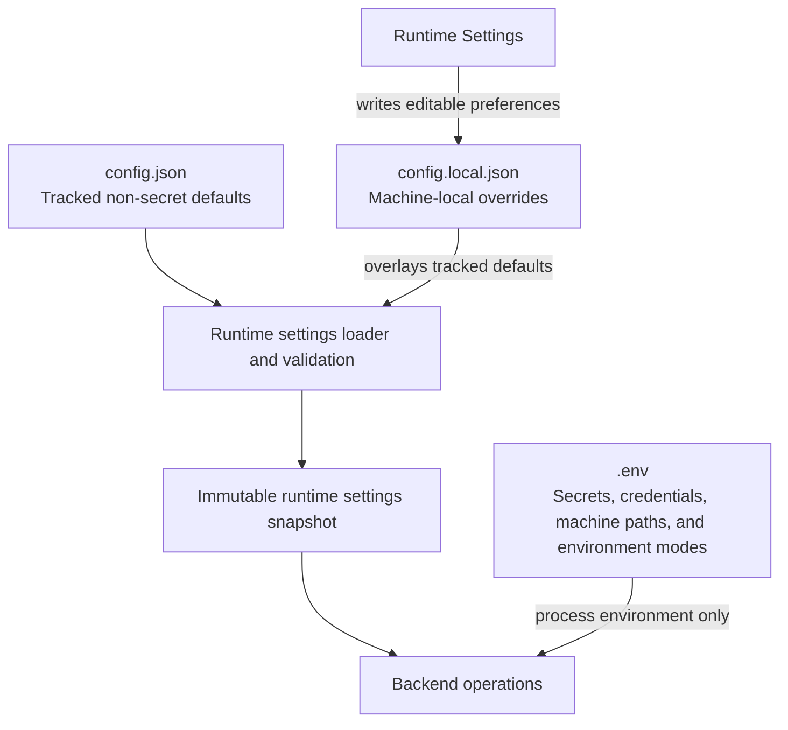

# Configuration

This is the canonical operator reference for APEX settings, runtime modes, credentials, and optional integrations. It explains ownership and behavior; [`.env.example`](../.env.example) remains the exhaustive list of supported environment keys and placeholders.

## Configuration ownership

| Surface | Contains | Version control |
|---|---|---|
| `.env` | Secrets, credential paths, machine paths, and environment-only modes | Never committed |
| `config.json` | Tracked non-secret defaults, prompt text, feature flags, model behavior, and provider presets | Committed |
| `config.local.json` | Machine-local runtime-setting overrides, including the optional user designation | Gitignored |
| Runtime Settings | Editable subset of resolved settings | Persists to `config.local.json` |



Runtime Settings writes only to the gitignored local overlay. APEX validates the resolved configuration before publishing a new immutable runtime snapshot.

At runtime, APEX loads `config.json`, recursively overlays valid values from `config.local.json`, and publishes an immutable settings snapshot. Errors in a local editable layer discard that layer as a whole and are reported through the settings API; a later valid patch repairs the file before the new snapshot is published. Invalid MCP shapes are warning-only: the affected field or provider fails closed while other valid local values remain active.

Arrays replace their tracked counterparts rather than merging item by item. This matters for `football.teams` and custom file-level MCP configuration.

## Runtime-editable settings

The HUD Runtime Settings panel and `GET` / `PATCH /api/v1/settings` expose schema version `13`.

| Group | Editable values |
|---|---|
| Connectors | Weather, sports, news, email, calendar, market |
| Sports modules | Formula 1 and football |
| Football teams | Up to three football-data.org team IDs with display names |
| Market symbols | Up to eight ticker symbols for the HUD monitor |
| Personalization | Optional user designation used when addressing the user; persisted only to `config.local.json` |
| Ask APEX | Global enablement switch, local context preferences, and grounding selection; Cortex owns Agent, effort, and grounding selection |
| Briefing | Panthera, Apodemus, or Structured Digest mode selected in the Home command rail |
| Voice | Google, pyttsx3, or Kokoro engine; male/female voice; off/manual/automatic delivery |
| MCP | Global client runtime and tracked GitHub, Brave, and Alpha Vantage presets |
| llama.cpp | Enablement, loopback router URL, and optional managed-server paths |

Prompt text remains exclusively in tracked `config.json`; it is not editable through Runtime Settings. Ollama host and resource gates, llama.cpp resource gates and timeouts, router presets, MCP endpoints and allowlists, credentials, and environment modes remain file-configured.

### When changes take effect

- Connector and sports flags are captured when telemetry collection begins.
- The Home command rail persists the selected default briefing mode immediately; it applies to the next generation request unless that request supplies an override.
- Ask APEX enablement, Agent selection, effort, and grounding are checked when a query begins; an in-flight query finishes.
- Voice engine, gender, and delivery mode bind when speech delivery begins.
- Market enablement starts or stops HUD polling immediately; symbol changes apply on the next poll.
- Tracked MCP preset changes reconcile after the settings write succeeds and do not require a restart.
- llama.cpp enablement, router URL, and managed-server settings apply after a successful settings write; APEX invalidates the provider status cache and reconciles an APEX-owned server when configured.

## Runtime modes

### Normal mode

With `DEV_MODE=false` and `DEMO_MODE=false`, APEX calls only enabled connectors, persists normal-mode briefing history, and uses the selected cloud, local, or deterministic briefing mode. Operational preflight can warn about network policy, power, refresh frequency, and local-model resources; credentials and unavailable runtime resources remain blockers.

### Development

`DEV_MODE=true` keeps the servers, database, and connectors active while suppressing configured-network warnings and normal-mode run logging. Gmail, Calendar, and reminders can still be collected, but subjects, event details, and reminder text are masked before briefing synthesis or Acinonyx context use.

`DEV_AI_SYNTHESIS` selects development briefing behavior:

- `raw` — deterministic output without a model call
- `local` — Apodemus synthesis with deterministic fallback
- `cloud` — Panthera with Apodemus and deterministic fallback

`DEV_TTS_PLAYBACK` selects the development speech engine.

### Demo

`DEMO_MODE=true` takes priority over the normal trigger path. It uses static telemetry, briefing history, reminders, market data, and deterministic Agent responses. It skips live connectors and normal-mode database writes. `DEMO_TTS` selects the optional demo speech engine.

`DEV_MODE` and `DEMO_MODE` are independent environment flags, but demo behavior wins where their paths overlap.

## Features and connectors

Disabling a connector prevents its network or authentication attempt and excludes it from briefing input and Sync Health scoring.

| Feature | Credential or local dependency | Notes |
|---|---|---|
| Weather | OpenWeatherMap API key and target location | Current conditions and forecast facts |
| Formula 1 | None | Jolpica/Ergast data with a 24-hour file cache |
| Football | football-data.org key | Up to three followed team IDs configured in Runtime Settings; disabled by default |
| News | GNews key | AI and global-events headlines |
| Gmail | Google desktop OAuth | Read-only primary inbox and Agent search/read tools |
| Calendar | Google desktop OAuth | Seven-day telemetry horizon and Agent tools |
| Reminders | SQLite | Always local; independent of Microsoft To Do |
| Market | Alpha Vantage key plus Runtime Settings symbols | End-of-day data; absent configuration returns an empty not-configured state |

Football telemetry keeps each configured team's next fixture. Briefing synthesis receives only the earliest eligible fixture within seven days.

## Briefing modes and Agents

### Cloud Agents

| Agent key and display name | Provider and model | Role |
|---|---|---|
| `acinonyx` — Acinonyx 1.0 | Gemini `gemini-3.5-flash-lite` | Development-only sandbox with isolated history, masked current briefing context, and non-personal tools |
| `panthera` — Panthera 1.0 | OpenAI `gpt-5.6-luna` | Default cloud Agent |
| `neofelis` — Neofelis 1.0 | Gemini `gemini-3.6-flash` | Persisted optional Google Search and Maps grounding |
| `delphinus` — Delphinus 1.0 | xAI `grok-4.3` | Focused xAI cloud Agent with persisted optional X Search |
| `orcinus` — Orcinus 1.0 | xAI `grok-4.5` | Extended xAI cloud Agent with persisted optional X Search |

Cloud Agents run independently of Ollama. Panthera requires `OPENAI_API_KEY`; Neofelis requires `GEMINI_API_KEY`; Delphinus and Orcinus require `XAI_API_KEY`; and Acinonyx requires `GEMINI_SANDBOX_API_KEY`. All cloud Agents support Light, Focused, and Extended effort. In development mode Acinonyx remains the effective Agent while preserving the saved cloud effort.

Brave MCP is the general web-search capability for every cloud Agent when connected. Provider-hosted general web search is disabled for OpenAI and xAI. Neofelis's Google Search and Maps controls, and the X Search controls for Delphinus and Orcinus, apply to subsequent requests only.

The `acinonyx` Agent uses `gemini-3.5-flash-lite` and remains hidden outside development mode. Its dedicated free-tier project means APEX reports zero provider token cost for that Agent.

### Local Agents

| Agent key and display name | Provider and model | Intended use |
|---|---|---|
| `sorex` — Sorex 1.0 | Ollama `qwen3:1.7b` | Lightweight fixed-effort local Agent |
| `mus` — Mus 1.0 | Ollama `qwen3:4b-instruct` | Balanced fixed-effort local Agent |
| `apodemus` — Apodemus 1.0 | llama.cpp `gemma-4-E2B-Q4_K_M.gguf` | Stable efficient local Agent and explicit briefing synthesizer with selectable context |
| `neotoma` — Neotoma 1.0 | llama.cpp `Qwen3.5-4B-Q4_K_M.gguf` | Preview generalist local Agent with selectable context |
| `unnamed-experimental-agent` — Unnamed Experimental Agent 1.0 | llama.cpp `gemma-4-E4B-Q4_K_M.gguf` | Development-only technical model-evaluation target with selectable context |

`ollama.host` defaults to `http://localhost:11434`. Tracked `llama_cpp.enabled` and `llama_cpp.managed` default to `false`, and `llama_cpp.host` defaults to `http://127.0.0.1:8080`. Enable llama.cpp and set the loopback router URL in Runtime Settings; local overrides persist to `config.local.json`. Local lifecycle policy is provider-neutral: APEX enforces one active local generation and one resident model through the global coordinator, applies per-Agent CPU/RAM gates before cold load, and unloads idle models after the configured timeout. Outside DEV_MODE, the user-facing Agent roster is Panthera, Apodemus, and Neotoma; DEV_MODE also surfaces the registered development Agents. Ollama serves Mus and Sorex; llama.cpp serves Apodemus, Neotoma, and the development-only Unnamed Experimental Agent.

#### llama.cpp configuration

| Key | Default | Runtime Settings | Notes |
|---|---|---|---|
| `llama_cpp.enabled` | `false` | Yes | Optional second local backend |
| `llama_cpp.managed` | `false` | Yes | When true, APEX may start a user-installed `llama-server` if the router is unreachable |
| `llama_cpp.host` | `http://127.0.0.1:8080` | Yes | Loopback HTTP router URL only |
| `llama_cpp.executable_path` | `""` | Yes | Machine-local path to `llama-server`; required when managed |
| `llama_cpp.preset_path` | `""` | Yes | Machine-local models preset INI; required when managed |
| `llama_cpp.idle_unload_timeout_minutes` | `5` | No | Same idle range as Ollama |
| `llama_cpp.manual_unload_enabled` | `true` | No | Allows HUD unload |
| `llama_cpp.request_timeout_seconds` | `180` | No | Generation and load wait budget |
| `llama_cpp.resource_gates.apodemus` | RAM/CPU limits | No | Cold-load gates for Apodemus |
| `llama_cpp.resource_gates.neotoma` | RAM/CPU limits | No | Cold-load gates for Neotoma |
| `llama_cpp.resource_gates.unnamed-experimental-agent` | RAM/CPU limits | No | Cold-load gates for the development-only evaluation target |

Optional router authentication uses `LLAMA_CPP_API_KEY` in `.env` only. APEX sends `Authorization: Bearer …` when the variable is set and never writes the key into settings or docs examples beyond a placeholder.

Machine-local overrides may enable the backend without committing host or path details:

```json
{
  "llama_cpp": {
    "enabled": true,
    "managed": false,
    "host": "http://127.0.0.1:8080",
    "executable_path": "",
    "preset_path": ""
  }
}
```

#### External and managed router modes

APEX does not install, bundle, or update llama.cpp, and it does not download model weights. Two operator modes are supported:

- **External mode** (`managed: false`): you start `llama-server` yourself. APEX only talks to the configured loopback URL over HTTP.
- **Managed mode** (`managed: true`): when llama.cpp is enabled and the router is unreachable, APEX starts your installed executable with the configured preset. If the router is already reachable, APEX uses it as an external server and does not spawn a duplicate process. APEX terminates only a child process it launched, never an externally started server.

Configure Apodemus, Neotoma, and Unnamed Experimental Agent aliases with one preset per exposed context size. A tracked placeholder is in [`docs/examples/llama-cpp-apex-agents.preset.ini`](examples/llama-cpp-apex-agents.preset.ini). Copy it to an untracked machine-local path, replace the GGUF placeholders, and keep absolute paths out of git.

```ini
version = 1

[*]
jinja = true
reasoning = auto
parallel = 1

[apodemus-4k]
model = C:\path\to\gemma-4-E2B-Q4_K_M.gguf
ctx-size = 4096

; Include the remaining Apodemus and Neotoma aliases from the tracked preset.
```

Recommended Windows launch for external mode (reconcile flag names against the build's `--help`). Managed mode uses the same argument sequence when APEX starts the process:

```powershell
llama-server.exe `
  --host 127.0.0.1 `
  --port 8080 `
  --models-preset <PATH_TO_MACHINE_LOCAL_PRESET> `
  --models-max 1 `
  --no-models-autoload
```

`--models-max 1` keeps a single resident model at the router. `--no-models-autoload` requires explicit `/models/load` so APEX remains the admission owner. Do not enable llama.cpp idle sleeping in this reference setup; APEX owns the HUD idle unload timer. Initial Windows validation used the `llama-b10276-bin-win-cpu-x64` package without hard-pinning that build in code.

Installed aliases come only from the router's `/models` list. A missing `apodemus-16k` (or other selected preset) is reported as not configured rather than fabricated by APEX.

#### Local context preferences

`ask_apex.local_context_windows` stores independent selectable context preferences by local Agent. Apodemus accepts `4096`, `16384`, `32768`, or `131072` and defaults to `16384`; Neotoma accepts `4096`, `16384`, `32768`, or `65536` and defaults to `16384`; Unnamed Experimental Agent accepts `4096`, `16384`, or `32768` and defaults to `16384`. Apodemus's `131072` and Neotoma's `65536` presets are marked high-resource in Cortex; none of the Unnamed Experimental Agent presets are currently marked high-resource. The Cortex inspector reads these options from Agent status metadata and changes persist to `config.local.json`; switching context applies the next time that Agent loads without triggering an automatic model load.

Apodemus model maximum metadata is `131072`, Neotoma model maximum metadata is `262144`, and Unnamed Experimental Agent model maximum metadata is `131072`; the larger native maxima are not fully exposed as presets.

#### Local reasoning preferences

`ask_apex.local_reasoning_modes` stores an independent reasoning preference for each local Agent. All local Agents default to `none`; Mus and Sorex currently expose only `none`, while Apodemus, Neotoma, and Unnamed Experimental Agent expose `none` and `focused`. The Cortex inspector shows the Reasoning selector only when the active Agent advertises both modes, and a change applies to the next response without unloading the resident model.

For llama.cpp, `none` sends `reasoning_effort: "none"` with `chat_template_kwargs.enable_thinking` set to `false`; `focused` omits that request field and sets `enable_thinking` to `true` so the model template can use its native reasoning behavior. Focused llama.cpp profiles use a larger model-configured completion ceiling because native thinking consumes the same completion budget as the visible answer. The server preset therefore uses `reasoning = auto`. Hidden `reasoning_content` and leaked `<think>` blocks continue to be removed before a response reaches Cortex.

Existing `ask_apex.apodemus_context_window` values are migrated into `ask_apex.local_context_windows.apodemus` when settings are normalized. Retired Apodemus `8K` preferences migrate to `16K`. Current Agent mappings used by documentation checks are `apodemus -> gemma-4-E2B-Q4_K_M.gguf`, `neotoma -> Qwen3.5-4B-Q4_K_M.gguf`, and `unnamed-experimental-agent -> gemma-4-E4B-Q4_K_M.gguf`.

Structured Digest requires no model and is the terminal fallback for every briefing mode.

Panthera is the default cloud briefing engine and always uses Light effort, independently of the selected interactive Agent or effort. On Panthera failure, APEX tries Apodemus once before returning Structured Digest. An explicit Apodemus briefing request falls directly to Structured Digest on failure; it never silently substitutes another local Agent. Apodemus cold-load briefing synthesis uses the dedicated 16K context, while an already-resident Apodemus load reuses its actual configured context alias.

## Voice

| Engine | Boundary | Fallback |
|---|---|---|
| Google Cloud TTS | External cloud service | pyttsx3 |
| pyttsx3 | Local operating-system voice | Terminal fallback |
| Kokoro ONNX | Local model when installed | Google, then pyttsx3 |

Google TTS requires a service-account key and an absolute `GOOGLE_APPLICATION_CREDENTIALS` path. Kokoro requires its ONNX model and voices file. Voice delivery mode controls whether speech is disabled, manually initiated, or automatic after a briefing.

## Google OAuth

Gmail and Calendar share a desktop OAuth flow:

1. Enable the Gmail and Calendar APIs in Google Cloud.
2. Create a desktop OAuth client and save it as `credentials.json` in the repository root.
3. Start APEX and complete the browser authorization flow.
4. APEX writes the local `token.json` cache.

Changing scopes requires reauthorization. Both files are gitignored and must remain local.

## Microsoft To Do

Register a public/native Microsoft Entra application, enable device-code flow, grant delegated `Tasks.Read`, and configure the client ID documented in `.env.example`. The tenant defaults to `common`.

APEX stores the authorization cache through encrypted operating-system persistence unless an explicit machine path is configured. The integration is read-only: it cannot create, update, complete, move, synchronize, or delete Microsoft tasks. SQLite reminders remain authoritative for the HUD and briefings.

## MCP providers

APEX is an MCP client, not an MCP server. The tracked presets are disabled by default:

- GitHub — read-only repository, code, issue, and pull-request operations
- Brave Search — bounded web and news search through a local Node subprocess
- Alpha Vantage — bounded market research through hosted OAuth

Every imported tool must be allowlisted and assigned a local risk classification before registration. Runtime Settings exposes only preset enablement; it never returns or accepts credentials, endpoints, commands, allowlists, or authorization artifacts.

Provider credentials stay in `.env` or the operating-system credential manager. Advanced endpoints, transports, allowlists, timeouts, and custom servers remain in configuration files.

## Browser and network boundary

`CUSTOM_BROWSER_PATH` can select a browser executable. The launcher otherwise checks supported Chrome and Edge paths before using the system default.

FastAPI and the static HUD bind to loopback. `APEX_ALLOWED_ORIGINS` controls which browser origins may call the API, but CORS is not authentication and does not make a remote bind safe.

## Secrets checklist

- Never commit `.env`, OAuth tokens, service-account keys, databases, generated audio, caches, or local model files.
- Use absolute paths for machine-specific credentials.
- Keep credentials out of `config.json` and `config.local.json`.
- Review [Privacy and Data Boundaries](privacy.md) before sending personal connector data to a cloud model.
- Use demo mode, a local briefing Agent, or Structured Digest when cloud disclosure is inappropriate.
