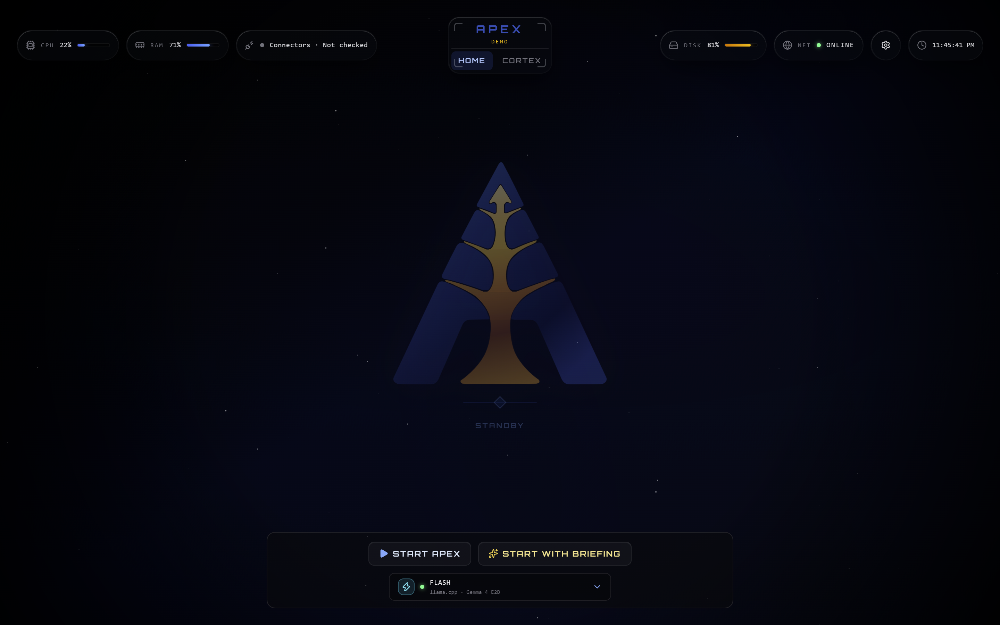

# Getting Started

This guide takes APEX from a clean checkout to a running local HUD. It starts with the credential-free demo path, then covers the normal launcher, manual development servers, optional providers, and common startup failures.

## Prerequisites

The validated development baseline is Windows with:

- Python `3.14.x`
- [uv](https://docs.astral.sh/uv/)
- Node.js 24
- npm

Run every command below from the repository root unless the step explicitly changes directory.

## Install the locked environments

```powershell
uv sync --locked

cd frontend
npm ci
npm run build
cd ..
```

`pyproject.toml` and `uv.lock` define the Python environment. `package-lock.json` defines the frontend dependency graph. Use `npm install` only when intentionally changing frontend dependencies.

## Run the credential-free demo

Create a local environment file:

```powershell
copy .env.example .env
```

Set the following value in `.env`:

```dotenv
DEMO_MODE=true
```

Then launch APEX:

```powershell
uv run python launcher.py
```

Demo mode uses static telemetry and deterministic Agent responses, skips live connectors, and does not write briefing history. It is the safest way to inspect the complete interface without disclosing personal data or configuring provider credentials.

<p align="center">
  
</p>

<p align="center">
  <em>APEX opens in standby and waits for the operator to start Home or begin with a briefing.</em>
</p>

## Run the full local system

After configuring the features you intend to use, run:

```powershell
uv run python launcher.py
```

The launcher:

1. Starts FastAPI on `127.0.0.1:8000`.
2. Starts the compiled HUD on `127.0.0.1:5500`.
3. Waits for API readiness and frontend availability.
4. Opens a supported browser in kiosk mode when possible.
5. Stops both child servers when the tracked browser closes.

If the launcher uses the operating-system default browser, it cannot track that browser process. Press `Ctrl+C` in the launcher terminal to stop the servers.

The Windows shortcut wrapper uses the same path:

```powershell
.\launch_apex.bat
```

For a desktop shortcut, set the shortcut's **Start in** field to the repository root so relative paths resolve correctly.

## Run the servers manually

Use two terminals from the repository root.

Terminal 1 — API:

```powershell
uv run python -m uvicorn core.api:app --host 127.0.0.1 --port 8000 --reload
```

Terminal 2 — compiled frontend:

```powershell
uv run python -m http.server 5500 --bind 127.0.0.1 --directory dist
```

Open `http://127.0.0.1:5500`.

For frontend hot reload, run this instead of the static server:

```powershell
cd frontend
npm run dev
```

Vite serves on its development port and calls the FastAPI process at `127.0.0.1:8000`.

## Configure optional capabilities

APEX can start without most provider credentials. Enable only the integrations you intend to use.

| Capability | What to prepare |
|---|---|
| Cloud Agents | `OPENAI_API_KEY`, `GEMINI_API_KEY`, `GEMINI_SANDBOX_API_KEY`, or `XAI_API_KEY`, according to the selected Agent |
| Weather, news, football, and market data | The corresponding key from `.env.example` |
| Gmail and Google Calendar | Desktop OAuth `credentials.json`; first authorization writes `token.json` |
| Google Cloud Text-to-Speech | Service-account key and an absolute `GOOGLE_APPLICATION_CREDENTIALS` path |
| Local inference (Ollama) | Ollama plus the desired Qwen3 model tags |
| Local inference (llama.cpp) | Optional external or APEX-managed llama.cpp router with Apodemus aliases |
| Microsoft To Do | Public/native Entra application with delegated `Tasks.Read` |
| MCP providers | Provider credential plus explicit runtime and preset enablement |

See [Configuration](configuration.md) for ownership, precedence, modes, Agent names, and provider-specific boundaries.

## Install local Ollama Agents

Install and start [Ollama](https://ollama.com), then pull only the models required by the local Agents you want:

```powershell
ollama pull qwen3:1.7b
ollama pull qwen3:4b-instruct
```

These map to Sorex and Mus. Missing tags appear as unavailable in the HUD instead of failing at selection time.

## Optional llama.cpp path

llama.cpp is not required to start APEX. When you want Apex Apodemus:

1. Install llama.cpp yourself (APEX does not install, bundle, or update it, and does not download model weights).
2. Copy [`docs/examples/llama-cpp-apodemus.preset.ini`](examples/llama-cpp-apodemus.preset.ini) to a machine-local path, set the GGUF placeholder, and keep that copy untracked.
3. Choose a mode:
   - **External:** start the router yourself with `--models-preset`, `--models-max 1`, and `--no-models-autoload` as documented in [configuration.md](configuration.md#external-and-managed-router-modes).
   - **Managed:** in Runtime Settings, enable llama.cpp, turn on Manage server automatically, and set the executable and preset paths. APEX starts the router only when the configured loopback URL is unreachable.
4. Set `llama_cpp.enabled` to `true` in `config.local.json` if needed, and optionally `LLAMA_CPP_API_KEY` in `.env`.
5. Keep `autoload` disabled for APEX traffic; the provider always requests `autoload=false`.

A manual smoke script is available when a router is running:

```powershell
uv run python scripts/smoke_llama_cpp.py --host http://127.0.0.1:8080 --model apodemus-8k --load --unload
```

## First-run expectations

- Standby does not automatically collect telemetry or run a briefing.
- **Start APEX** activates Home and refreshes its data.
- **Start with Briefing** activates Home, refreshes telemetry, and synthesizes with the selected briefing mode.
- Ask APEX becomes available after activation when it is enabled in Settings.
- Runtime Settings writes machine-local overrides to `config.local.json`.
- Production briefings and reminders persist to `apex_memory.db`; demo briefings do not.

## Troubleshooting

### The browser never opens

Read the launcher error first. A bind conflict, failed readiness probe, missing frontend build, or early child-process exit suppresses browser launch. Run the API and static server manually to isolate the failing side.

### The frontend build is missing

Rebuild it from `frontend/`:

```powershell
npm run build
```

The launcher serves the root `dist/` output produced by Vite.

### Port 8000 or 5500 is already in use

Stop the existing APEX process or other service using the port. APEX intentionally uses fixed loopback ports because the frontend API constants, launcher, and allowed origins agree on them.

### Readiness fails

`GET /api/v1/health/ready` checks the runtime settings snapshot and a lightweight SQLite query. Inspect malformed `config.local.json`, database access, and the API terminal. Optional external providers do not affect readiness.

### A local model is unavailable

Confirm the selected backend is running. For Ollama, check the configured host and that the exact model tag is installed with `ollama list`. For Apodemus, confirm the llama.cpp router lists the selected runtime alias. Cold loads can also be blocked by the Agent's CPU or RAM gate.

### Live connectors return no data

Confirm the connector is enabled, its required credential is present, and the HUD preflight or telemetry health reason. Disabled connectors deliberately make no network or authentication attempt.

### Google authorization changed

If Gmail or Calendar scopes change, remove the local `token.json` and authorize again. Never commit OAuth tokens or credential files.

## Next references

- [Configuration](configuration.md) for all settings and provider boundaries
- [Architecture](architecture.md) for runtime ownership and failure behavior
- [Privacy](privacy.md) before enabling personal data or cloud processing
- [API](api.md) for manual HTTP workflows
