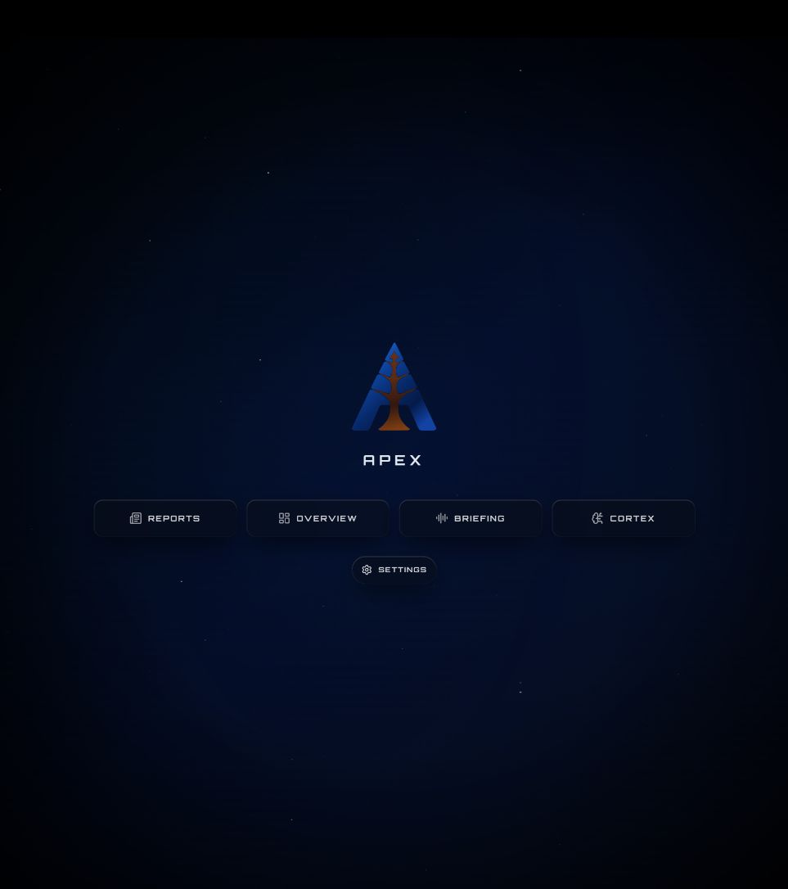

# Getting Started

This guide takes you from a clean checkout to a first run of APEX. Start with the demo to explore the interface, then configure the models and connected services you want to use.

## Prerequisites

The validated development baseline is Windows with:

- Python `3.14.x`
- [uv](https://docs.astral.sh/uv/)
- Node.js 24
- npm

Run every command below from the repository root unless the step explicitly changes directory.

## Install the locked environments

```powershell
uv sync --locked

cd frontend
npm ci
npm run build
cd ..
```

`pyproject.toml` and `uv.lock` define the Python environment. `package-lock.json` defines the frontend dependency graph. Use `npm install` only when intentionally changing frontend dependencies.

## Run the credential-free demo

If you do not already have a `.env` file, copy the example:

```powershell
copy .env.example .env
```

Set the following value in `.env`:

```dotenv
DEMO_MODE=true
```

Then launch APEX:

```powershell
uv run python launcher.py
```

Demo mode uses static telemetry, deterministic Agent responses, and fixed Daily and Catch Up briefing fixtures in an in-memory database. It skips live connectors and model provider calls, and its sessions reset when the demo process stops. Deep briefings are unavailable in demo mode. Optional speech uses `DEMO_TTS`, which defaults to the local pyttsx3 engine; selecting Google speech requires its credentials and sends spoken text to Google.

<p align="center">
  
</p>

<p align="center">
  <em>APEX opens on Launch. Choose a workspace or open Settings; Overview waits for an explicit telemetry collection.</em>
</p>

## Run the full local system

Stop the demo and set this value in `.env`:

```dotenv
DEMO_MODE=false
```

Read [Privacy](privacy.md) before connecting personal services or using cloud models, then restart APEX after changing `.env`:

```powershell
uv run python launcher.py
```

Once APEX is running, open Runtime Settings to choose a model and enable the features you intend to use. [Configuration](configuration.md) explains the required credentials and local model setup. APEX can open without a model provider credential, but live Agent responses and generated briefings need an available model.

The launcher:

1. Starts a managed backend on `127.0.0.1:8000`.
2. Starts the compiled frontend on `127.0.0.1:5500`.
3. Matches API runtime identity to its launched child, then waits for API readiness and frontend availability.
4. Opens a supported browser in an application window when possible.
5. Stops both child servers when the tracked browser closes.

If the launcher uses the operating-system default browser, it cannot track that browser process. Press `Ctrl+C` in the launcher terminal to stop the servers.

Stopping the launcher requests graceful backend shutdown and waits through the backend's advertised timeout. A port conflict or another backend owning the selected data profile stops startup without attaching to or terminating that process. Stop the existing instance yourself, or select a different data profile after freeing port 8000; the host does not choose another port.

The Windows shortcut wrapper uses the same path:

```powershell
.\launch_apex.bat
```

For a desktop shortcut, set the shortcut's **Start in** field to the repository root so relative paths resolve correctly.

## Run the backend without the browser

For API and CLI use without the launcher or frontend server:

```powershell
uv run python -m core.backend_host serve --standalone
```

`uv run python -m core.api` is the equivalent standalone entrypoint. Both retain the configured development/demo behavior and selected data directory. Stop the host with `Ctrl+C`; see [Backend hosting](architecture.md#backend-hosting) for ownership and shutdown behavior.

For the Windows x64 frozen backend and standalone CLI build, see [Windows backend bundle](backend-bundle.md).

## Run the servers manually

Use two terminals from the repository root.

Terminal 1: API

```powershell
uv run python -m uvicorn core.api:app --host 127.0.0.1 --port 8000 --reload
```

This reload workflow lets Uvicorn manage development-process exit. Use the standalone host above for its enforced shutdown timeout and socket ownership checks.

Terminal 2: compiled frontend

```powershell
uv run python -m http.server 5500 --bind 127.0.0.1 --directory dist
```

Open `http://127.0.0.1:5500`.

For frontend hot reload, run this instead of the static server:

```powershell
cd frontend
npm run dev
```

Vite serves on its development port and calls the FastAPI process at `127.0.0.1:8000`.

## Windows desktop installation

The per-user Windows installer places the shell and its bundled backend under `%LOCALAPPDATA%\Programs\APEX`. APEX keeps its mutable profile separately under `%LOCALAPPDATA%\APEX`; uninstalling the application does not remove that profile. See [Configuration](configuration.md#where-settings-live) for the data directory and [Privacy](privacy.md#retention-and-deletion) for deletion boundaries.

The installer uses the WebView2 download bootstrapper. If the WebView2 Runtime is already installed, setup can use it directly; if it is missing, setup needs network access to download it. The installed app does not require Python, Node.js, Rust, or developer tools.

Before upgrading, quit APEX from the tray and stop any separately started APEX backend or CLI process that is using the installed program files. If setup detects a running installed process, it asks you to quit it and retry; it does not force-terminate it.

For the installer build, packaging command, artifact location, and validation steps, see [Windows backend bundle](backend-bundle.md#desktop-build-installer-and-validation).

## First run in the Windows desktop app

The desktop app asks whether to start fresh or copy an existing APEX data folder before opening the interface. Choose **Import** to preview a stopped source checkout or another supported data folder, review the managed files, and copy them into the desktop profile. If the source process used `APEX_DATA_DIR`, choose that actual data folder directly; the desktop app does not search a source `.env` to discover it. Import does not merge profiles and leaves the source unchanged. Close APEX in the source folder before importing so its SQLite database is not changing during the copy.

Choose **Fresh Start** to start the selected profile without importing another folder. Existing files in that profile are preserved and may still be used; Fresh Start does not delete or reset a checkout, another profile, or files outside the selected desktop data folder. You can keep using the source checkout separately.

The preview lists the managed files that will be copied. Some destinations remain where configured, including the encrypted Microsoft To Do token cache and external Context vault, report-folder, and model paths. The import flow reuses the existing same-user Microsoft encrypted storage where supported; it leaves those cache bytes in place. Correct any reported credential reference after setup. See [Configuration](configuration.md#desktop-first-run-and-import) for profile and path rules.

## Explore the workspaces

APEX opens on Launch without collecting telemetry or running a briefing.

1. Open **Overview** and select **Collect Telemetry** to check connected services and populate the grid. This does not run a model.
2. Open **Briefing**, choose **Daily**, and generate a session. In demo mode this uses a fixture; outside demo mode it uses the model selected in APEX Agent settings. The saved result can be continued in its linked Cortex conversation.
3. Open **Cortex** to talk directly with the Agent. You can do this without collecting telemetry first.
4. Open **Reports** to inspect imported external activity reports.

Personal-context retrieval is off by default for cloud and local models. You can still inspect and manage local records through Cortex's Context inspector. Exporting selected records as Markdown is also off by default; see [Context Vault](context-vault.md).

Normal sessions are stored in the local `apex_memory.db`; demo sessions are temporary. If you are opening an existing database, see [Persistence compatibility](architecture.md#persistence-compatibility) for the supported versions and startup checks.

## Troubleshooting

### The browser never opens

Read the launcher error first. A bind conflict, failed readiness probe, missing frontend build, or early child-process exit suppresses browser launch. Run the API and static server manually to isolate the failing side.

### The frontend build is missing

Rebuild it from `frontend/`:

```powershell
npm run build
```

The launcher serves the root `dist/` output produced by Vite.

### Port 8000 or 5500 is already in use

Stop the existing APEX process or other service using the port. APEX intentionally uses fixed loopback ports because the frontend API constants, launcher, and allowed origins agree on them.

### Readiness fails

`GET /api/v1/health/ready` checks the runtime settings snapshot and a lightweight SQLite query. Inspect the API terminal and database access. Runtime Settings reports invalid local overrides and falls back to tracked defaults. Optional external providers do not affect readiness.

### A local model is unavailable

Confirm the llama.cpp backend is running and the router lists the selected model-based runtime alias. Cold loads can also be blocked by the model's CPU or RAM gate.

### Live connectors return no data

Confirm the connector is enabled, its required credential is present, and the preflight or telemetry health reason. Disabled connectors deliberately make no network or authentication attempt.

### Google authorization changed

If Gmail or Calendar scopes change, remove the local `token.json` and authorize again. Never commit OAuth tokens or credential files.

## Next references

- [Configuration](configuration.md) for all settings and provider boundaries
- [Architecture](architecture.md) for runtime ownership and failure behavior
- [Privacy](privacy.md) before enabling personal data or cloud processing
- [Speech Runtime](speech-runtime.md) for local and cloud voice options
- [Context Vault](context-vault.md) for managing personal knowledge exports
- [API](api.md) for manual HTTP workflows
