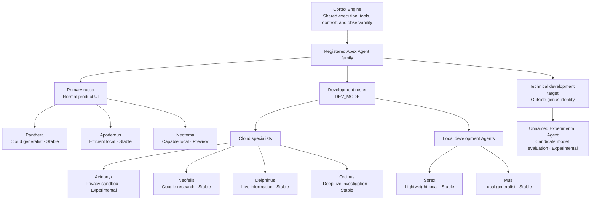

# APEX Identity and Naming

This document explains the meaning behind the main names used throughout APEX. It is intended both as an introduction for someone unfamiliar with the project and as a record of the identity and naming rationale for the full registered Apex Agent family, including Agents that are not currently user-facing.

An Agent being documented here does not mean that it is visible in the normal product UI. The current primary/user-facing roster is Apex Panthera, Apex Apodemus, and Apex Neotoma. Other named Agents remain documented because they still exist as development, legacy, specialized, or experimental identities. DEV_MODE surfaces the wider development roster for testing and evaluation.

The naming system combines product terminology with biological metaphors. Those metaphors help communicate differences in scale, purpose, and capability, but they are not intended as a strict scientific classification or permanent ranking.

## APEX

**APEX** stands for **Automated Personal Environment Xylem**.

The name has several connected meanings.

An apex is the highest point of a structure. In APEX, it represents the point where information from across a personal digital environment is brought together into one operational view.

Xylem is the vascular tissue that carries water and minerals upward through a plant. APEX uses that as an analogy for collecting signals from separate systems, such as calendars, messages, reminders, weather, markets, and machine telemetry, and moving the useful information upward into a single interface.

The name also evokes an **apex predator**, connecting the product to the genus-based names used by Apex Agents.

Together, these ideas describe APEX as a system that collects information from across a personal environment, moves it upward, and presents it at the highest operational level.

## The APEX logo

The APEX logo combines the same ideas visually.

Its outer structure forms the shape of an **A**. That structure is divided into sections resembling the levels of a food-chain pyramid, leading upward toward its apex.

The inner structure resembles a trunk or xylem channel. It represents data being collected from the wider environment and moving upward through the system toward the peak.

The logo therefore combines:

- the letter **A** for APEX;
- a food-chain pyramid leading to an apex predator;
- a trunk or xylem channel transporting information upward;
- and the apex itself, where the collected information converges.

The logo is not only a monogram. It is a visual summary of the project name and the way APEX is intended to operate.

<p align="center">
  
</p>

## Product vocabulary

The main APEX terms describe different parts of the product rather than interchangeable names for the same system.

```text
APEX
├── Home workspace
│   └── Telemetry, briefings, health, and compact Ask APEX access
└── Cortex
    ├── Cortex workspace
    ├── Cortex Engine
    └── Apex Agents
```

### APEX

**APEX** is the complete application and operational environment.

It includes Home, Cortex, telemetry collection, briefing generation, voice delivery, connectors, settings, and all available Agents.

### Home

**Home** is the primary operational workspace.

It presents the current state of the user’s environment through telemetry, briefings, connector health, system status, reminders, and compact controls. The name is intentionally direct: it is the workspace the user returns to for the overall state of APEX.

### Ask APEX

**Ask APEX** is the prompt and command surface through which the user makes requests.

Ask APEX is not itself an Agent. A request entered through Ask APEX is handled by the selected Apex Agent through the Cortex Engine.

### Cortex workspace

The **Cortex workspace** is the detailed interface for working with the visible Apex Agents.

It contains Agent selection, effort controls, provider-specific capabilities, the unified Tools selector, model lifecycle controls, conversation history, and execution information.

### Cortex Engine

The **Cortex Engine** is the backend subsystem that executes Agent requests.

It coordinates the selected Agent, conversation context, tools, provider calls, local-model lifecycle, execution limits, and returned results. Cortex is the operating layer; it is not the identity of the Agent doing the work.

### Apex Agents

**Apex Agents** are the named workers registered with Cortex. The catalog includes both the normal product roster and identities retained for development, specialization, legacy compatibility, or experimentation; registration does not mean that every Agent is equally surfaced in the normal Cortex UI.

Each Agent has a particular role, underlying model configuration, runtime, capability policy, cost profile, and intended type of work.

## Why Agents use genus names

Apex Agents use animal genera as product identities.

The names create a cohesive family while allowing relationships between Agents to communicate differences in scale and capability. Some Agents are direct counterparts, while others represent specialized branches serving a different purpose.

The genus name is not meant to describe only the underlying model. It represents the complete role that the Agent occupies within APEX.

At present, most Agents are closely associated with one model. That can make them appear like named costumes for their underlying models. The longer-term purpose of the Agent identity is broader.

An Apex Agent can eventually include:

- one or more underlying models;
- APEX tools and external integrations;
- Agent-specific instructions and behavior;
- context selection and memory policies;
- routing between different execution strategies;
- and capabilities that do not belong to the raw model itself.

The model is therefore one part of an Agent’s implementation, not necessarily its permanent identity.

## Agent versioning

The version attached to an Apex Agent belongs to that named Agent identity. It is not the APEX application version, a shared Cortex contract version, or the version of the underlying provider model.

Each current Agent begins at `1.0` as the initial version of its current product identity.

Agent versions evolve independently:

- A meaningful model upgrade, compatible capability expansion, or substantial change to execution behavior normally increases the minor version, such as `1.0` to `1.1`.
- A provider migration, major role change, or substantial change to the Agent's capability, privacy, or operating contract normally increases the major version, such as `1.1` to `2.0`.

The version is intended as a concise indicator of meaningful Agent evolution rather than strict semantic versioning.

## The registered Agent family

The registered family shares one Cortex operating layer across cloud-hosted and local Agents, while each Agent occupies a distinct product role or development purpose. The normal product roster is intentionally smaller than the full catalog: Primary Agents are Panthera, Apodemus, and Neotoma. DEV_MODE surfaces the wider development roster, while the other identities remain registered and documented without being normal user-facing alternatives.

DEV_MODE visibility does not necessarily indicate instability. Some Agents have established identities and technically stable implementations but are currently hidden from the primary roster because APEX does not yet provide enough Agent-specific functionality to make their roles meaningfully distinct in normal use. They remain surfaced in the DEV_MODE roster for development, evaluation, and future capability work. Stability answers whether an Agent works reliably; visibility answers whether its current role earns space in the product.

Some DEV_MODE-only Agents retain intended future product roles that APEX does not yet fully support, while others remain registered primarily for development, comparison, or historical continuity.



Every registered Apex Agent uses the same Cortex operating layer, while differing in provider, model scale, capability policy, cost profile, and intended role. Only the Primary Agents belong to the normal user-facing roster; DEV_MODE surfaces the Development Agents and technical target in the development roster.

These roles describe current product intent. They should not be read as a precise biological hierarchy or permanent capability ranking.

## Apex Acinonyx

**Status:** Visibility: DEV_MODE only / Stability: Experimental

*Acinonyx* is the genus of the cheetah.

The cheetah is strongly associated with speed and short bursts of focused activity. Apex Acinonyx applies that association to quick experimentation.

Acinonyx is the development-only privacy sandbox used for short, fast tests with masked or non-personal context. It is not intended to be the broad everyday Agent. Its purpose is to make experimentation inexpensive, rapid, and separated from the full personal operating context.

Within the felid naming group, Acinonyx represents the fast and narrowly focused starting point.

## Apex Panthera

**Status:** Visibility: Primary / Stability: Stable

*Panthera* is the genus containing lions, tigers, leopards, jaguars, and snow leopards.

Apex Panthera represents a significant jump from Acinonyx in breadth and adaptability. It is the default general-purpose Agent for ordinary daily use.

Panthera is not intended only for difficult or complex work. It should be suitable across a wide range of situations, from simple questions and routine planning to work that requires greater analysis.

The variety within the *Panthera* genus supports that meaning. Its different species occupy different environments and demonstrate different strengths while still belonging to one recognizable group. In APEX, this represents an Agent that can adapt to many types of work rather than being defined by one specialized capability.

Panthera is therefore the broad, everyday generalist of the current Agent family.

## Apex Neofelis

**Status:** Visibility: DEV_MODE only / Stability: Stable

*Neofelis* is the genus containing the clouded leopards. It is distinct from, but closely related to, *Panthera*.

That relationship is reflected in APEX. Neofelis is adjacent to Panthera, but it is not intended for the same broad general-purpose role.

Apex Neofelis specializes in using the distinctive capabilities of its underlying model. It currently uses Gemini 3.6 Flash and focuses on Google Search, Google Maps, and a one-million-token context window without a separate long-context surcharge in the current pricing configuration. The underlying model may support multimodal work, but current APEX requests are text- and tool-based.

The name represents a smaller and more specialized relative of the Panthera group. Neofelis remains a registered development/specialized Agent whose intended product role is Google-centered research and long-context work. APEX does not yet provide enough Agent-specific research capability to make that specialization meaningfully distinct in the normal roster, so Neofelis remains surfaced through DEV_MODE.

Its identity should therefore be understood as a specialized branch, not simply a weaker or stronger Panthera.

## Apex Delphinus

**Status:** Visibility: DEV_MODE only / Stability: Stable

*Delphinus* is the genus associated with common dolphins.

Delphinus begins a separate naming group from the felid Agents. It represents a different scope of work rather than another step in the Acinonyx–Panthera relationship.

Apex Delphinus specializes in live and social information retrieval. Its current Grok integration gives it access to X Search, making it useful for current conversations, developing events, social reactions, and information that may be moving faster than conventional sources.

Like Neofelis, Delphinus is defined by a specific capability rather than broad everyday coverage.

Apex Delphinus is a registered development/specialized Agent whose intended product role is live and social information work. Its lower-cost X-centered capability remains distinct from Orcinus, but APEX does not yet provide enough workflow support around that specialization to justify surfacing Delphinus in the normal roster.

## Apex Orcinus

**Status:** Visibility: DEV_MODE only / Stability: Stable

*Orcinus* is the genus containing the orca. Although commonly called a killer whale, the orca is the largest member of the dolphin family.

That makes Orcinus a direct larger counterpart to Delphinus within the APEX naming system.

Apex Orcinus is a registered development/specialized Agent whose intended product role is deeper investigation and reasoning over live information. It currently has the same general X-centered capability family as Delphinus, including live and social information retrieval. Its underlying model provides stronger intelligence and reasoning, particularly for deeper analysis and extended investigations, but at a higher cost. APEX does not yet provide enough differentiated investigation workflow capability for that role to justify a primary roster slot.

Delphinus was introduced because many requests can benefit from X integration without requiring Orcinus-level reasoning. The two registered development Agents therefore preserve different cost and capability points around a related set of tools.

The relationship can be summarized as:

- **Delphinus:** specialized live information at a lower cost;
- **Orcinus:** the same general information scope with stronger reasoning at a higher cost.

## Apex Sorex

**Status:** Visibility: DEV_MODE only / Stability: Stable

*Sorex* is a genus of shrews.

Sorex belongs to the local Agent group. The shift from large cats and dolphins to very small mammals represents the smaller model size and more limited computing resources of local inference.

Apex Sorex is retained as a lightweight local development Agent. Its technical role represents situations where a simple answer is sufficient and minimizing local hardware use matters more than obtaining the strongest possible reasoning, but it is not a normal product choice or briefing fallback tier.

Its small scale represents:

- lower model capacity;
- lower CPU and memory requirements;
- shorter and simpler work;
- and wider compatibility with constrained systems.

Sorex is not intended to imitate the full capability of the cloud Agents. Its historical and technical identity represents a fast, private, on-device fallback for straightforward requests; it remains documented for development rather than occupying a normal roster slot.

## Apex Mus

**Status:** Visibility: DEV_MODE only / Stability: Stable

*Mus* is a genus of mice.

Apex Mus is retained as a larger local development Agent than Sorex. It represents an improvement in intelligence and general usefulness over Sorex while requiring more local hardware resources, but it is not a normal product choice or briefing fallback tier.

Mus remains intentionally smaller in scale than the cloud Agent groups. Its historical and technical role represents a practical on-device generalist for work that benefits from greater capability than Sorex can provide but should remain local; it is retained as a development Agent rather than part of the normal roster.

The Sorex–Mus relationship is therefore:

- **Sorex:** the smallest and lightest local option for simple answers;
- **Mus:** a more capable local generalist with higher hardware requirements.

Mice and shrews are not especially close taxonomic counterparts. Their relationship in APEX is based primarily on their shared small scale and the operational progression between the two local models.

## Apex Apodemus

**Status:** Visibility: Primary / Stability: Stable

*Apodemus* is a genus of field mice.

Apodemus belongs to the same small-mammal local group as Sorex and Mus. The name positions it as an efficient local relative rather than a cloud-scale Agent.

Apex Apodemus is a local Agent that runs through a llama.cpp HTTP router (external or APEX-managed). It is intended for private, on-device work that benefits from structured tool use, with a selectable context window of 4K, 16K, 32K, or high-resource 132K tokens. Its configured model is Gemma 4 E2B (`gemma-4-E2B-Q4_K_M.gguf`). Its local reasoning control supports None and Focused, with None as the safe default; Focused uses the model template's native reasoning without exposing hidden reasoning in Cortex.

Apodemus is also independently selectable for briefing synthesis. The current simplified briefing architecture has Panthera and Apodemus as the model-backed briefing choices: Panthera uses the cloud synthesis path, while Apodemus uses the shared local synthesis lifecycle and llama.cpp provider. Apodemus keeps its selectable context policy for interactive Cortex work.

## Apex Neotoma

**Status:** Visibility: Primary / Stability: Preview

*Neotoma* is a genus of pack rats and woodrats.

Apex Neotoma is a preview local Agent that runs through the same generic llama.cpp provider path as Apodemus. Its configured model is Qwen3.5 4B (`Qwen3.5-4B-Q4_K_M.gguf`), with selectable 4K, 16K, 32K, and high-resource 64K context presets and a 16K default. Its native model maximum is 262K tokens, while APEX exposes only the smaller presets as a resource policy. Its local reasoning control also supports None and Focused, defaulting to None.

Neotoma is not a briefing mode. Its role is interactive Ask APEX and Cortex local execution alongside the other local Agents.

## Unnamed Experimental Agent

**Status:** Visibility: DEV_MODE only / Stability: Experimental

Unnamed Experimental Agent is a development-only technical target for evaluating candidate local models. It is deliberately outside the genus-based Agent family: its name carries no genus-based identity, lore, or Apex prefix. It uses the same generic llama.cpp provider and local runtime coordinator as Apodemus and Neotoma, with Gemma 4 E4B (`gemma-4-E4B-Q4_K_M.gguf`) behind 4K, 16K, and 32K aliases.

Its Cortex controls expose None and Focused reasoning, defaulting to None. None disables native thinking explicitly; Focused enables the model template's native thinking, while the provider strips hidden reasoning before returning the answer. The target is fully registered for development use but hidden from the normal Agent catalog. The lack of a genus-based identity is intentional: experimental model candidates should not automatically become permanent members of the Apex Agent family. A candidate should receive a permanent genus-based identity only if it graduates into a durable product role.

## The Agent family is not permanent

The current Agent family is an experimental product structure, not a permanent roster. Product visibility and registration are separate: an Agent can remain implemented and documented for development without occupying a Primary product slot.

Agents may be introduced, changed, combined, or removed as the Agent capabilities of APEX evolve. The names should reflect useful distinctions that exist in the product, not preserve an Agent after its original purpose has disappeared.

The Primary roster should stay small, and each visible Agent should justify a distinct operational role. DEV_MODE can expose broader development identities without making them normal user-facing choices. An Agent may therefore remain registered and documented without occupying a primary product slot until APEX provides the capabilities that justify its intended role.

Delphinus is an example. It was derived from the Orcinus capability family because the cost difference created a useful lower-priced role. If a future model provides Orcinus-level reasoning and capabilities at Delphinus-level pricing, the distinction may no longer be valuable. Delphinus could then be changed or removed.

The same principle applies throughout the family. Agent continuity is useful, but maintaining meaningful roles is more important than preserving every name indefinitely.

## Previous naming

Before the current Agent family, APEX used a mixture of celestial and animal profile names.

The cloud profiles included:

- Comet;
- Nova;
- Pulsar.

The local profiles included:

- Lynx;
- Acinonyx;
- Neofelis.

This created two unrelated naming styles inside the same system. The celestial names described cloud model tiers, while the genus-based names described local model tiers. The result did not communicate one cohesive Agent family.

The current system replaced the celestial terminology with genus names throughout the roster. Acinonyx and Neofelis were retained but assigned new roles within the broader Agent structure. Lynx was retired because it did not fit the final distribution and relationships between the current Agents.

The terminology also changed from **profiles** to **Apex Agents**.

A profile primarily sounds like a collection of settings around one model. That description was increasingly too narrow. The Agent identity leaves room for tools, context policies, orchestration, model replacement, and eventually more than one model working behind a single named role.

The current names therefore describe evolving APEX product identities rather than fixed aliases for individual models.

## Closing idea

The APEX naming system is intended to make the product memorable while still communicating real differences between its parts.

APEX describes information moving upward through a personal environment. The logo turns that movement into a visual path toward the peak. Cortex operates the named Agents, and the Agent genera communicate relationships in speed, scale, specialization, capability, and cost.

Those meanings record the current design of APEX, while leaving the family free to evolve alongside the project.

---

For runtime responsibilities and system boundaries, see
[Architecture](architecture.md). For the implementation of the visual
language, see the [Design System](design-system.md).
