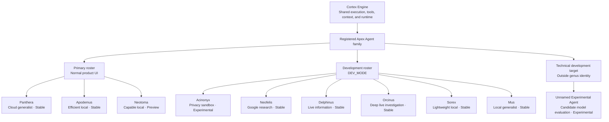

# APEX Identity and Naming

This document explains the names used throughout APEX and the reasoning behind them. It covers both the normal product roster and Agents that remain registered for development, specialization, legacy continuity, or experimentation.

Being documented here does not mean an Agent appears in the normal UI. The current primary roster is Apex Panthera, Apex Apodemus, and Apex Neotoma. `DEV_MODE` exposes the wider development roster.

The naming system uses biological metaphors to communicate differences in role, scale, and capability. It is not meant to be a strict scientific classification or permanent ranking.

## APEX

**APEX** stands for **Automated Personal Environment Xylem**.

An apex is the highest point of a structure. In APEX, it represents the place where information from across a personal digital environment comes together into one view.

Xylem is the plant tissue that carries water and minerals upward. APEX uses that as an analogy for collecting signals from calendars, messages, reminders, weather, markets, system telemetry, and other sources and bringing the useful parts into one interface.

The name also suggests an **apex predator**, which connects the product to the genus-based names used by Apex Agents.

## The APEX logo

The logo combines the same ideas visually.

Its outer structure forms an **A** and resembles the levels of a food-chain pyramid leading to an apex. The inner structure resembles a trunk or xylem channel carrying information upward.

The logo therefore combines:

- the letter **A** for APEX;
- a food-chain pyramid leading to an apex predator;
- a trunk or xylem channel carrying information upward;
- and the apex where that information comes together.

<p align="center">
  
</p>

## Product vocabulary

The main APEX terms refer to different parts of the system.

```text
APEX
├── Home workspace
│   └── Telemetry, briefings, health, reminders, and compact Agent access
└── Cortex
    ├── Cortex workspace
    ├── Cortex Engine
    └── Apex Agents
```

### APEX

**APEX** is the complete application. It includes Home, Cortex, telemetry, briefings, voice, connectors, settings, and the available Agents.

### Home

**Home** is the main operational workspace. It shows the current state of the user's environment through telemetry, briefings, connector health, reminders, system status, and compact controls.

### Agent queries

An **Agent query** is a request sent to the selected Apex Agent. It is the interaction surface, not the Agent itself.

### Cortex workspace

The **Cortex workspace** is the detailed interface for working with Apex Agents. It contains Agent selection, effort and reasoning controls, tools, local-model controls, conversation history, and execution information.

### Cortex Engine

The **Cortex Engine** is the backend that runs Agent requests, coordinates context and tools, calls the selected provider, and manages local-model lifecycle.

### Apex Agents

**Apex Agents** are the named workers used through Cortex. Each has its own role, model configuration, runtime, tool policy, cost profile, and intended type of work.

## Why Agents use genus names

Apex Agents use animal genera as product identities. The names create one family while still allowing relationships between Agents to suggest differences in speed, scale, specialization, and capability.

The genus name represents the Agent's role in APEX, not only the model behind it. Most current Agents are still closely tied to one model, but the identity is meant to survive model changes when the role remains useful.

An Agent can eventually include its model, tools, instructions, context and memory rules, routing choices, and other behavior that does not belong to the raw model itself.

## Agent versioning

An Agent version belongs to that Agent identity. It is separate from the APEX application version and the provider model version.

Each current Agent begins at `1.0`. A meaningful model or capability upgrade can increase the minor version, while a provider migration or major role or privacy change can increase the major version. This is a simple record of Agent evolution rather than strict semantic versioning.

## The registered Agent family

The normal roster is intentionally smaller than the full registered catalog. Panthera, Apodemus, and Neotoma are the current Primary Agents. Other Agents remain available in `DEV_MODE` or stay registered for development and evaluation.

Visibility and stability are separate. An Agent can work reliably and still stay out of the main roster if APEX does not yet give its role enough distinct value in normal use.



For current model IDs, context sizes, provider controls, and runtime behavior, see [Configuration](configuration.md) and [Architecture](architecture.md).

## Apex Acinonyx

**Status:** Visibility: DEV_MODE only / Stability: Experimental

*Acinonyx* is the cheetah genus. The cheetah's association with speed fits Acinonyx's role as a development-only privacy sandbox for quick tests with masked or non-personal context.

It is deliberately narrow rather than an everyday Agent. Within the felid group, it represents the fast experimental starting point.

## Apex Panthera

**Status:** Visibility: Primary / Stability: Stable

*Panthera* includes lions, tigers, leopards, jaguars, and snow leopards. Their range and adaptability fit Panthera's role as the broad everyday cloud Agent.

Panthera is meant for ordinary use across many kinds of work, not only difficult questions. It is the generalist of the current Agent family.

## Apex Neofelis

**Status:** Visibility: DEV_MODE only / Stability: Stable

*Neofelis* is the genus of clouded leopards and is closely related to *Panthera*. In APEX, that relationship represents an Agent that sits near Panthera but has a narrower role.

Neofelis focuses on Google-centered research, especially Search, Maps, and long-context work. It stays in `DEV_MODE` because APEX does not yet have enough workflows built around that specialization to justify putting it in the main roster.

## Apex Delphinus

**Status:** Visibility: DEV_MODE only / Stability: Stable

*Delphinus* is associated with common dolphins. It begins a separate naming group from the felid Agents.

Delphinus focuses on live and social information through X Search. It is meant for developing events, current conversations, and social reactions. It stays in `DEV_MODE` because that role does not yet have enough dedicated workflow support to justify a main roster slot.

## Apex Orcinus

**Status:** Visibility: DEV_MODE only / Stability: Stable

*Orcinus* is the orca genus. Orcas are the largest members of the dolphin family, making Orcinus a natural larger counterpart to Delphinus.

Orcinus covers the same general live-information space but is intended for deeper analysis and investigation at a higher cost. Delphinus keeps the lower-cost role; Orcinus keeps the stronger-reasoning role.

## Apex Sorex

**Status:** Visibility: DEV_MODE only / Stability: Stable

*Sorex* is a genus of shrews. Its small scale fits the smallest local Agent in the family.

Sorex is kept as a lightweight development Agent for simple work where low hardware use matters more than maximum capability. It is not part of the normal roster or briefing fallback path.

## Apex Mus

**Status:** Visibility: DEV_MODE only / Stability: Stable

*Mus* is the mouse genus. Mus represents a larger local step than Sorex: more capable, but also more demanding on the machine.

It remains a development Agent rather than a normal product choice. The Sorex-Mus relationship is based on their shared small scale and their progression as local models, not close taxonomy.

## Apex Apodemus

**Status:** Visibility: Primary / Stability: Stable

*Apodemus* is a genus of field mice. It belongs to the same small-mammal local group as Sorex and Mus while representing a more capable and useful everyday local Agent.

Apodemus is intended for private, on-device work and can also be selected for local briefing generation. Its exact model, context options, reasoning controls, and llama.cpp setup belong in [Configuration](configuration.md).

## Apex Neotoma

**Status:** Visibility: Primary / Stability: Preview

*Neotoma* is a genus of pack rats and woodrats. The name keeps Neotoma in the small-mammal local family while distinguishing it from Apodemus.

Neotoma is the more capable preview local Agent for interactive Cortex work. It is not a briefing mode. Current model and context details are documented in [Configuration](configuration.md).

## Unnamed Experimental Agent

**Status:** Visibility: DEV_MODE only / Stability: Experimental

Unnamed Experimental Agent is a technical target for trying candidate local models before they receive a permanent product identity. It deliberately has no genus name or Apex prefix.

It uses the same local runtime path as the named llama.cpp Agents but stays outside the Agent family until a candidate proves useful enough to earn a durable role. Technical model and context details belong in [Configuration](configuration.md).

## The Agent family is not permanent

The Agent family can change as APEX changes. Agents may be introduced, combined, renamed, or removed when their roles stop being useful.

The Primary roster should stay small. A visible Agent should earn its place by doing something meaningfully different in the product, while `DEV_MODE` can keep broader development identities available for testing.

Delphinus is a useful example. Its role exists because X access at a lower cost is meaningfully different from Orcinus today. If that distinction disappears in the future, there is no reason to preserve two Agents only for the sake of keeping both names.

## Previous naming

Before the current Agent family, APEX mixed celestial cloud-profile names with animal local-profile names.

The cloud profiles were Comet, Nova, and Pulsar. The local profiles were Lynx, Acinonyx, and Neofelis.

The current system replaced that split with one genus-based Agent family. Acinonyx and Neofelis were kept but given new roles; Lynx was retired.

The terminology also changed from **profiles** to **Apex Agents**. A profile sounds like settings wrapped around one model. The Agent identity leaves room for tools, context rules, model replacement, and other behavior that can grow beyond a single model configuration.

## Closing idea

The naming system is meant to make APEX memorable while still communicating real differences between its parts.

APEX describes information moving upward through a personal environment. The logo turns that movement into a visual path toward the peak. Cortex runs the named Agents, and their genera suggest relationships in speed, scale, specialization, capability, and cost.

For runtime responsibilities and system boundaries, see [Architecture](architecture.md). For the visual language, see the [Design System](design-system.md).
