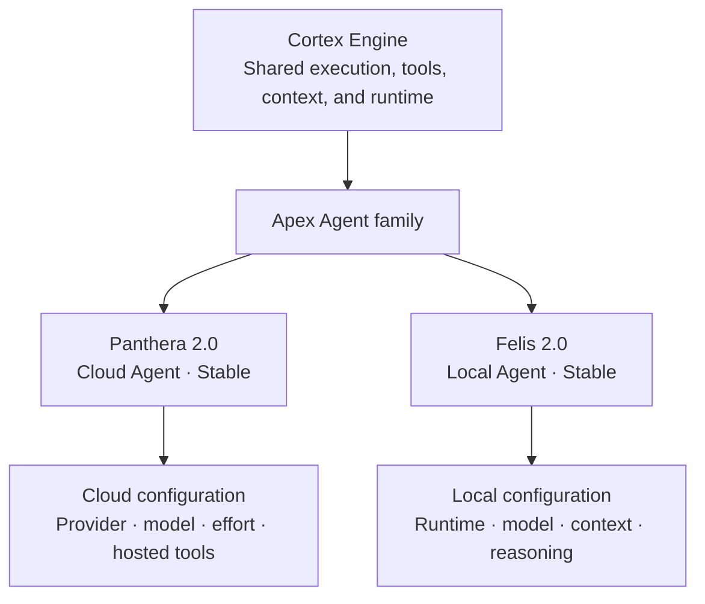

# APEX Identity and Naming

This document explains the names used throughout APEX and the reasoning behind them. It covers the current Apex Agent roster and how former Agent identities relate to today's model configuration.

The current product roster is Apex Panthera and Apex Felis. Cloud provider, local runtime, and model selection live underneath those two Agent identities in settings and Cortex.

The naming system uses biological metaphors to communicate differences in role, scale, and capability. It is not meant to be a strict scientific classification or permanent ranking.

## APEX

**APEX** stands for **Automated Personal Environment Xylem**.

An apex is the highest point of a structure. In APEX, it represents the place where information from across a personal digital environment comes together into one view.

Xylem is the plant tissue that carries water and minerals upward. APEX uses that as an analogy for collecting signals from calendars, messages, reminders, weather, markets, system telemetry, and other sources and bringing the useful parts into one interface.

The name also suggests an **apex predator**, which connects the product to the genus-based names used by Apex Agents.

## The APEX logo

The logo combines the same ideas visually.

Its outer structure forms an **A** and resembles the levels of a food-chain pyramid leading to an apex. The inner structure resembles a trunk or xylem channel carrying information upward.

The logo therefore combines:

- the letter **A** for APEX;
- a food-chain pyramid leading to an apex predator;
- a trunk or xylem channel carrying information upward;
- and the apex where that information comes together.

<p align="center">
  
</p>

## Product vocabulary

The main APEX terms refer to different parts of the system.

```text
APEX
├── Home workspace
│   └── Telemetry, briefings, health, reminders, and compact Agent access
└── Cortex
    ├── Cortex workspace
    ├── Cortex Engine
    └── Apex Agents
        ├── Apex Panthera (Cloud · Generalist)
        └── Apex Felis (Local · Private)
```

### APEX

**APEX** is the complete application. It includes Home, Cortex, telemetry, briefings, voice, connectors, settings, and the available Agents.

### Home

**Home** is the main operational workspace. It shows the current state of the user's environment through telemetry, briefings, connector health, reminders, system status, and compact controls.

### Agent queries

An **Agent query** is a request sent to the selected Apex Agent. It is the interaction surface, not the Agent itself.

### Cortex workspace

The **Cortex workspace** is the detailed interface for working with Apex Agents. It contains Agent selection, provider and model controls, effort and reasoning controls, tools, local-runtime controls, conversation history, and execution information.

### Cortex Engine

The **Cortex Engine** is the backend that runs Agent requests, coordinates context and tools, calls the selected provider or local runtime, and manages local-model lifecycle.

### Apex Agents

**Apex Agents** are the named workers used through Cortex. APEX currently exposes two durable Agent identities:

- **Apex Panthera** (`Cloud · Generalist`) for cloud work through a selected provider and model.
- **Apex Felis** (`Local · Private`) for local on-device work through Ollama or llama.cpp and a selected model.

Where space is tight—such as very small pills, badges, and mobile controls—compact labels use short forms (`Panthera` / `Felis`).

Model, context, reasoning, effort, tool policy, and cost profile are configuration underneath the Agent identity rather than separate product Agents. The selected model profile supplies the provider or local runtime automatically.

## Why Agents use genus names

Apex Agents use animal genera as product identities. The names create one family while still allowing relationships between Agents to suggest differences in speed, scale, specialization, and capability.

The genus name represents the Agent's role in APEX, not only the model behind it. Panthera and Felis are meant to survive model changes when their roles remain useful.

An Agent can include its model, tools, instructions, context and memory rules, routing choices, and other behavior that does not belong to the raw model itself.

## Agent versioning

An Agent version belongs to that Agent identity. It is separate from the APEX application version and the provider model version.

Panthera and Felis are currently at **2.0**. That major version marks the Agent Family Consolidation checkpoint: two durable Agent identities with replaceable model configuration underneath them. A meaningful model or capability upgrade can increase the minor version, while a provider migration or major role or privacy change can increase the major version. This is a simple record of Agent evolution rather than strict semantic versioning.

## The Apex Agent family

APEX now keeps the product roster intentionally small. Panthera and Felis are the only Apex Agents in the UI and API. Former genus-based names belong to project history rather than active configuration or runtime compatibility.



For current model IDs, context sizes, provider controls, and runtime behavior, see [Configuration](configuration.md) and [Architecture](architecture.md).

## Apex Panthera

**Status:** Visibility: Primary / Stability: Stable / Version: 2.0

*Panthera* includes lions, tigers, leopards, jaguars, and snow leopards. Their range and adaptability fit Panthera's role as the cloud Agent.

Panthera is meant for thoughtful answers, planning, and complex everyday work across many kinds of tasks. It is the generalist cloud identity. The selected OpenAI, Google, or SpaceXAI model, effort level, and optional provider-hosted grounding controls live in Panthera settings rather than in separate Agent names.

Default model: OpenAI `gpt-5.6-luna`. Development-only cloud models such as Gemini Flash Lite and Grok variants remain selectable when `DEV_MODE` is active.

## Apex Felis

**Status:** Visibility: Primary / Stability: Stable / Version: 2.0

*Felis* is the genus of small cats, known for agility, stealth, and operating closely within local territory. That fits Felis's role as the private, on-device local Agent.

Felis is meant for on-device work through Ollama or llama.cpp. The selected runtime, GGUF or Ollama tag, context preset, and reasoning mode live in Felis settings rather than in separate local Agent names.

Default model: llama.cpp `gemma-4-E2B-Q4_K_M.gguf`. Development-only local models such as smaller Ollama Qwen3 tags and the unnamed experimental GGUF remain selectable when `DEV_MODE` is active. Gemma 4 E4B is an experimental llama.cpp model available outside `DEV_MODE`.

## Registered models are not Agents

The model catalog under Panthera and Felis contains registered models provided by OpenAI, Google, SpaceXAI, Ollama, and llama.cpp.

These models are replaceable execution choices configured underneath Panthera and Felis. They are not separate Apex Agents in the product vocabulary.

## The Agent family is not permanent

The Agent family can change as APEX changes. Agents may be introduced, combined, renamed, or removed when their roles stop being useful.

The product roster should stay small. A visible Agent should earn its place by doing something meaningfully different in the product, while `DEV_MODE` can keep broader model and sandbox options available for testing.

## Previous naming

Before the current two-Agent model, APEX went through earlier naming schemes.

The first mixed celestial cloud-profile names with animal local-profile names. The cloud profiles were Comet, Nova, and Pulsar. The local profiles were Lynx, Acinonyx, and Neofelis.

The second replaced that split with one genus-based Agent family: Acinonyx, Neofelis, Apodemus, Neotoma, Sorex, Mus, Delphinus, and Orcinus.

The current design consolidates that family to Panthera for cloud work and Felis for local work. The terminology also moved from **profiles** to **Apex Agents**, and now from many genus Agents to two durable Agent identities with model configuration underneath them.

## Closing idea

The naming system is meant to make APEX memorable while still communicating real differences between its parts.

APEX describes information moving upward through a personal environment. The logo turns that movement into a visual path toward the peak. Cortex runs Panthera and Felis, and their genera suggest the cloud/local split in scale, privacy, and capability.

For runtime responsibilities and system boundaries, see [Architecture](architecture.md). For the visual language, see the [Design System](design-system.md).
