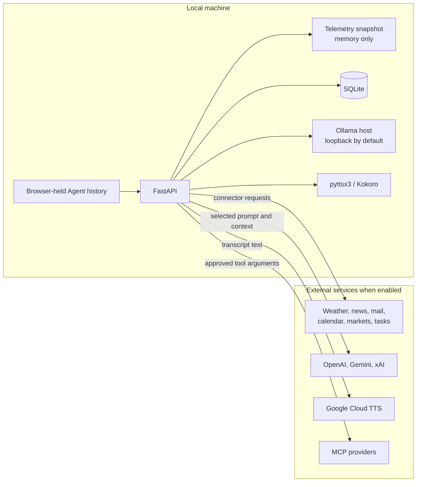

# Privacy and Data Boundaries

APEX is local-first, not entirely offline. This reference separates project-controlled behavior from external provider policy so I can make an informed choice before enabling personal connectors or cloud processing.

> **Provider terms last verified: August 1, 2026.** External terms can change independently of this repository; follow the linked primary sources before relying on a cloud-service claim.

## Data-flow summary

| Data or operation | Stays local by default | Can leave the machine | Persisted by APEX | Cloud-free choice |
|---|---|---|---|---|
| HUD and API traffic | Yes, loopback only | No | No | Default behavior |
| Telemetry collection | Snapshot and normalization | Enabled connector receives its request | Snapshot is memory-only | Disable external connectors or use demo mode |
| Briefing synthesis | Typed bounded input is built locally | Panthera sends it to OpenAI; Mus and Sorex send it to Ollama | Production transcript/digest in SQLite | Mus, Sorex, or Structured Digest |
| Interactive Agent conversation | Browser tab owns history | Selected cloud/local Agent and explicitly selected APEX/MCP schemas receive required context; provider-hosted grounding remains a separate provider path | No server-side chat store | Local Agent with No APEX Tools or local runtime |
| Reminders | SQLite | No | Yes | Default behavior |
| Microsoft To Do | Authorization and bounded task results | Microsoft Graph and selected Agent | Authorization cache only; tasks are not copied to SQLite | Leave integration disconnected |
| Voice | Transcript exists locally | Google receives text when Google TTS is used | No; generated audio is temporary | pyttsx3 or local Kokoro |
| MCP tools | Manager and policy remain local | Enabled provider receives selected arguments | Provider authorization stays outside repository | Leave MCP disabled |

External paths exist only when the corresponding connector, provider, speech engine, or MCP integration is enabled.

APEX treats Ollama as local by default; configuring a remote Ollama host moves that model traffic outside the machine boundary.

## Local service boundary

`launcher.py` binds FastAPI to `127.0.0.1:8000` and the compiled HUD to `127.0.0.1:5500`. The API has no authentication, so loopback binding is part of the security model. LAN and public access are unsupported; adding either requires authentication, authorization, and transport security first.

`APEX_ALLOWED_ORIGINS` changes which browser origins may call the API. CORS is not authentication and does not protect a remotely bound service from non-browser clients.

The backend child receives connector and provider credentials. The static server and browser receive a restricted environment containing only process essentials, so API keys are not copied into those child environments.

## Briefing synthesis

Enabled connectors return typed results. Briefing orchestration selects bounded weather, email, news, calendar, reminder, Formula 1, football, and connector-health facts for `SynthesisInput`. Text is normalized, stripped of control characters and markup, truncated per field, serialized to a fixed bound, and wrapped in `<untrusted_connector_data>` markers.

Panthera and Ollama receive the same selected facts. Concatenated display telemetry, Agent tools, and Agent history are excluded. Generated output is bounded and validated before use; invalid output ends in deterministic synthesis from the typed input.

The markers and validation reduce prompt-injection risk. They do not make model output an authorization boundary, and model prose must never authorize an action.

### Panthera briefing policy boundary

The Panthera briefing path sends briefing input to the OpenAI Responses API. That input can include personal facts such as calendar events, reminders, and bounded email subjects.

OpenAI states that API inputs and outputs are not used to train or improve its models by default. Abuse-monitoring and endpoint-specific retention still apply, and eligible accounts may have more restrictive retention controls. See OpenAI's [API data controls](https://platform.openai.com/docs/models/default-usage-policies-by-endpoint).

This is provider policy, not a guarantee implemented by APEX. Review the linked current terms before sending sensitive data.

Selecting a local briefing Agent or Structured Digest avoids sending briefing synthesis data to OpenAI.

## Interactive Agent data

Interactive Agent work is separate from briefing synthesis. A cloud Agent sends the prompt, optional local user designation, browser-provided history, explicitly selected HUD context, and invoked tool results to its configured provider: OpenAI, Gemini, or xAI. A local Agent sends the applicable categories to the configured Ollama host, which defaults to loopback but can be changed. The designation is stored only in gitignored `config.local.json` and is omitted when empty.

An explicit cloud access verification sends only the configured model identifier and credential to the provider's metadata endpoint. It sends no prompt, history, HUD context, provider tool call, or credential value back to the browser. APEX stores only a sanitized availability category and timestamp; it does not expose or log raw provider messages.

HUD context is never implicit. A briefing is attached only through an explicit valid `briefing_id`; telemetry is attached only through the current matching `snapshot_id`. Omitting both identifiers injects neither. Tool results and HUD context are marked as untrusted model data.

Conversation history exists in the browser tab and is lost on reload. The backend has no chat-session store. Local context budgeting can omit old complete interactions and reports counts, never prompt or tool-result content.

Acinonyx is a development-only Gemini sandbox with a browser history partition separate from production Agents. The backend rejects cross-partition history and saved briefing records. Acinonyx can receive only weather, Formula 1, Brave Search, Alpha Vantage, and the process-current development briefing after the backend has masked email subjects, calendar details, and reminder text. It never receives full telemetry, Gmail, Calendar, reminders, Microsoft To Do, briefing history, GitHub/private MCP, files, images, or production conversation history.

### Native personal-data tools

Gmail tools can search bounded metadata and read one selected plain-text message under `gmail.readonly`. They exclude attachments, embedded resources, active HTML, and raw MIME and cannot send, delete, archive, or label mail.

Microsoft To Do uses delegated `Tasks.Read`, a public/native device-code flow, and an encrypted operating-system authorization cache. Task titles, dates, list identifiers, and bounded metadata can reach the selected Agent when invoked. The integration has no mutation methods, and SQLite reminders remain authoritative.

## MCP providers

Enabled MCP providers receive arguments selected for an approved tool call. GitHub can receive repository, issue, pull-request, and code-search queries; Brave receives web or news search; Alpha Vantage receives market-research parameters.

Neofelis can send a query to provider-hosted Google Search or Google Maps grounding when their settings are enabled. Delphinus and Orcinus can use provider-hosted X Search when their respective setting is enabled. These calls are visible as provider-origin traces and may incur separate provider charges. Panthera receives no OpenAI hosted search, and xAI general web search is not enabled.

Imported results are untrusted and bounded before model and HUD delivery. The presets are disabled by default, must be allowlisted and locally risk-classified, and are never included in scheduled briefing telemetry.

Runtime Settings exposes only preset enablement. It never returns or accepts credentials, authorization headers, OAuth artifacts, endpoints, subprocess commands, allowlists, or tool-risk classifications. APEX remains an MCP client and exposes no MCP server.

## Local persistence

`apex_memory.db` stores production run timestamps, reminders, up to 50 recent briefing records, structured digests, and runtime metadata. New timestamps are timezone-aware UTC; legacy timezone-naive run timestamps remain readable as local wall-clock values.

The database is not encrypted by APEX. Operating-system account access and filesystem permissions protect it at rest. Database files, WAL files, caches, OAuth tokens, credentials, generated audio, local settings, and model weights are gitignored.

OAuth credential and service-account files remain local and must not be committed. Alpha Vantage MCP authorization and the default Microsoft To Do cache use operating-system credential protection rather than tracked files.

## Logging

API and launcher logs use module loggers. Briefing `run_id` values correlate pipeline, worker, and persistence events. Operational failures record components, stable categories, and exception types rather than connector payloads, credentials, prompts, or stored briefings.

Public Agent failures use stable messages instead of raw third-party exceptions. New connectors and providers still require a privacy review because external exception objects are not guaranteed to be safe.

## Runtime modes

- `DEMO_MODE=true` uses static mock data, skips live connectors, and does not write production briefing history.
- `DEV_MODE=true` can still collect Gmail, Calendar, and reminders, but returned personal text is masked before briefing synthesis or Acinonyx context use.
- Production mode calls only enabled connectors. Disabling a connector skips its request and excludes it from briefing input and Sync Health.

See [Configuration](configuration.md) for exact mode ownership and [Architecture](architecture.md) for the process and trust model.
