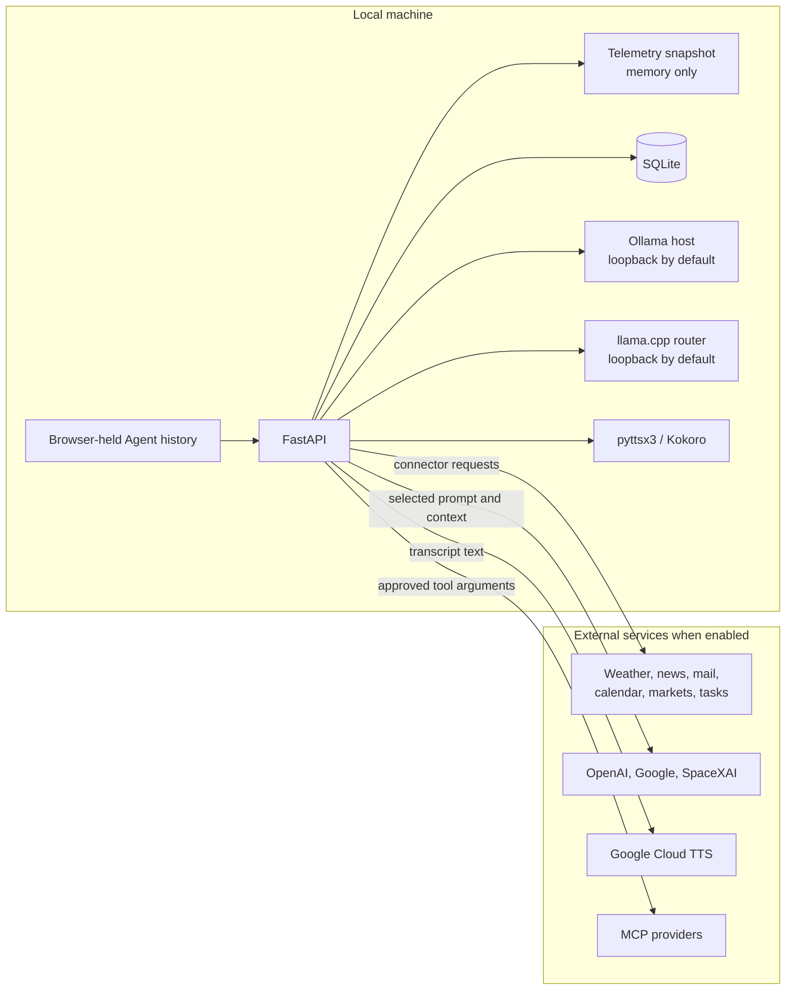

# Privacy and Data Boundaries

APEX is local-first, not entirely offline. This reference separates behavior APEX controls from external provider policy so I can make an informed choice before enabling personal connectors or cloud processing.

> **Provider terms last verified: August 10, 2026.** External terms can change independently of this repository; follow the linked primary sources before relying on a cloud-service claim.

## Data-flow summary

| Data or operation | Stays local by default | Can leave the machine | Persisted by APEX | Cloud-free choice |
|---|---|---|---|---|
| HUD and API traffic | Yes, loopback only | No | No | Default behavior |
| Telemetry collection | Snapshot and normalization | Enabled connector receives its request | Snapshot is memory-only | Disable external connectors or use demo mode |
| Briefing synthesis | Selected, size-limited input is built locally | Panthera sends it to the selected cloud provider; Lynx sends it to the local Ollama or llama.cpp runtime | Normal-mode transcript/digest in SQLite | Lynx or Structured Digest |
| Interactive Agent conversation | Browser tab owns history | Selected cloud/local Agent and explicitly selected APEX/MCP schemas receive required context; provider-hosted grounding remains a separate provider path | No server-side chat store | Local Agent with No APEX Tools or local runtime |
| Reminders | Selected Microsoft To Do list or local queue | Approved task fields go to Microsoft Graph | Small task cache and retained local outbox rows in SQLite | Leave the list unselected or integration disconnected |
| Microsoft To Do | Authorization and bounded task results | Microsoft Graph and selected Agent | Authorization cache, selected-list cache, and action evidence | Leave integration disconnected |
| Action controls | Proposal, lifecycle state, and execution/verification evidence | A supported native action receives its saved arguments after local approval | SQLite action and audit ledger | Demo mode does not read or mutate the action ledger |
| Voice | Transcript exists locally | Google receives text when Google TTS is used | No; generated audio is temporary | pyttsx3 or local Kokoro |
| MCP tools | Manager and policy remain local | Enabled provider receives selected arguments | Provider authorization stays outside repository | Leave MCP disabled |

External paths exist only when the corresponding connector, provider, speech engine, or MCP integration is enabled.

APEX treats Ollama and llama.cpp as local by default. Ollama can be pointed at a remote host, which moves that model traffic outside the machine. APEX requires the llama.cpp router to stay on loopback.

## Local service boundary

`launcher.py` binds FastAPI to `127.0.0.1:8000` and the compiled HUD to `127.0.0.1:5500`. The API has no authentication, so loopback binding is part of the security model. LAN and public access are unsupported; either would require authentication, authorization, and transport security first.

`APEX_ALLOWED_ORIGINS` changes which browser origins may call the API. CORS is not authentication and does not protect a remotely bound service from non-browser clients.

`uv run apex` is another local API client, not a second runtime. It talks only to the same loopback backend and adds no storage or remote destination. It can display the same locally stored action details and Agent output that the HUD can display.

The backend child receives connector and provider credentials. The static server and browser receive only the environment variables they need to run, so API keys are not copied into those child environments.

## Briefing synthesis

Enabled connectors return typed results. Briefing generation picks the weather, email, news, calendar, reminder, Formula 1, football, and connector-health facts that may be sent to a model. Text is cleaned, limited in size, and wrapped in `<untrusted_connector_data>` markers.

Panthera through the selected cloud provider and Lynx through its fixed Gemma E2B llama.cpp briefing path receive the same selected facts. The interactive Lynx model and runtime selection in Cortex do not change briefing synthesis; Ollama remains available for interactive Lynx requests but is not used for briefings. Display text, Agent tools, and conversation history are not sent as briefing input. Generated output is checked before use; invalid model output falls back to Structured Digest built from the same facts.

These boundaries reduce prompt-injection risk. They do not authorize actions, and model text is never treated as approval for a write.

### Panthera briefing policy boundary

The Panthera briefing path sends briefing input to the selected cloud provider. With the default OpenAI model, that input goes to the OpenAI Responses API and can include personal facts such as calendar events, reminders, and limited email subjects.

OpenAI states that API inputs and outputs are not used to train or improve its models by default. Abuse-monitoring and endpoint-specific retention still apply, and eligible accounts may have more restrictive retention controls. See OpenAI's [API data controls](https://platform.openai.com/docs/models/default-usage-policies-by-endpoint).

This is provider policy, not a guarantee implemented by APEX. Review the linked current terms before sending sensitive data.

Selecting Lynx or Structured Digest avoids sending briefing synthesis data to a cloud provider.

## Interactive Agent data

Interactive Agent work is separate from briefing synthesis. Panthera can receive the prompt, optional local user designation, browser-provided history, explicitly selected HUD context, and results from tools it uses. Lynx receives the same applicable categories through its configured Ollama or llama.cpp host.

The optional user designation is stored only in gitignored `config.local.json` and is omitted when empty.

An explicit cloud access check sends the configured model identifier and credential to the provider's metadata endpoint. It does not send the prompt, conversation history, HUD context, or tool results. APEX keeps only a safe availability category and timestamp and does not return or log raw provider messages.

HUD context is opt-in for each request. A briefing is attached only through a valid `briefing_id`; telemetry is attached only through the current matching `snapshot_id`. Omitting both attaches neither. Tool results and HUD context are marked as untrusted model data.

Conversation history lives in the browser tab and is lost on reload. The backend has no chat-session store. Local context trimming can remove old complete interactions when needed, but diagnostics report only counts rather than prompt or tool-result content.

`DEV_MODE` sandbox queries keep history in the `sandbox` partition and can receive only the small non-personal allowlist defined for sandbox mode, plus a masked development briefing. They do not receive full telemetry, Gmail, Calendar, Microsoft To Do, normal briefing history, private GitHub/MCP data, files, images, or normal-mode conversation history.

### Native personal-data tools

Gmail tools can search limited metadata and read one selected plain-text message under `gmail.readonly`. They exclude attachments, embedded resources, active HTML, and raw MIME and cannot send, delete, archive, or label mail.

Microsoft To Do uses delegated `Tasks.ReadWrite`, a public/native device-code flow, and an encrypted operating-system authorization cache. Task titles, dates, list identifiers, and other limited task metadata can reach the selected Agent when a To Do tool is used.

Direct Home edits, deletion, completion, and reopening are operator commands. Agent-requested writes become action proposals first. In both cases APEX records enough local evidence to verify the result against Microsoft Graph. The selected list remains the reminder authority. SQLite keeps only the active-task cache and local pending or uncertain rows; completed history is fetched live and is not stored or sent to briefing synthesis.

## MCP providers

Enabled MCP providers receive only the arguments sent to the selected tool. GitHub can receive repository, issue, pull-request, and code-search queries; Brave receives web or news search; Alpha Vantage receives market-research parameters.

Panthera can use provider-hosted Google Search or Google Maps grounding and X Search when the selected model and persisted hosted-tool settings allow them. These calls are separate from APEX-managed tool calls and may have their own provider charges. OpenAI general hosted search and SpaceXAI general web search are not enabled.

Imported results are marked untrusted and limited in size before model or HUD delivery. MCP presets are disabled by default, must be allowlisted and locally risk-classified, and are never part of scheduled briefing telemetry.

Runtime Settings exposes only preset enablement. It does not return or accept credentials, authorization headers, OAuth artifacts, endpoints, subprocess commands, allowlists, or tool-risk classifications. APEX remains an MCP client and does not expose an MCP server.

### Provider terms and attribution

APEX is a personal, non-commercial application. A public source repository does not make its operator a public service, and personal OAuth credentials must remain local. The following provider-specific boundaries still apply when their integrations are enabled:

- Gemini Search returns Google-provided Search Suggestions that APEX displays with the grounded response. Gemini Maps sources display immediately after the supported response, identify Google Maps without translation, retain the provider name, and link to the returned Maps URL. See the [Gemini API terms](https://ai.google.dev/gemini-api/terms) and [Maps grounding requirements](https://ai.google.dev/gemini-api/docs/maps-grounding).
- SpaceXAI personal data requires a Zero Data Retention-enabled xAI API. ZDR is configured for the xAI team rather than per request; APEX users must keep it enabled for the team owning their key. HIPAA Protected Health Information requires both ZDR and an xAI Business Associate Agreement. See the [xAI Enterprise terms](https://x.ai/legal/terms-of-service-enterprise) and [ZDR guidance](https://docs.x.ai/developers/faq/security).
- Brave Search results remain transient: they are not part of scheduled briefing telemetry and must not be copied into persistent memory, datasets, or model evaluation/benchmark material. See the [Brave Search API terms](https://api-dashboard.search.brave.com/documentation/resources/terms-of-service).
- Open-Meteo's free hosted API is limited to non-commercial use and its documented request limits. APEX sends the requested location or configured default location to Open-Meteo geocoding, then adapts returned temperatures and WMO weather codes into display summaries. The weather HUD and Cortex forecast cards visibly credit Open-Meteo and GeoNames, link to [CC BY 4.0](https://creativecommons.org/licenses/by/4.0/), and state that APEX adapted the data. See the [Open-Meteo terms](https://open-meteo.com/en/terms), [licence](https://open-meteo.com/en/license), [forecast API](https://open-meteo.com/en/docs), and [geocoding API](https://open-meteo.com/en/docs/geocoding-api). Football fixtures visibly credit the Football-Data.org API. Formula 1 schedule data visibly credits Jolpica and its [CC BY-NC-SA 4.0](https://creativecommons.org/licenses/by-nc-sa/4.0/) data license. See the [Football-Data terms](https://www.football-data.org/about) and [Jolpica terms](https://github.com/jolpica/jolpica-f1/blob/main/TERMS.md).
- GNews Free and Alpha Vantage are for personal or non-commercial use. Do not use their free/personal credentials for commercial activity without the provider's appropriate plan or written agreement. See [GNews pricing](https://gnews.io/pricing) and [Alpha Vantage terms](https://www.alphavantage.co/terms_of_service/).

## Local persistence

`apex_memory.db` stores normal-mode run timestamps, up to 50 recent briefing records and their runtime metadata, the Microsoft To Do reminder cache and local outbox, legacy reminder rows kept for compatibility, and the durable action ledger.

Action records keep the proposing Agent, capability, saved arguments, target, risk, summary, state, timestamps, and proposal hash. Their audit events keep state changes, stable result codes, and limited execution or verification evidence. New timestamps use UTC; old timezone-naive run timestamps remain readable as local wall-clock values.

The database is not encrypted by APEX. Operating-system account access and filesystem permissions protect it at rest. Database files, WAL files, caches, OAuth tokens, credentials, generated audio, local settings, and model weights are gitignored.

OAuth credential and service-account files remain local and must not be committed. Alpha Vantage MCP authorization and the default Microsoft To Do authorization cache use operating-system credential protection rather than tracked files.

## Logging

API and launcher logs use module loggers. Briefing `run_id` values connect pipeline, worker, and persistence events. Failures record component names, stable categories, and exception types rather than connector payloads, credentials, prompts, stored briefings, action arguments, or action evidence.

The action ledger stores limited evidence locally, but exceptions are reduced to stable categories before logging or persistence. Public Agent failures also use stable messages instead of raw third-party exceptions.

New connectors and providers still require a privacy review because external exception objects are not guaranteed to be safe.

## Runtime modes

- `DEMO_MODE=true` uses static mock data, skips live connectors, and does not write normal-mode briefing history or access the production action ledger.
- `DEV_MODE=true` can still collect Gmail, Calendar, and reminders, but returned personal text is masked before briefing synthesis or sandbox context use.
- Normal mode calls only enabled connectors. Disabling a connector skips its request and excludes it from briefing input and Sync Health.

See [Configuration](configuration.md) for exact mode ownership and [Architecture](architecture.md) for the process and trust model.
